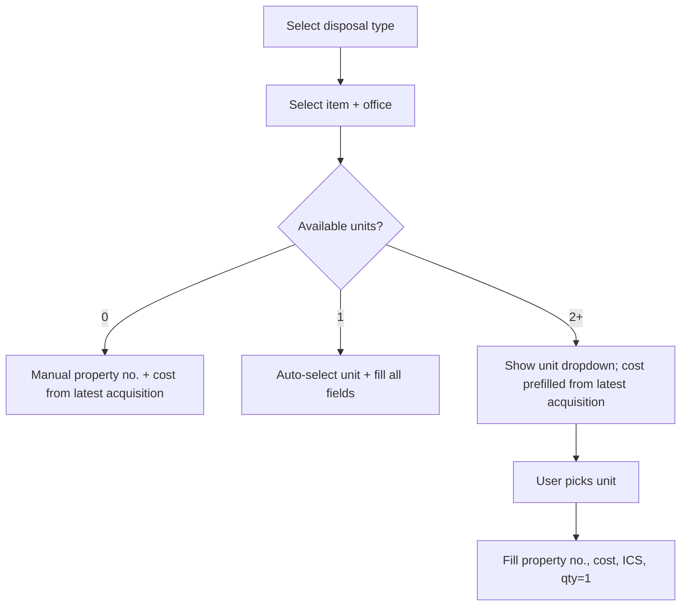

# Disposal create: auto-fill + simplified UI

## Current behavior (why it feels broken)

Today in [`DisposalForm.php`](app/Filament/Resources/Disposals/Schemas/DisposalForm.php):

- Selecting **Item** or **Office** **clears** `property_number`, `acquisition_cost`, and `inventory_unit_id` — nothing is pre-filled.
- Auto-fill runs **only** when the user picks a row in **Specific inventory item no.** (`inventory_unit_id` → `DisposalInventoryUnitService::applyUnitToFormState()`).

So yes — the user’s expectation is reasonable for **acquisition cost** (Issuance already does this in [`IssuanceForm.php`](app/Filament/Resources/Issuances/Schemas/IssuanceForm.php) via latest `Acquisition::unit_cost`).

For **inventory item no.**, it cannot be guessed when multiple physical units exist (e.g. 6 wall clocks = 6 different SPLV numbers). Auto-fill is correct only when:

- User picks a unit from the dropdown, **or**
- Exactly **one** available unit exists for item + office → **auto-select** (user confirmed this).

---

## 1. Service: centralize item/office sync

Extend [`DisposalInventoryUnitService.php`](app/Services/DisposalInventoryUnitService.php):

- **`resolveLatestAcquisitionCost(?int $itemId, ?int $officeId): ?float`**
    - Prefer latest acquisition for `item_id` (and `office_id` when present), same pattern as IssuanceForm.
    - Fallback: if a single unit exists, use `resolveAcquisitionCostForUnit()`.

- **`syncFormStateForItemOffice(?int $itemId, ?int $officeId, Set $set, ?int $excludeDisposalId = null): void`**
    - If item or office blank → clear unit-linked fields only.
    - Query available units via existing `availableUnitsQuery()`.
    - **Count = 1** → `$set('inventory_unit_id', $id)` + `applyUnitToFormState()`.
    - **Count > 1** → clear `inventory_unit_id`, property, ICS; set `acquisition_cost` from `resolveLatestAcquisitionCost()`; leave property number empty until unit picked.
    - **Count = 0** → clear unit fields; set `acquisition_cost` from latest acquisition; property number stays manual for semi RLSDDP.

Wire this from `item_id` and `office_id` `afterStateUpdated` callbacks in `DisposalForm` (replace the current “clear everything” handlers).

When user manually changes `inventory_unit_id`, keep existing `applyUnitToFormState()` (unit-specific cost overrides generic latest acquisition).

---

## 2. Type-first, simplified form layout

Restructure [`DisposalForm.php`](app/Filament/Resources/Disposals/Schemas/DisposalForm.php) sections (no Filament Wizard needed — use ordering + `visible()`):

| Step | Section                                                               | Fields                                                                                                                                |
| ---- | --------------------------------------------------------------------- | ------------------------------------------------------------------------------------------------------------------------------------- |
| 1    | **Disposal type**                                                     | `disposal_type`, `disposal_date`                                                                                                      |
| 2    | **What to dispose** (visible when type set)                           | category filter, `item_id`, `office_id`, `quantity`, `reason`                                                                         |
| 3    | **Asset details** (semi + RLSDDP only, or stock no. for non-property) | `inventory_unit_id` (when units exist), read-only `property_number`, read-only `acquisition_cost`, optional read-only ICS display     |
| 4    | **Type-specific** (one block)                                         | WMR: mode + inspection no. / IIRUP: mode / RLSDDP: status, circumstances, police toggle, gov ID (collapsed optional)                  |
| 5    | **Signatories**                                                       | Short labels only; merge RLSDDP “Accountable officer” designation/station into RLSDDP block or signatories (remove duplicate section) |
| 6    | **Sale details**                                                      | Keep collapsible + **collapsed** by default                                                                                           |

UI simplification rules:

- **Hide** `par_issuance_id` select when auto-filled from unit — show as disabled read-only “ICS/PAR No.” text instead.
- **Disable** `property_number` and `acquisition_cost` whenever filled by service (unit auto-select or latest acquisition); helper text: “Auto-filled from inventory.”
- **Remove** long signatory `description()` paragraphs; one short line per type max.
- **Remove** separate “Accountable officer” section — fold `accountable_officer_designation` / `_station` into RLSDDP type-specific block.
- `place_of_storage` stays WMR-only.
- Edit form: keep `reference_code` at top; same field logic, less reordering on edit.

---

## 3. Validation (unchanged intent, small tweaks)

- Semi RLSDDP + available units → `inventory_unit_id` required (unchanged).
- When auto-selected single unit, validation should pass without extra user action.
- `acquisition_cost` still required for semi RLSDDP; auto-fill satisfies it when acquisition data exists.

---

## 4. Tests

Update [`SemiExpendableRlsddpDisposalTest.php`](tests/Feature/SemiExpendableRlsddpDisposalTest.php):

- Unit test `syncFormStateForItemOffice` behavior (0 / 1 / many units) on the service directly.
- Optional Livewire test on `CreateDisposal` if a similar pattern exists elsewhere; otherwise service tests are sufficient.

Run: `php artisan test --compact tests/Feature/SemiExpendableRlsddpDisposalTest.php` and `vendor/bin/pint --dirty`.

---

## Out of scope (separate plan)

Export filename gaps (`PC`, `AnnexA1`, `PAR-batch` / `ICS-batch`) remain in the pending filename plan — not part of this UX change.
