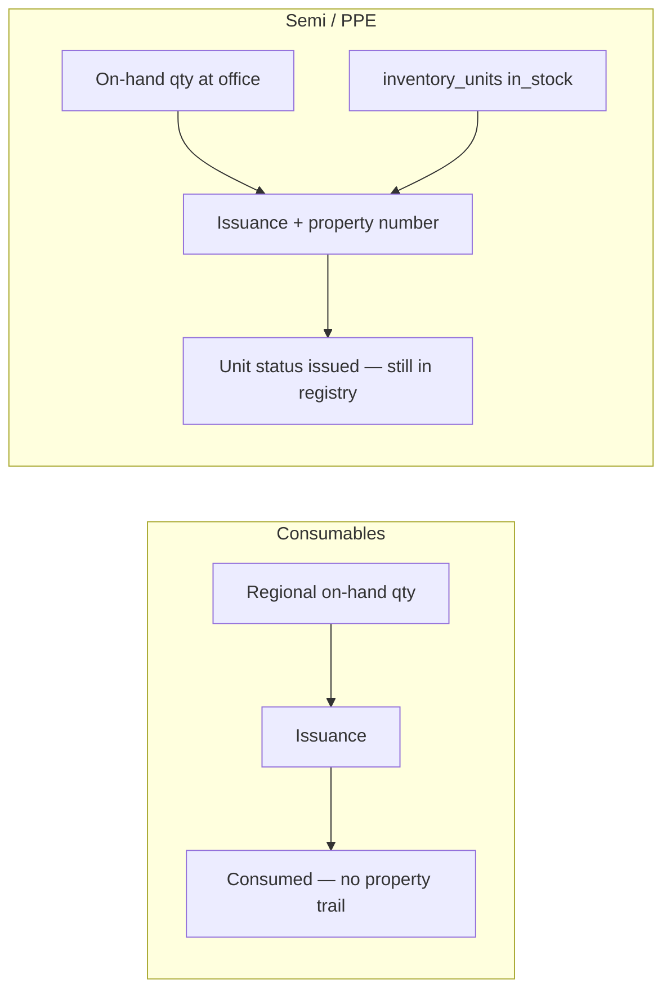
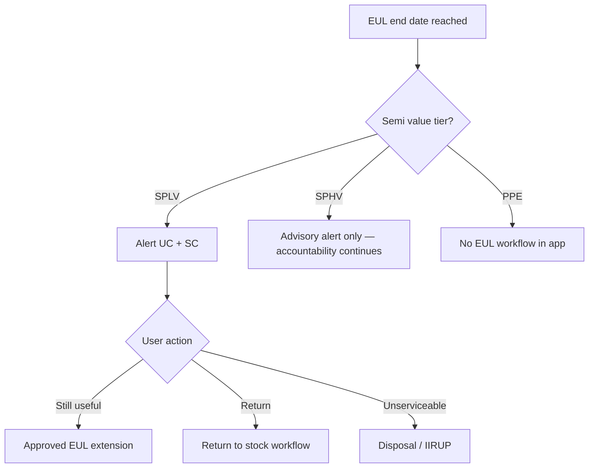

# Useful life lifecycle, Unit Consolidator, and PPE instruction audit

## Current state (what the app does today)

### Useful life scope

| Category            | Field                                                            | Validated when                                                                                          | Expiry automation |
| ------------------- | ---------------------------------------------------------------- | ------------------------------------------------------------------------------------------------------- | ----------------- |
| **Semi-expendable** | `items.estimated_useful_life`, `issuances.estimated_useful_life` | Item (if filled); **required** at issuance via [`IssuanceObserver`](app/Observers/IssuanceObserver.php) | **None**          |
| **PPE**             | Not captured                                                     | N/A                                                                                                     | N/A               |
| **Consumables**     | `days_to_consume` (analytics hint only)                          | N/A                                                                                                     | N/A               |

EUL is **text for OWWA exports** (ICS col H, Annex A.4 col E), not a computed end date. No alerts, extensions, or auto-cancellation exist.

### Stock vs accountability (semi/PPE vs consumables)

- **On-hand stock** ([`InventoryStockService`](app/Services/InventoryStockService.php)): decreases on issuance for all categories.
- **Property record** (`inventory_units`, issuances, PAR/ICS exports): **remains** after issue; QR scan and physical count still resolve issued units.

### Unit Consolidator today — **no EUL visibility**

UC role in the chain ([`RequisitionFulfillmentService`](app/Services/RequisitionFulfillmentService.php)):

1. UC submits requisition → SC accepts & issues.
2. Issuance `issued_to` = requisition `requested_by` (the UC).
3. Semi EUL is stored on the issuance but **never shown to UC**.

| UC capability                                                      | Can see issued property?                                     | Can see useful life / nearing expiry? |
| ------------------------------------------------------------------ | ------------------------------------------------------------ | ------------------------------------- |
| Requisitions (own office/dept)                                     | Status only; linked issuance refs in view                    | **No**                                |
| Stock levels ([`StockLevels`](app/Filament/Pages/StockLevels.php)) | On-hand qty at office (movement-based)                       | **No**                                |
| Distributions                                                      | Employee handoffs (category-scoped)                          | **No**                                |
| Issuances list                                                     | **`IssuanceResource::canViewAny()` = Supply Custodian only** | **No**                                |
| Regional supply catalog                                            | Requestable items at supply office                           | **No**                                |

**Answer:** Today UC **cannot** see nearing useful life. They are accountable on PAR/ICS paper (`issued_to`), but the app gives them no property register or EUL dashboard.

---

## Semi vs PPE — where does useful life belong?

|                                | **Semi-expendable**                                                      | **PPE**                                                                                                     |
| ------------------------------ | ------------------------------------------------------------------------ | ----------------------------------------------------------------------------------------------------------- |
| **Primary owner of EUL**       | **Supply / Property** (custody)                                          | **Accounting** (depreciation)                                                                               |
| **Captured on custody forms?** | **Yes** — ICS field #9 "Estimated Useful Life"; Annex A.4 registry col E | **No** — PAR, Property Card, RPCPPE have no EUL column                                                      |
| **Purpose in COA 2022-004**    | Eligibility (>1 yr), accountability rules (esp. SPLV ICS cancellation)   | Capitalization (≥₱50k); depreciation on PPE ledger cards                                                    |
| **This app's scope**           | `items` + `issuances.estimated_useful_life` — **in scope**               | EUL/depreciation — **out of scope** (disposal IIRUP may reference accumulated depreciation from accounting) |

**Semi EUL is not "accounting-only" like PPE.** It is a **property accountability field** filled at issuance and tracked on ICS/Annex A.4. Accounting may still receive copies of disposal forms, but semi useful life is **not** deferred to a separate SPLC ledger the way PPE depreciation is.

---

## PPE instruction / template audit — is useful life required?

**Verified locally** (June 2026): full-text search of instruction PDFs under [`storage/app/templates/ppe/`](storage/app/templates/ppe/) using PDF text extraction. Folders match PPE task categories: Acquisition, Issuances, Transfer, Disposal, Physical Count, Recording (Stock Level), Incident Report.

### PPE instruction PDF results

| Instruction PDF                          | "Estimated Useful Life" / "useful life"? | Notes                                                                                                |
| ---------------------------------------- | ---------------------------------------- | ---------------------------------------------------------------------------------------------------- |
| Appendix 60 PR                           | **No**                                   |                                                                                                      |
| Appendix 61 PO                           | **No**                                   |                                                                                                      |
| Appendix 62 IAR                          | **No**                                   |                                                                                                      |
| Appendix 69 PC (Acquisition + Recording) | **No**                                   |                                                                                                      |
| Appendix 71 PAR                          | **No**                                   |                                                                                                      |
| Appendix 73 RPCPPE                       | **No**                                   |                                                                                                      |
| Appendix 76 PTR                          | **No**                                   |                                                                                                      |
| Appendix 75 RLSDDP                       | **No**                                   |                                                                                                      |
| Appendix 74 IIRUP                        | **No EUL**                               | Mentions **Accumulated Depreciation** / carrying amount (disposal valuation from accounting records) |

**Confirmed:** No PPE custody instruction requires capturing estimated useful life on PR, PO, IAR, Property Card, PAR, PTR, RPCPPE, or RLSDDP.

### Semi instruction PDF contrast

| Instruction PDF             | EUL?                                                                                      |
| --------------------------- | ----------------------------------------------------------------------------------------- |
| Appendix 59 ICS             | **Yes** — field **#9 Estimated Useful Life** — "estimated useful life of the item issued" |
| PR / PO / IAR / PTR / IIRUP | **No** (IIRUP same depreciation language as PPE disposal)                                 |
| Annex A.4 registry          | Excel col E (no separate instruction PDF in templates folder)                             |

### PPE forms — mapped columns (aligns with PDF audit)

| PPE task                | Template        | Mapped detail columns                                              | EUL column? |
| ----------------------- | --------------- | ------------------------------------------------------------------ | ----------- |
| Purchase Request        | Appendix 60 PR  | stock_no, unit, description, qty, unit_cost, total                 | **No**      |
| Purchase Order          | Appendix 61 PO  | item, unit, qty, unit_cost, total                                  | **No**      |
| IAR                     | Appendix 62 IAR | (acquisition paperwork)                                            | **No**      |
| Property Card           | Appendix 69 PC  | date, reference, receipt/issue qty, balance, amount, remarks       | **No**      |
| PAR (issuance)          | Appendix 71 PAR | qty, unit, description, **property_number**, date_acquired, amount | **No**      |
| RPCPPE (physical count) | Appendix 73     | signatures only in map; count lines from session                   | **No**      |
| PTR (transfer)          | Appendix 76     | date_acquired, property_no, description, amount, condition         | **No**      |
| IIRUP (disposal)        | Appendix 74     | date_acquired, description, property_no, qty, remarks              | **No**      |
| RLSDDP (incident)       | Appendix 75     | incident narrative fields                                          | **No**      |

**Only semi ICS** maps `useful_life` → column **H** ([`config/owwa_cell_maps.php`](config/owwa_cell_maps.php) line 103).

**Conclusion:** PPE **custody/supply forms do not require estimated useful life** — verified against instruction PDFs and cell maps. PPE useful life / depreciation belongs on **accounting PPE ledger cards** (out of capstone scope). **Do not add PPE EUL fields** unless accounting module is added.

**Phase 5 deliverable:** Document this PDF audit table in [`docs/OWWA_EXPORT_MAPPING.md`](docs/OWWA_EXPORT_MAPPING.md) + PHPUnit test that `useful_life` exists only on `ICS` cell map.

---

## When EUL is reached but item is still physically useful

COA Circular 2022-004 (already documented in project):

| Value tier               | COA accountability rule                                           | Recommended system behavior                                                                                              |
| ------------------------ | ----------------------------------------------------------------- | ------------------------------------------------------------------------------------------------------------------------ |
| **SPLV** (≤ ₱5,000)      | Accountability may end at EUL expiry; ICS may be cancelled        | **Alert** UC + SC; offer **return**, **disposal**, or **documented extension** (amend EUL with approval — re-export ICS) |
| **SPHV** (> ₱5k, < ₱50k) | Accountability continues until **return/disposal**, not EUL alone | **Informational alert only**; no auto-cancel; item stays on registry                                                     |
| **PPE**                  | Depreciation/accounting scope                                     | **Out of scope** for EUL alerts in this module                                                                           |

**System must NOT** auto-remove stock, auto-dispose, or hide property when EUL date passes. Physical usability is a **custody/accounting decision**, not a stock timer.

---

## Implementation plan (five recommendations + UC)

### Phase 1 — Training clarity (docs + in-app copy, no schema)

**Goal:** Recommendation #1 — separate "available stock" vs "accountable property."

- Add a short **"Stock vs property"** section to [`docs/PROCESS_WORKFLOW.md`](docs/PROCESS_WORKFLOW.md) and link from [`docs/INVENTORY_NUMBERING.md`](docs/INVENTORY_NUMBERING.md).
- Add Filament helper text on Stock levels (semi/PPE categories): _"On-hand quantity only. Issued property remains on PAR/ICS and property registers."_
- Add UC-facing subheading on category dashboard stock KPI explaining the same.

**No code behavior change.**

---

### Phase 2 — Require EUL on semi item catalog (Recommendation #2)

**Goal:** Prevent issuance failures by catching missing defaults early.

- [`ItemForm.php`](app/Filament/Resources/Items/Schemas/ItemForm.php): make `estimated_useful_life` **required** when category = semi-expendable (keep `assertEligibleForSemi` validation).
- Optional: block item activation if `property_class` set but EUL blank.

**Files:** `ItemForm.php`, [`SemiExpendableUsefulLifeTest`](tests/Feature/SemiExpendableUsefulLifeTest.php).

---

### Phase 3 — EUL expiry engine (Recommendation #3)

**Goal:** Compute dates, surface alerts, support extension — **semi only**.

**Schema** (new migration):

- `issuances.eul_expires_at` (date, nullable) — computed on save from `issuance_date` + parsed EUL.
- `useful_life_extensions` table (optional but recommended): `issuance_id`, `previous_eul`, `new_eul`, `new_expires_at`, `reason`, `approved_by`, `approved_at`.

**Service:** extend [`SemiExpendableUsefulLife`](app/Support/SemiExpendableUsefulLife.php):

- `computeExpiresAt(Carbon $issuanceDate, string $eul): ?Carbon`
- `daysUntilExpiry(Issuance $issuance): ?int`
- `status(Issuance $issuance): enum` → `ok | nearing | expired` (configurable thresholds, e.g. 90/30 days)

**Observers:** on issuance create/update, set `eul_expires_at`.

**Notifications:**

- Scheduled command `inventory:eul-reminders` → notify SC + `issued_to` user when nearing/expired.
- SPLV expired: stronger copy referencing ICS cancellation policy.

**Extension workflow (SC-only action on issuance):**

- Form: new EUL + justification → creates extension row, updates `estimated_useful_life` + `eul_expires_at`, audit log.
- Re-export ICS / Annex A.4 after extension.

**Explicit non-goals:** auto-cancel ICS, auto-disposal, PPE EUL.

---

### Phase 4 — Return-to-stock workflow (Recommendation #4)

**Goal:** Formal path when property comes back before/after EUL.

**Option A (preferred, matches PTR semantics):** "Return" transfer type from department → supply office.

- Extend [`Transfer`](app/Models/Transfer.php) or add `Return` action on issuance/inventory unit.
- On complete: `inventory_unit.status` → `in_stock`, clear `issuance_id`, increment stock at supply office.

**Option B:** Negative issuance / reversal record (more audit noise).

**UC role:** initiate return request; SC confirms receipt (two-step).

**Files:** Transfer form/resource, [`IssuanceUnitAssignmentService`](app/Services/IssuanceUnitAssignmentService.php) (reverse assignment), tests.

---

### Phase 5 — PPE scope confirmation (Recommendation #5)

**Goal:** Lock decision documented; audit when PDFs exist.

- Keep PPE out of EUL module (no fields, no alerts).
- When templates are in `storage/app/templates/`, run audit command and append **PPE instruction checklist** to [`docs/OWWA_EXPORT_MAPPING.md`](docs/OWWA_EXPORT_MAPPING.md).
- Add PHPUnit test asserting `OwwaCellMapping` has `useful_life` only on `ICS`, not on `PAR`/`PC`/`RPCPPE`/`PTR`/`IIRUP`.

---

### Phase 6 — Unit Consolidator property register (new, answers your UC question)

**Goal:** UC sees **what was issued to them** and EUL status.

**New page:** `OfficePropertyRegister` (or extend requisition view)

- **Access:** `isUnitConsolidator()` (and optionally employees for items issued via distribution if needed later).
- **Query:** `issuances` where `issued_to = auth user` OR (`office_id` + `department_id` match and category semi/PPE).
- **Columns:** property number, item, category, issuance date, EUL text, **expires at**, status badge (ok / nearing / expired), PAR/ICS export link (read-only).
- **Dashboard widget:** `UnitConsolidatorStatsWidget` — add "Property nearing EUL" count (semi SPLV/SPHV split).

**Also fix inconsistency:** [`IssuanceResource::getEloquentQuery()`](app/Filament/Resources/Issuances/IssuanceResource.php) already scopes UC office but `canViewAny()` blocks UC — either enable read-only issuance view for UC or keep data only on the new register page (prefer dedicated register to avoid SC workflow confusion).

**Infolist:** show `estimated_useful_life` on issuance modal for SC; add to UC register.

---

## Unit Consolidator — plain-language summary (for your defense/documentation)

1. **Sila ang accountable officer sa PAR/ICS** kapag sila ang `issued_to` mula sa requisition fulfillment.
2. **Hindi sila makakakita ng nearing useful life ngayon** — wala pang expiry date, widget, o property register.
3. **Hindi mawawala ang record** sa system kapag na-issue na; bababa lang ang on-hand stock ng supply office.
4. **Kapag umabot na ang EUL pero useful pa physically:**
    - **SPHV / PPE:** manatiling accountable; alert lang; kailangan formal return o disposal kapag hindi na dapat gamitin.
    - **SPLV:** alert + piliin ang **extension** (may approval), **return**, o **disposal** — hindi automatic na mawawala sa system.
5. **PPE:** walang useful life sa supply forms (verified sa lahat ng PPE instruction PDFs); depreciation ay accounting function.
6. **Semi:** useful life ay **property/supply function** (ICS + registry), hindi accounting-only tulad ng PPE depreciation.

---

## Suggested rollout order

1. Phase 1 (docs) + Phase 5 (PPE audit test/docs) — low risk, immediate clarity.
2. Phase 2 (require EUL on items) — small form change.
3. Phase 3 + 6 together — expiry dates + UC visibility.
4. Phase 4 (returns) — depends on transfer semantics; can ship after alerts.

## Test plan (high level)

- Unit: `computeExpiresAt`, SPLV vs SPHV alert rules, cell map has no PPE EUL.
- Feature: semi item requires EUL; issuance sets `eul_expires_at`; UC register lists issued property with badges; extension updates EUL; return restores `in_stock` unit.
