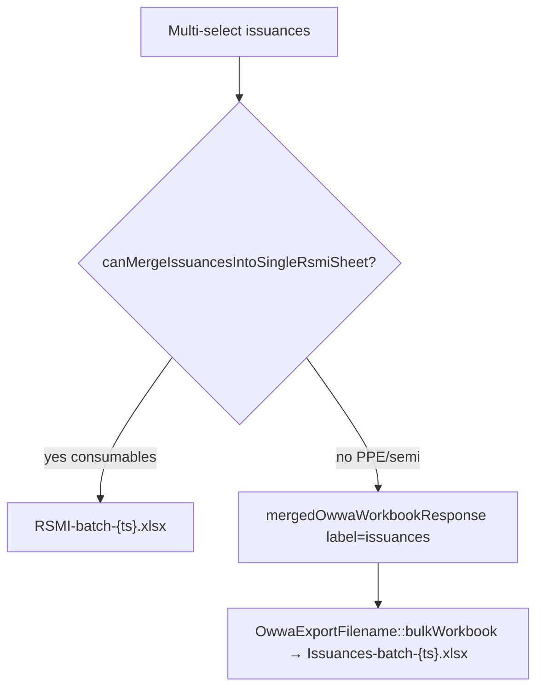

# Fix export filename gaps (PC / Annex A.1 / bulk PAR-ICS)

## What’s wrong today

### Gap 1 — PPE/semi custody receipt → `OWWA-{ref}.xlsx`

Single acquisition exports call [`resolveOwwaFormCode()`](app/Services/OwwaTemplateExportService.php) on the template path, then [`buildOwwaExportFilename()`](app/Services/OwwaTemplateExportService.php):

| Category    | Template path ([`config/owwa_templates.php`](config/owwa_templates.php)) | Current match                                        | Filename today                   |
| ----------- | ------------------------------------------------------------------------ | ---------------------------------------------------- | -------------------------------- |
| PPE         | `ppe/Accquisition/Appendix 69 - PC.xls`                                  | **none** (checks `PAR`/Appendix 71, not Appendix 69) | `OWWA-2026-01-0008.xlsx`         |
| Semi        | `Semi-Expendable/.../Property-Form-Annex-A.1-...xlsx`                    | **none** (Annex A.10 → IIRUSP only)                  | `OWWA-2026-01-0008.xlsx`         |
| Consumables | `.../Appendix 58 - SC.xls`                                               | SC                                                   | `SC-2026-01-0008.xlsx` (correct) |

The app already knows Annex A.1 via [`isAnnexA1PropertyCardTemplate()`](app/Services/OwwaTemplateExportService.php) (`Property-Form-Annex-A.1`) — filename resolver just doesn’t reuse that.

### Gap 2 — Bulk PPE/semi issuances → `Issuances-batch-{ts}.xlsx`

In [`OwwaBulkExportController::issuances()`](app/Http/Controllers/OwwaBulkExportController.php):



RSMI merge only applies to consumables ([`canMergeIssuancesIntoSingleRsmiSheet()`](app/Services/OwwaTemplateExportService.php)). PPE/semi bulk exports are multi-sheet workbooks (one PAR/ICS per tab) but the **download filename** uses the generic label `issuances`.

**Note:** The admin panel is **category-scoped** (`active_item_category_id`), so a bulk issuance export in PPE view is always PAR; semi view is always ICS. We can safely derive the batch prefix from category.

---

## Recommended fix (small, targeted)

### Fix 1 — Extend `resolveOwwaFormCode()`

In [`OwwaTemplateExportService::resolveOwwaFormCode()`](app/Services/OwwaTemplateExportService.php), add rules **before** the `default => 'OWWA'` case:

```php
str_contains($path, 'Appendix 69') || str_contains($path, 'Appendix 69 - PC') => 'PC',
str_contains($path, 'Property-Form-Annex-A.1') || str_contains($path, 'Annex-A.1') => 'AnnexA1',
```

Order matters: place Annex A.1 **before** generic `Annex A.10` / IIRUSP rules (already separate). Do **not** match bare `'PC'` — that could hit unrelated paths (e.g. RPCPPE).

**Result:**

- PPE custody receipt → `PC-2026-01-0008.xlsx`
- Semi custody receipt → `AnnexA1-2026-01-0008.xlsx` (matches item-level Annex A.1 exports)

Optional consistency: reuse `isAnnexA1PropertyCardTemplate($path)` inside the resolver to avoid duplicating the string check.

### Fix 2 — Category-aware bulk issuance filename

**Option A (recommended):** Pass explicit form code into merged workbook helper.

1. Add optional `$formCode` param to [`mergedOwwaWorkbookResponse()`](app/Http/Controllers/OwwaBulkExportController.php), or add a sibling helper that accepts form code directly.
2. In `issuances()`, when falling back to multi-sheet merge, resolve form code from the active category (or first record):

```php
$formCode = match (OwwaReferenceLabels::itemCategorySlug($records->first()->item_id)
    ?? session('active_item_category_id') /* via ItemCategory slug */) {
    'ppe' => 'PAR',
    'semi_expendable' => 'ICS',
    default => 'RSMI',
};
// OwwaExportFilename::batch($formCode)
```

3. Extend [`OwwaExportFilename::bulkWorkbook()`](app/Support/OwwaExportFilename.php) with mappings `'par' => 'PAR'`, `'ics' => 'ICS'`, `'issuances' => 'Issuances'` **or** stop using label indirection for issuances and call `batch()` directly.

**Result:**

- Bulk PPE issuances → `PAR-batch-2026-06-04_143022.xlsx`
- Bulk semi issuances → `ICS-batch-2026-06-04_143022.xlsx`
- Consumables (non-merge edge case) → `RSMI-batch-...`

### Fix 3 (optional) — Bulk acquisitions batch name

Same pattern for [`acquisitions()`](app/Http/Controllers/OwwaBulkExportController.php) merged path: today always `SC-batch-...` via `bulkWorkbook('acquisitions')`. If you bulk-export multiple PPE custody receipts, filename should be `PC-batch-...`; semi → `AnnexA1-batch-...`.

Low priority because bulk acquisitions UI is rarely used and panel is category-scoped — same one-line category match as issuances.

---

## What we should NOT do

- **Do not** rename sheet tab titles inside merged workbooks (they already use `reference_code`).
- **Do not** force PAR/ICS into a single merged form like RSMI — OWWA PAR/ICS are per-asset forms; multi-sheet workbook is correct.
- **Do not** remove `Issuances-batch` entirely — keep as fallback if category is unknown (system-admin edge case).

---

## Tests

Add to [`tests/Unit/OwwaExportFilenameTest.php`](tests/Unit/OwwaExportFilenameTest.php) or new `OwwaFormCodeResolutionTest.php`:

| Input path                                             | Expected form code |
| ------------------------------------------------------ | ------------------ |
| `ppe/Accquisition/Appendix 69 - PC.xls`                | `PC`               |
| `Semi-Expendable/.../Property-Form-Annex-A.1-....xlsx` | `AnnexA1`          |
| `Consumable/.../Appendix 58 - SC.xls`                  | `SC` (unchanged)   |

Add bulk filename test:

```php
OwwaExportFilename::batch('PAR') → PAR-batch-{ts}.xlsx
```

Run `vendor/bin/pint --dirty` and targeted unit tests.

---

## Effort

| Item                               | Files                                                    | Risk     |
| ---------------------------------- | -------------------------------------------------------- | -------- |
| PC / AnnexA1 form codes            | `OwwaTemplateExportService.php`                          | Very low |
| PAR/ICS bulk batch names           | `OwwaBulkExportController.php`, `OwwaExportFilename.php` | Low      |
| Bulk acquisitions batch (optional) | Same controller                                          | Low      |
| Tests                              | 1 unit test file                                         | —        |

**Total:** ~30–50 lines, no migrations, no UI changes.
