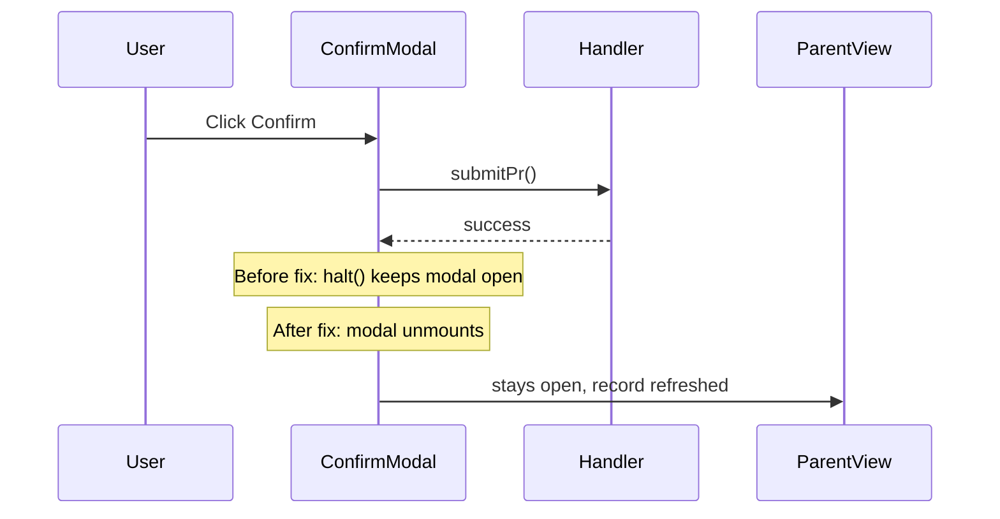

# Fix Workflow Confirmation Modal Not Closing

## Root cause

In [`AcquisitionPaperworkActions.php`](app/Filament/Resources/Acquisitions/Paperwork/Actions/AcquisitionPaperworkActions.php), `workflowAction()` sends the success toast **and then calls `$action->halt()`**:

```235:257:app/Filament/Resources/Acquisitions/Paperwork/Actions/AcquisitionPaperworkActions.php
            ->action(function (AcquisitionPaperwork $record, Action $action) use (...) {
                try {
                    $handler($record);
                } catch (...) {
                    // ...
                    $action->halt();  // correct — keep modal open on error
                    return;
                }

                Notification::make()->...->send();
                $action->halt();      // BUG — blocks confirmation modal from closing
            });
```

In Filament, `halt()` cancels the action lifecycle and **prevents the confirmation modal from unmounting**. That matches what you see: toast appears, but the Confirm/Cancel dialog stays on screen.

Other actions in this app (e.g. [`CustodianRequisitionActions::rejectAction`](app/Filament/Resources/Requisitions/Actions/CustodianRequisitionActions.php)) send a notification on success **without** `halt()`.

## Fix

**File:** [`AcquisitionPaperworkActions.php`](app/Filament/Resources/Acquisitions/Paperwork/Actions/AcquisitionPaperworkActions.php)

1. **Remove `$action->halt()` from the success branch** — only call `halt()` when validation fails (keep modal open so the user can fix data).

2. **Refresh the record after the handler** so the parent case view modal (stepper, footer buttons, status) reflects the new `pr_status`:

```php
$handler($record);
$record->refresh();
```

3. **Optional cleanup:** replace manual `Notification::make()` with Filament’s `->successNotification(Notification::make()->title(...)->body(...))` on the action definition for consistency (not required for the close fix).



## Scope

- Applies to **all** workflow actions using `workflowAction()`: Submit/Mark approved PR/PO/IAR and Record custody receipt.
- No change to [`PhysicalCountSessionActions`](app/Filament/Resources/PhysicalCountSessions/Actions/PhysicalCountSessionActions.php) unless you want the same behavior there (separate issue).

## Verification

- Manual: open a case → **Submit PR for approval** → Confirm → confirmation modal closes, success toast shows, parent view modal shows updated status (e.g. PR pending approval).
- Repeat from **PR details** nested modal footer.
- Run `vendor/bin/pint --dirty` on the touched file.

No new automated test required (Filament modal lifecycle); existing `AcquisitionPaperwork` workflow tests remain unchanged.
