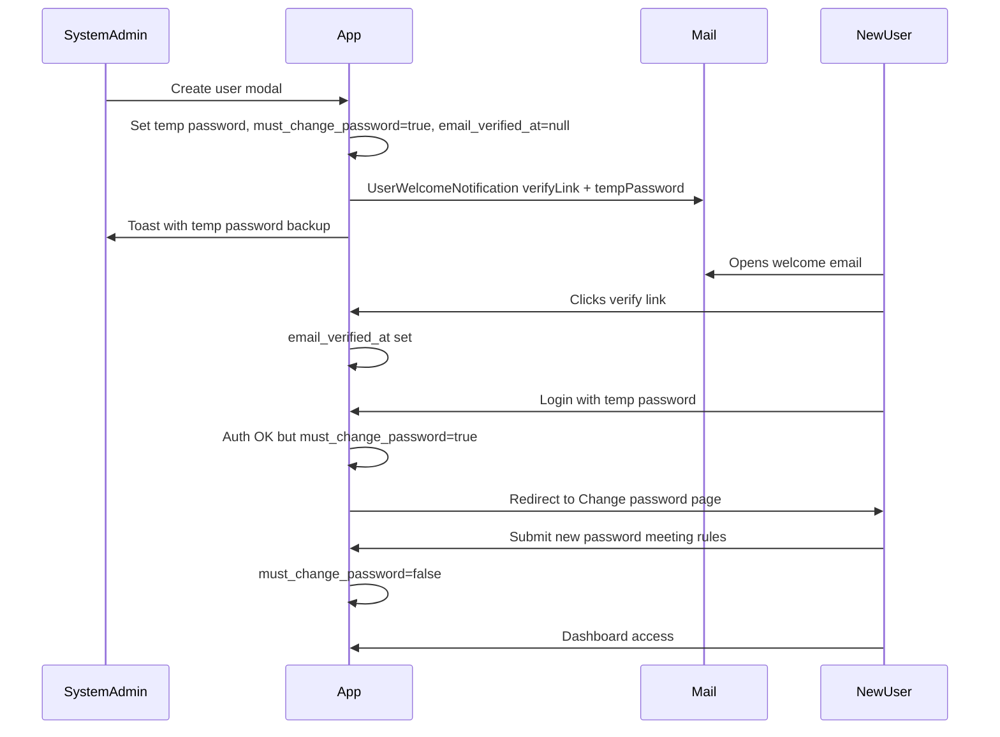

# Forced password change (addendum to workflow notifications)

Extends [`.cursor/plans/workflow_notifications_7c2c73d3.plan.md`](.cursor/plans/workflow_notifications_7c2c73d3.plan.md) **Section 2** (user onboarding) and **Section 3** (forgot password). Does not replace requisition notifications or shared bell infra.

---

## Answer to your question

**Yes** — on admin user create the system sends email with:

1. **Email verification link** (signed URL so the account is verified)
2. **Temporary password** (already generated in [`ListUsers::generateTemporaryPassword()`](app/Filament/Resources/Users/Pages/ListUsers.php))

**Recommended delivery:** one **welcome email** containing both (verify button + temp password + panel login URL). Avoids two separate inbox messages. Laravel’s default `VerifyEmail` notification can be skipped in favor of a custom [`UserWelcomeNotification`](app/Notifications/UserWelcomeNotification.php) that embeds `$user->verificationUrl()` (or calls the same signed route Filament/Laravel uses).

Admin toast still shows the temp password as backup (existing behavior in workflow plan).

---

## End-to-end onboarding flow



**Order:** verify email first (panel already blocks unverified users via `MustVerifyEmail` + `->emailVerification()`), then login with temp password, then forced password change.

---

## 1. Database + User model

**Migration:** add to `users`:

- `must_change_password` — `boolean`, default `false`

**On admin create** ([`ListUsers`](app/Filament/Resources/Users/Pages/ListUsers.php)):

- Set `must_change_password = true` alongside temp password hash
- Keep `email_verified_at = null`

**[`User.php`](app/Models/User.php):**

- Add to `$fillable` / casts
- Helper: `mustChangePassword(): bool`
- Enable `MustVerifyEmail` (already in parent workflow plan)
- Update `canAccessPanel()`: require `hasVerifiedEmail()` **and** allow panel only when not forcing change **or** when request targets the change-password page (see middleware below)

**Seeders / existing users:** leave `must_change_password = false` so current accounts are unaffected.

---

## 2. Central password rules

**[`AppServiceProvider::boot()`](app/Providers/AppServiceProvider.php):**

```php
Password::defaults(fn () => Password::min(8)
    ->letters()
    ->mixedCase()
    ->numbers());
```

| Rule           | Requirement                     |
| -------------- | ------------------------------- |
| Minimum length | 8 characters                    |
| Uppercase      | At least 1                      |
| Lowercase      | At least 1                      |
| Number         | At least 1                      |
| Symbol         | **Not required** (user request) |

Apply everywhere passwords are set by users:

- Forced change page
- Filament forgot-password reset (customize reset form validation or use `Password::defaults()` in reset handler)
- Optional future profile password change

**User-facing message (Filament form helper):** “At least 8 characters with one uppercase letter, one lowercase letter, and one number.”

---

## 3. Forced change password page (Filament)

**New:** [`app/Filament/Pages/Auth/ChangePassword.php`](app/Filament/Pages/Auth/ChangePassword.php)

- Extends Filament simple page (same pattern as login/reset)
- Fields: `password`, `password_confirmation`
- Validation: `['required', 'confirmed', Password::defaults()]`
- On success: hash password, set `must_change_password = false`, redirect to panel dashboard
- No navigation/sidebar; logout link available
- Register on **both** [`AdminPanelProvider`](app/Providers/Filament/AdminPanelProvider.php) and [`SystemAdminPanelProvider`](app/Providers/Filament/SystemAdminPanelProvider.php) as a guest-accessible auth route **or** authenticated-only page (authenticated-only is simpler after login)

**Middleware:** [`app/Http/Middleware/EnsurePasswordChanged.php`](app/Http/Middleware/EnsurePasswordChanged.php)

- If authenticated + `must_change_password` + not already on change-password route → redirect to change-password page
- Register in both panel middleware stacks **after** `Authenticate`

**Login redirect:** after successful login, Filament middleware will intercept before dashboard — no custom login changes needed beyond middleware.

---

## 4. Welcome email content

**Update workflow plan Section 2** — [`UserWelcomeNotification`](app/Notifications/UserWelcomeNotification.php) + [`resources/views/mail/user-welcome.blade.php`](resources/views/mail/user-welcome.blade.php):

- Subject: “Welcome to OWWA Inventory — verify your email”
- Body sections:
    - Verify email button (signed URL)
    - Temporary password (plain text)
    - Login URL for correct panel (admin vs system-admin by role)
    - **Important:** “You will be asked to choose a new password on first login.”

Do **not** send a separate Laravel `VerifyEmail` notification if the welcome mail already includes the verify link (avoids duplicate emails). Call only `UserWelcomeNotification` on create.

---

## 5. Forgot password (Section 3 alignment)

When [`->passwordReset()`](app/Providers/Filament/AdminPanelProvider.php) is enabled, new passwords from reset must use the **same** `Password::defaults()` rules.

After reset, set `must_change_password = false` (user chose their own password).

---

## 6. Tests

**New:** [`tests/Feature/ForcePasswordChangeTest.php`](tests/Feature/ForcePasswordChangeTest.php)

- Admin-created user has `must_change_password = true`
- Verified user with flag cannot reach dashboard; redirected to change-password
- Weak password rejected (no uppercase / no number / too short)
- Valid password clears flag and allows dashboard
- Forgot-password reset accepts password meeting rules; rejects weak password

**Extend:** [`tests/Feature/UserEmailVerificationTest.php`](tests/Feature/UserEmailVerificationTest.php) (from workflow plan)

- Welcome notification includes verify URL and temp password text
- Only one mail/notification sent on create (no duplicate verify)

Run with workflow test suite:

```bash
php artisan test --compact tests/Feature/ForcePasswordChangeTest.php tests/Feature/UserEmailVerificationTest.php tests/Feature/PasswordResetTest.php
vendor/bin/pint --dirty
```

---

## 7. Workflow plan todo updates

Add to existing workflow plan todos (do not recreate unrelated todos):

| New todo ID              | Content                                                                                          |
| ------------------------ | ------------------------------------------------------------------------------------------------ |
| `password-policy`        | Add `must_change_password` migration, `Password::defaults()` in AppServiceProvider, User helpers |
| `force-change-page`      | ChangePassword Filament page + EnsurePasswordChanged middleware on both panels                   |
| `welcome-email-combined` | UserWelcomeNotification with verify link + temp password; set flag on ListUsers create           |
| `password-tests`         | ForcePasswordChangeTest + extend UserEmailVerificationTest                                       |

Insert in implementation order **after** `user-verification`, **before** or **with** `password-reset`:

1. Shared infra
2. Mail transport
3. Email verification + **combined welcome email** + `must_change_password` on create
4. **Forced password change page + middleware**
5. Forgot password (same rules)
6. Requisition notifications
7. Tests

---

## 8. Files to create / touch

| Area          | Files                                                                 |
| ------------- | --------------------------------------------------------------------- |
| Migration     | `add_must_change_password_to_users_table`                             |
| Model         | [`User.php`](app/Models/User.php)                                     |
| Provider      | [`AppServiceProvider.php`](app/Providers/AppServiceProvider.php)      |
| Middleware    | `EnsurePasswordChanged.php`                                           |
| Filament      | `Pages/Auth/ChangePassword.php`, both panel providers                 |
| Notifications | `UserWelcomeNotification`, `mail/user-welcome.blade.php`              |
| User create   | [`ListUsers.php`](app/Filament/Resources/Users/Pages/ListUsers.php)   |
| Tests         | `ForcePasswordChangeTest.php`, extend `UserEmailVerificationTest.php` |

---

## Defense talking point

> New accounts receive **one welcome email** with verification link and a **temporary password**. After verifying and signing in, users **must set their own password** (uppercase, lowercase, number, minimum 8 characters) before using the system. **Forgot password** uses the same rules. This keeps onboarding secure without relying on long-lived temporary credentials.
