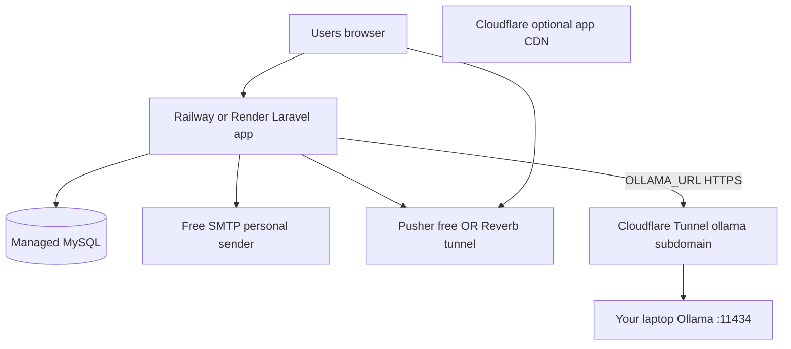

# Free temporary deployment (PaaS + personal SMTP + Reverb + Ollama tunnel)

## Target architecture (your choice: free PaaS)



- **App + DB:** online on Railway/Render.
- **Email:** free SMTP; `MAIL_FROM` = your **personal** email (verified with provider).
- **AI:** Ollama stays on laptop; production `.env` points `OLLAMA_URL` at a **second** Cloudflare Tunnel hostname.
- **Realtime:** prefer **Pusher free sandbox** on PaaS (no long-running Reverb process). Reverb self-host is fallback.

**Out of scope:** OWWA government SMTP/domain, HA production, 24/7 laptop uptime SLA.

---

## 1. Free web hosting (Laravel-capable)

Ranked for **this project** (PHP 8.2+, Composer, MySQL, env vars, HTTPS).

| Provider                                                           | Free tier                        | Laravel fit                  | Reverb on same host               | Notes                                    |
| ------------------------------------------------------------------ | -------------------------------- | ---------------------------- | --------------------------------- | ---------------------------------------- |
| **[Railway](https://railway.app)**                                 | ~$5 credit/month (trial/credits) | **Best PaaS fit**            | Hard (no always-on extra process) | Easy Git deploy, MySQL plugin, env UI    |
| **[Render](https://render.com)**                                   | Free web service                 | Good                         | Hard (free tier sleeps)           | Cold start ~30s; free DB expires or paid |
| **[Fly.io](https://fly.io)**                                       | Small free allowance             | Good                         | Possible with extra machine       | More DevOps; `fly.toml`                  |
| **[Koyeb](https://www.koyeb.com)**                                 | Free nano                        | OK                           | Hard                              | Similar to Render                        |
| **[Oracle Cloud Always Free](https://www.oracle.com/cloud/free/)** | 2 AMD VMs or Ampere ARM          | **Best if you accept Linux** | **Yes** — run `reverb:start`      | Not “one-click”; full control            |
| **HelioHost**                                                      | Free shared PHP                  | Poor                         | No                                | Legacy PHP hosting; avoid for Laravel 12 |
| **InfinityFree / 000webhost**                                      | Free                             | **Poor**                     | No                                | No proper Composer/deploy                |
| **Vercel / Netlify**                                               | Free                             | **No**                       | No                                | Not for traditional Laravel              |
| **Heroku**                                                         | No longer free                   | —                            | —                                 | Skip                                     |

**Recommended for your plan:** **Railway** (primary) or **Render** (backup).

### Railway deploy checklist

1. Connect GitHub repo; add **MySQL** service.
2. Set build: `composer install --no-dev --optimize-autoloader && npm ci && npm run build`.
3. Start: `php artisan migrate --force && php artisan serve --host=0.0.0.0 --port=$PORT` (or use Nixpacks PHP blueprint).
4. Env: `APP_KEY`, `APP_URL=https://your-app.up.railway.app`, `DB_*`, mail vars, `OLLAMA_URL`, broadcast vars.
5. Run `php artisan config:cache` on deploy hook if supported.

### Render caveats

- Free web service **spins down** after inactivity — bad for live panel demo unless you ping it.
- Pair with **Render PostgreSQL** or external free MySQL (Railway DB only).

---

## 2. Free SMTP (personal email as sender)

Use your **personal** address as `MAIL_FROM_ADDRESS` until OWWA provides official mail.

### Option A — Gmail (personal) — simplest if you already use Gmail

1. Google Account → Security → **2-Step Verification** ON.
2. Create **App Password** (Google Account → App passwords).
3. `.env` on Railway:

```env
MAIL_MAILER=smtp
MAIL_HOST=smtp.gmail.com
MAIL_PORT=587
MAIL_USERNAME=you@gmail.com
MAIL_PASSWORD=your-16-char-app-password
MAIL_ENCRYPTION=tls
MAIL_FROM_ADDRESS=you@gmail.com
MAIL_FROM_NAME="OWWA Inventory (Capstone)"
```

Limits: ~500 emails/day; fine for capstone. Recipients see mail **from your Gmail**.

### Option B — Outlook / Hotmail / Live

```env
MAIL_HOST=smtp-mail.outlook.com
MAIL_PORT=587
MAIL_ENCRYPTION=tls
MAIL_USERNAME=you@outlook.com
MAIL_PASSWORD=your-password-or-app-password
```

### Option C — Brevo / Resend (free transactional; verify personal email as sender)

| Provider                               | Free allowance | Setup                                                        |
| -------------------------------------- | -------------- | ------------------------------------------------------------ |
| **[Brevo](https://www.brevo.com)**     | ~300/day       | Verify `you@gmail.com` as sender; use SMTP relay credentials |
| **[Resend](https://resend.com)**       | ~3,000/month   | Verify single sender email; SMTP or API                      |
| **[Mailjet](https://www.mailjet.com)** | ~200/day       | Similar to Brevo                                             |

Better deliverability than raw Gmail; still shows your personal address until you add a domain.

### Option D — Keep `MAIL_MAILER=log` on laptop only

Production PaaS must use real SMTP for verification / forgot-password / rejections ([workflow notifications plan](.cursor/plans/workflow_notifications_7c2c73d3.plan.md)).

### Local testing (no cost)

- **[Mailpit](https://github.com/axllent/mailpit)** — `127.0.0.1:1025`, web UI `8025`.

---

## 3. Realtime (Reverb / WebSockets) on free PaaS

Your app uses [`RequisitionChanged`](app/Events/RequisitionChanged.php) broadcast + Filament Echo ([`config/filament.php`](config/filament.php)). Default `.env`: `BROADCAST_CONNECTION=log` (no live refresh).

**Problem:** `php artisan reverb:start` is a **long-running process**. Railway/Render free tiers usually run **one** web process — Reverb on the same free dyno is awkward.

### Recommended: Pusher Channels free sandbox

|               |                                                                                                                                   |
| ------------- | --------------------------------------------------------------------------------------------------------------------------------- |
| **Free tier** | ~200k messages/day, 100 concurrent connections (sandbox)                                                                          |
| **Laravel**   | Set `BROADCAST_CONNECTION=pusher`; install/config already supports pusher in [`config/broadcasting.php`](config/broadcasting.php) |
| **Filament**  | Point Echo config to Pusher host/keys instead of Reverb                                                                           |

```env
BROADCAST_CONNECTION=pusher
PUSHER_APP_ID=...
PUSHER_APP_KEY=...
PUSHER_APP_SECRET=...
PUSHER_APP_CLUSTER=mt1

VITE_PUSHER_APP_KEY="${PUSHER_APP_KEY}"
VITE_PUSHER_APP_CLUSTER="${PUSHER_APP_CLUSTER}"
```

Rebuild frontend (`npm run build`) after Vite env change.

**Code touch (when implementing):** update [`AdminPanelProvider`](app/Providers/Filament/AdminPanelProvider.php) Filament `broadcasting.echo` block to read Pusher vars when `BROADCAST_CONNECTION=pusher`.

### Alternative free realtime providers

| Provider                         | Free tier       | Notes                    |
| -------------------------------- | --------------- | ------------------------ |
| **[Pusher](https://pusher.com)** | Sandbox above   | **Recommended for PaaS** |
| **[Ably](https://ably.com)**     | ~6M msgs/month  | Laravel driver available |
| **Self-host Reverb**             | $0 on Oracle VM | Run alongside app        |
| **Soketi** (Pusher-compatible)   | $0 self-host    | Same VM as app           |

### Fallback: Cloudflare Tunnel to laptop Reverb (not recommended)

Possible but fragile: tunnel `wss://reverb.yourdomain.com` → laptop `reverb:start`. Laptop must stay on; same as Ollama. Use only if you refuse Pusher.

### Accept degraded mode

`BROADCAST_CONNECTION=log` — tables still work; users refresh manually. OK for minimal demo.

---

## 4. Ollama on laptop → production via Cloudflare Tunnel

Production PaaS calls Ollama through HTTP ([`OllamaClient`](app/Services/OllamaClient.php) uses `config('services.ollama.url')`).

### Architecture

1. **Tunnel A (optional):** expose Railway app on custom domain via Cloudflare.
2. **Tunnel B (required for AI):** on laptop, expose `http://127.0.0.1:11434` as `https://ollama.yourdomain.com`.

### Laptop: install and run Ollama

```bash
ollama pull nomic-embed-text
ollama pull deepseek-v3.2:7b   # or model in your .env
ollama serve                   # listens :11434
```

### Laptop: Cloudflare Tunnel config (second tunnel)

```yaml
# ~/.cloudflared/ollama-config.yml
tunnel: <OLLAMA_TUNNEL_ID>
credentials-file: C:\Users\<you>\.cloudflared\<OLLAMA_TUNNEL_ID>.json

ingress:
  - hostname: ollama.yourdomain.com
    service: http://127.0.0.1:11434
  - service: http_status:404
```

```bash
cloudflared tunnel create owwa-ollama
cloudflared tunnel route dns owwa-ollama ollama.yourdomain.com
cloudflared tunnel --config ollama-config.yml run owwa-ollama
```

Run as Windows service (NSSM) or Task Scheduler so it survives reboot during demo week.

### Production `.env` (Railway)

```env
OLLAMA_URL=https://ollama.yourdomain.com
OLLAMA_EMBED_MODEL=nomic-embed-text
OLLAMA_CHAT_MODEL=deepseek-v3.2:7b
```

**No code change** if URL is reachable; [`OllamaClient`](app/Services/OllamaClient.php) already uses HTTP.

### Security (critical)

Ollama has **no built-in auth**. A public tunnel exposes your GPU/CPU to the internet.

| Mitigation                                                                           | Required?                |
| ------------------------------------------------------------------------------------ | ------------------------ |
| **Cloudflare Access** (email OTP / Google login) in front of `ollama.yourdomain.com` | **Strongly recommended** |
| Separate tunnel hostname (not same as app)                                           | Yes                      |
| Do not commit tunnel tokens                                                          | Yes                      |
| Turn tunnel off when not demoing                                                     | Recommended              |

Without Access, anyone who discovers the URL can use your Ollama.

### Operational limits

- Laptop must be **on**, Ollama running, tunnel connected.
- Procurement Analytics / RAG fail gracefully today (`__OLLAMA_UNAVAILABLE__` in [`ProcurementAnalytics`](app/Filament/Pages/ProcurementAnalytics.php)).
- Latency: PaaS → Cloudflare → home internet → laptop; 30–120s chat timeout already in client.

---

## 5. Environment matrix

| Variable               | Laptop dev               | Railway production                    |
| ---------------------- | ------------------------ | ------------------------------------- |
| `APP_URL`              | `http://localhost:8000`  | `https://your-app.up.railway.app`     |
| `MAIL_MAILER`          | `log` or Mailpit `smtp`  | Gmail / Brevo `smtp`                  |
| `MAIL_FROM_ADDRESS`    | test@example.com         | **your personal email**               |
| `BROADCAST_CONNECTION` | `reverb` or `log`        | `pusher` (recommended)                |
| `OLLAMA_URL`           | `http://127.0.0.1:11434` | `https://ollama.yourdomain.com`       |
| `QUEUE_CONNECTION`     | `database`               | `sync` or `database` + worker if paid |

---

## 6. Implementation tasks (when you execute this plan)

| Task                             | Files / actions                                                                                                                                    |
| -------------------------------- | -------------------------------------------------------------------------------------------------------------------------------------------------- |
| Document production env template | Extend [`.env.example`](.env.example) with commented blocks: PaaS, Gmail SMTP, Pusher, Ollama tunnel URL                                           |
| Pusher path for Filament Echo    | [`config/filament.php`](config/filament.php), [`AdminPanelProvider`](app/Providers/Filament/AdminPanelProvider.php) — conditional Reverb vs Pusher |
| Trust proxies on PaaS            | [`bootstrap/app.php`](bootstrap/app.php) or middleware — `TrustProxies` for HTTPS behind Railway                                                   |
| Ollama tunnel runbook            | Add section to [`docs/DEPLOYMENT.md`](docs/DEPLOYMENT.md) (Ollama tunnel + Access, separate from app tunnel)                                       |
| Deploy smoke test                | Artisan command or doc step: `php artisan tinker` → test mail + HTTP GET Ollama `/api/tags` from server                                            |

**No app feature code required** for basic Ollama tunnel — only env + infrastructure.

---

## 7. Suggested rollout order

1. Deploy app to **Railway** + MySQL; `APP_URL`, migrate, login works.
2. Configure **Gmail or Brevo** SMTP; test verification email ([workflow notifications plan](.cursor/plans/workflow_notifications_7c2c73d3.plan.md)).
3. Create **Pusher** app; switch broadcast; rebuild assets; test requisition live refresh.
4. Create **Ollama tunnel** on laptop + Cloudflare Access; set `OLLAMA_URL` on Railway; test Procurement Analytics.
5. Optional: custom domain on app via Cloudflare.

---

## 8. Cost summary (temporary capstone)

| Item                        | Cost                                                              |
| --------------------------- | ----------------------------------------------------------------- |
| Railway / Render            | $0 within free credits                                            |
| Gmail / Brevo / Resend SMTP | $0                                                                |
| Pusher sandbox              | $0                                                                |
| Cloudflare Tunnel + DNS     | $0                                                                |
| Ollama local                | $0                                                                |
| Domain name                 | ~$0–15/year if you buy one; free subdomain on `railway.app` works |

---

## Defense talking point

> The system is deployed on free cloud hosting for the capstone demo. Transactional email uses a verified **personal SMTP sender** until agency mail is available. Realtime requisitions use **Pusher’s free tier** because managed hosts cannot run Reverb alongside PHP. AI features call **Ollama on the developer machine** through a **secured Cloudflare Tunnel**, so the production app does not host the model.
