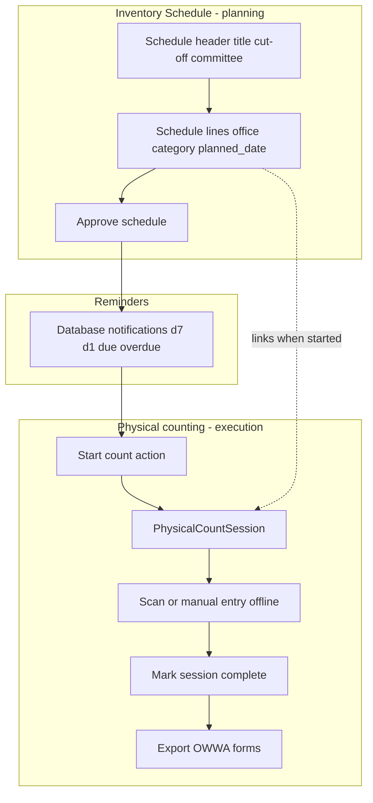
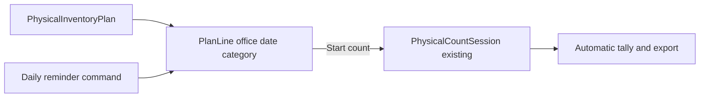

# Inventory Schedule, schedule lines, and reminders

## What is Inventory Schedule vs physical counting?

**They are related but not the same thing.**

| Layer                  | What it is                                                                                                          | In the system                                                          |
| ---------------------- | ------------------------------------------------------------------------------------------------------------------- | ---------------------------------------------------------------------- |
| **Inventory Schedule** | Year-end **planning** document: which offices count which category on which dates, cut-off, committee, COA timeline | `PhysicalInventoryPlan` + schedule lines (`PhysicalInventoryPlanLine`) |
| **Physical counting**  | **Execution**: scan/count items on-site, tally, mark session complete, export RPCI / RPCPPE / RPCSP                 | Existing `PhysicalCountSession` workflow                               |



**Short answer:** Inventory Schedule is **not** physical counting itself. It **schedules when and where** counts should happen, sends **reminders**, and provides a **Start count** button that **creates or opens** the same physical count session you would use from the Physical counts menu. Counting still happens in the existing physical count workflow (including offline scanning where supported).

---

## Feature walkthrough (all details)

### Schedule header (`PhysicalInventoryPlan`)

| Field                   | Purpose                                                                                                              |
| ----------------------- | -------------------------------------------------------------------------------------------------------------------- |
| **Reference**           | Auto `IP-YYYYMMDD-####`                                                                                              |
| **Title**               | e.g. "FY 2026 Year-end Semi-Expendable Count"                                                                        |
| **Period label**        | Optional text (`FY 2026`) — not linked to fiscal_years table                                                         |
| **Cut-off date**        | Last date counts may be scheduled; inventory as-of this date for COA                                                 |
| **Default category**    | Hidden when opened from category dashboard; scopes list/filter                                                       |
| **COA submission date** | When COA paperwork was/will be submitted                                                                             |
| **Committee**           | Chair, property officer, accounting officer (optional names)                                                         |
| **Status**              | `draft` → **Approve** → `approved` → `in_progress` (when any count started) → **Mark completed** when all lines done |

### Schedule lines (repeater / view table)

Each line is one **office + category + planned date**:

| Field                 | Purpose                                                                           |
| --------------------- | --------------------------------------------------------------------------------- |
| **Office**            | Any **active** office (regional + satellites)                                     |
| **Category**          | Consumables, Semi-Expendable, PPE, etc.                                           |
| **Planned date**      | Target date for that office’s count                                               |
| **Status** (computed) | `pending` / `in_progress` / `complete` / `overdue`                                |
| **Actions**           | **Start count** → **Continue** → **View count** (links to `PhysicalCountSession`) |

**Line status rules:**

- **Pending** — no physical count session yet
- **In progress** — session exists but not complete
- **Complete** — linked session is `STATUS_COMPLETE`
- **Overdue** — planned date is in the past (not today) and session not complete

**Plan progress:** `completed lines / total lines` (percent in view modal).

### Workflow steps

1. Supply Custodian opens category dashboard → **Inventory Schedule**
2. Creates schedule (modal): header + one or more lines
3. **Approve schedule** on view modal
4. On or before planned dates, custodian gets **bell notifications** (7 days, 1 day, due, overdue)
5. **Start count** on a line → creates `PhysicalCountSession` (RPCI/RPCPPE/RPCSP by category) with `count_date = planned_date`
6. Custodian completes count in existing Physical counts UI
7. When all lines complete → **Mark completed** on schedule

### Reminders

- Daily command `inventory:send-plan-reminders` at 08:00
- Only **approved** or **in_progress** schedules; skips complete sessions
- All supply custodians receive database (bell) notifications — no email

### Naming (user-facing)

All UI labels, toasts, notification titles, and validation messages should say **Inventory Schedule** (not "Inventory plan").

**Keep internal names** (`PhysicalInventoryPlan`, table `physical_inventory_plans`, PHP classes) to avoid a large refactor — only change `$navigationLabel`, `$modelLabel`, `$pluralModelLabel`, page titles, dashboard card, notification copy, and validator error strings.

**Files to relabel:** [`InventoryCategoryDashboard`](app/Filament/Pages/InventoryCategoryDashboard.php), [`PhysicalInventoryPlanResource`](app/Filament/Resources/PhysicalInventoryPlans/PhysicalInventoryPlanResource.php), list/create/view modals, [`InventoryPlanReminderNotification`](app/Notifications/InventoryPlanReminderNotification.php), [`InventoryPlanValidator`](app/Services/InventoryPlanValidator.php) messages, empty states.

---

## Scope

- **In:** `PhysicalInventoryPlan` + `PhysicalInventoryPlanLine`, Filament CRUD for Supply Custodian, **Start count** bridge to existing [`PhysicalCountSession`](app/Models/PhysicalCountSession.php), line status sync, scheduled **database notifications** (7 days before, 1 day before, due date, overdue).
- **Out:** Restoring `fiscal_years` table or FY-scoped offices/items; email reminders; audit pack ZIP; committee PDF export.

## Business model (aligned with prior clarifications)

- One regional Supply Custodian manages **all active offices** on schedule lines (same as unlocked transfers—not `CustodianOfficeScope::officeQuery()`).
- Physical counting remains **offline**; the system plans dates, reminds, and launches the existing count workflow.



---

## 1. Database

**Migration A** — `physical_inventory_plans`

| Column                                                                     | Notes                                                        |
| -------------------------------------------------------------------------- | ------------------------------------------------------------ |
| `reference_code`                                                           | Unique, auto-generated `IP-YYYYMMDD-####`                    |
| `title`                                                                    | e.g. "FY 2026 Year-end PPE Count"                            |
| `period_label`                                                             | Optional string (`FY 2026`) — **not** a fiscal_years FK      |
| `cut_off_date`                                                             | Required date                                                |
| `status`                                                                   | `draft`, `approved`, `in_progress`, `completed`, `cancelled` |
| `item_category_id`                                                         | Nullable FK — default scope when lines omit category         |
| `committee_chair_name`, `property_officer_name`, `accounting_officer_name` | Optional text                                                |
| `approved_at`, `coa_submitted_at`                                          | Optional dates                                               |
| `recorded_by`                                                              | FK users                                                     |

**Migration B** — `physical_inventory_plan_lines`

| Column                       | Notes                                                   |
| ---------------------------- | ------------------------------------------------------- |
| `physical_inventory_plan_id` | FK cascade                                              |
| `office_id`                  | FK                                                      |
| `item_category_id`           | FK (required per line)                                  |
| `planned_date`               | Required date                                           |
| `physical_count_session_id`  | Nullable unique FK → links execution                    |
| `last_reminder_type`         | Nullable string (`d7`, `d1`, `due`, `overdue`) — dedupe |
| `last_reminded_at`           | Nullable timestamp                                      |

**Migration C** — `notifications` table (`php artisan notifications:table`) if not present.

No changes to `physical_count_sessions` columns required (link is on the plan line).

---

## 2. Models and relationships

**New:** [`app/Models/PhysicalInventoryPlan.php`](app/Models/PhysicalInventoryPlan.php), [`app/Models/PhysicalInventoryPlanLine.php`](app/Models/PhysicalInventoryPlanLine.php)

- `PhysicalInventoryPlan::lines()` HasMany
- `PhysicalInventoryPlanLine::plan()`, `office()`, `itemCategory()`, `physicalCountSession()` BelongsTo
- Line **computed status** via method (not stored): `pending` | `in_progress` | `complete` | `overdue` (overdue = `planned_date` < today and session not complete)
- Plan **progress**: count lines where session `STATUS_COMPLETE` / total lines

**Factory** for plan + line (minimal) for tests.

---

## 3. Services and validation

### [`app/Services/InventoryPlanValidator.php`](app/Services/InventoryPlanValidator.php)

Server-side rules (throw `ValidationException`):

| Rule                                                                     | Intent                                                        |
| ------------------------------------------------------------------------ | ------------------------------------------------------------- |
| `title` required                                                         | Schedule must be named                                        |
| `cut_off_date` required                                                  | COA cut-off                                                   |
| `cut_off_date` ≥ **today**                                               | Cannot set cut-off in the past                                |
| `planned_date` on each line required                                     | Schedule date                                                 |
| `planned_date` ≥ **today**                                               | Cannot schedule counts in the past                            |
| `planned_date` ≤ `cut_off_date`                                          | Count on or before cut-off                                    |
| `office_id` + `item_category_id` required per line                       | What/where to count                                           |
| **Unique** `(plan_id, office_id, item_category_id)`                      | No duplicate office+category in same schedule                 |
| `coa_submitted_at` ≤ first `planned_date` **minus 10 days** (strict)     | COA must be submitted at least 10 days before the first count |
| Cannot mark schedule `completed` unless all lines have complete sessions | Gate on status transition                                     |
| Cannot delete line with linked session                                   | Protect audit trail                                           |

**Form UI (mirror server rules):**

- `DatePicker::make('cut_off_date')->minDate(today())`
- `DatePicker::make('planned_date')->minDate(today())` on repeater lines
- COA helper: "Must be at least 10 days before the first scheduled count."

**Tests to add/update in [`InventoryPlanValidatorTest`](tests/Unit/InventoryPlanValidatorTest.php):**

- Rejects `planned_date` before today
- Rejects `cut_off_date` before today
- Rejects `coa_submitted_at` fewer than 10 days before first planned date

Call from create/edit plan pages and status actions.

### [`app/Services/InventoryPlanLineStatusService.php`](app/Services/InventoryPlanLineStatusService.php)

- `statusForLine(PhysicalInventoryPlanLine $line): string`
- `syncPlanStatus(PhysicalInventoryPlan $plan): void` — promote plan to `in_progress` when any line has a session; `completed` when all lines complete

### [`app/Services/InventoryPlanStartCountService.php`](app/Services/InventoryPlanStartCountService.php)

`startCount(PhysicalInventoryPlanLine $line, User $user): PhysicalCountSession`

- Reject if line already has a session
- Create session with `office_id`, `item_category_id`, `count_date = planned_date`, `count_type` from category slug (same mapping as [`ListPhysicalCountSessions`](app/Filament/Resources/PhysicalCountSessions/Pages/ListPhysicalCountSessions.php))
- Merge [`OfficeSignatoryDefaults::forPhysicalCountSession`](app/Support/OfficeSignatoryDefaults.php)
- Set `physical_count_session_id` on line; set plan status `in_progress`

### [`app/Services/InventoryPlanReminderService.php`](app/Services/InventoryPlanReminderService.php)

`sendDueReminders(): array{sent: int, skipped: int}`

For each line on **approved** or **in_progress** plans where session is not complete:

| Condition                       | `last_reminder_type` | Notification title                     |
| ------------------------------- | -------------------- | -------------------------------------- |
| `planned_date` = today + 7 days | `d7`                 | "Inventory count in 7 days — {office}" |
| `planned_date` = today + 1 day  | `d1`                 | "Inventory count tomorrow — {office}"  |
| `planned_date` = today          | `due`                | "Inventory count today — {office}"     |
| `planned_date` < today          | `overdue`            | "Overdue inventory count — {office}"   |

- Send to all users with `ROLE_SUPPLY_CUSTODIAN` via Laravel `Notification` → database channel.
- **Dedupe:** skip if `last_reminder_type` already equals current type for that line; update `last_reminded_at` on send.
- Notification `data` includes `plan_line_id`, `plan_id`, action URL to plan view.

### Observer hook

Extend or add listener: when [`PhysicalCountSession`](app/Models/PhysicalCountSession.php) transitions to `STATUS_COMPLETE`, call `InventoryPlanLineStatusService::syncPlanStatus` for the linked plan.

Wire in [`AppServiceProvider`](app/Providers/AppServiceProvider.php) or a small `PhysicalCountSessionObserver` addition (check if observer exists).

---

## 4. Filament UI

**New resource:** [`app/Filament/Resources/PhysicalInventoryPlans/`](app/Filament/Resources/PhysicalInventoryPlans/)

Mirror patterns from Physical counts / Transfers:

| Piece                                                       | Details                                                                                  |
| ----------------------------------------------------------- | ---------------------------------------------------------------------------------------- |
| `PhysicalInventoryPlanResource`                             | `shouldRegisterNavigation = false` (category dashboard entry)                            |
| `ListPhysicalInventoryPlans`                                | Table: reference, title, period_label, cut_off_date, progress badge, status              |
| `CreatePhysicalInventoryPlan` / `EditPhysicalInventoryPlan` | Form with plan header + **Repeater** for schedule lines (office, category, planned_date) |
| `ViewPhysicalInventoryPlan`                                 | Hero: progress bar, cut-off, committee; **schedule table** with line status + actions    |

**Schedule line actions (on View):**

- **Start count** — visible when `pending` or `overdue` and no session; calls `InventoryPlanStartCountService`, redirects to existing physical count view/scan URL
- **Continue count** — when session in progress
- **View count** — when session complete (link to `PhysicalCountSessionResource`)

**Form fields (plan header):**

- Title, period label, cut-off date, optional committee names, COA submitted date
- Status (draft → approved via action; completed via action when validator passes)

**Office select on lines:** all active offices (`Office::query()->active()`), not custodian-locked.

---

## Form field UX (optional labels + hover help)

Target: [`PhysicalInventoryPlanForm.php`](app/Filament/Resources/PhysicalInventoryPlans/Schemas/PhysicalInventoryPlanForm.php) (create/edit modal). Match existing app conventions from [`IssuanceForm.php`](app/Filament/Resources/Issuances/Schemas/IssuanceForm.php) and [`ItemViewActions.php`](app/Filament/Resources/Items/Actions/ItemViewActions.php) (`Office (optional)` label pattern).

### Filament APIs to use

| Need                | Method                                          | Behavior                                                |
| ------------------- | ----------------------------------------------- | ------------------------------------------------------- |
| Optional indicator  | `->label('… (optional)')`                       | Clear at a glance; no asterisk on optional fields       |
| Input example       | `->placeholder('…')`                            | Shown when empty; not saved                             |
| Always-visible hint | `->helperText('…')`                             | Gray text below field (validation rules, short context) |
| Hover explanation   | `->hintIcon(Heroicon::QuestionMarkCircle, '…')` | Question-mark icon beside label; tooltip on hover       |

Use **both** `helperText()` (short, rule-related) and `hintIcon()` (longer explanation on hover) on every field. Optional fields get `(optional)` in the label **and** a placeholder where it helps.

Add section-level context:

```php
Section::make('Schedule details')
    ->description('Header info for this Inventory Schedule. Schedule lines below list each office and count date.')
```

Rename section `Plan details` → `Schedule details` to align with user-facing "Inventory Schedule" naming.

### Field copy (create modal)

**Header section**

| Field                                      | Label                          | Placeholder                                 | helperText                                                        | hintIcon tooltip                                                                   |
| ------------------------------------------ | ------------------------------ | ------------------------------------------- | ----------------------------------------------------------------- | ---------------------------------------------------------------------------------- |
| `title`                                    | Title                          | e.g. FY 2026 Year-end Semi-Expendable Count | Short name shown in the list and reminders.                       | Identifies this schedule in notifications and exports.                             |
| `period_label`                             | Period label (optional)        | FY 2026                                     | Optional label for reports; not linked to the Fiscal Years table. | Display-only text such as fiscal year or quarter. Leave blank if not needed.       |
| `cut_off_date`                             | Cut-off date                   | —                                           | Last date a count may be scheduled; inventory is as-of this date. | Must be today or later. Every planned date must fall on or before cut-off.         |
| `coa_submitted_at`                         | COA submission date (optional) | —                                           | Must be at least 10 days before the first scheduled count.        | Date COA paperwork was or will be submitted to support the year-end report.        |
| `committee_chair_name`                     | Committee chair (optional)     | Full name                                   | Printed on committee signatory blocks when exported.              | Chair of the physical inventory committee.                                         |
| `property_officer_name`                    | Property officer (optional)    | Full name                                   | Printed on committee signatory blocks when exported.              | Property officer signatory for the count.                                          |
| `accounting_officer_name`                  | Accounting officer (optional)  | Full name                                   | Printed on committee signatory blocks when exported.              | Accounting officer signatory for the count.                                        |
| `item_category_id` (default, when visible) | Default category (optional)    | —                                           | Pre-fills category on new schedule lines.                         | When set, new lines inherit this category. You can still change category per line. |

**Schedule repeater (`lines`)**

| Field              | Label          | Placeholder   | helperText                                    | hintIcon tooltip                                                                                              |
| ------------------ | -------------- | ------------- | --------------------------------------------- | ------------------------------------------------------------------------------------------------------------- |
| Repeater           | Schedule lines | —             | Add one row per office and count date.        | Each line becomes a separate physical count. Duplicate office + category in the same schedule is not allowed. |
| `office_id`        | Office         | Select office | Active office that will perform the count.    | Regional or satellite office included in this schedule.                                                       |
| `item_category_id` | Category       | —             | Consumables, Semi-Expendable, PPE, etc.       | Determines the count form (RPCI, RPCPPE, or RPCSP) when you start the count.                                  |
| `planned_date`     | Planned date   | —             | Target date for this office's physical count. | Must be today or later and on or before the cut-off date.                                                     |

Import: `use Filament\Support\Icons\Heroicon;`

### Out of scope for this pass

- View modal infolist entries (`PhysicalInventoryPlanInfolist`) — read-only; labels already clear. Add tooltips later only if needed.
- Other resources — Inventory Schedule form only.

### Verification

- Open create modal from category dashboard; confirm optional fields show `(optional)`, placeholders render, helper text visible, and question-mark icons show tooltips on hover.
- No change to validation logic beyond copy alignment with date-validation todo.

**Category dashboard** — add card in [`InventoryCategoryDashboard::getTaskCards()`](app/Filament/Pages/InventoryCategoryDashboard.php):

```php
'title' => 'Inventory Schedule',
'description' => 'Schedule year-end counts by office and date; get reminders when counts are due.',
'url' => PhysicalInventoryPlanResource::getUrl('index') // category filter via session
```

Filter list to plans where `item_category_id` matches `active_item_category_id` OR any line matches category (service query class `InventoryPlanCategoryQuery`).

---

## 5. Database notifications (bell icon)

Currently the app only has **toasts** and **requisition broadcasts**—no `notifications` table.

1. Run `php artisan notifications:table` migration
2. Enable on panel in [`AdminPanelProvider`](app/Providers/Filament/AdminPanelProvider.php): `->databaseNotifications()`
3. **New:** [`app/Notifications/InventoryPlanReminderNotification.php`](app/Notifications/InventoryPlanReminderNotification.php) — `via(['database'])`, Filament-compatible array shape with `title`, `body`, `actions` (link to plan view)
4. User model already uses `Notifiable`

---

## 6. Scheduler

**New command:** [`app/Console/Commands/SendInventoryPlanReminders.php`](app/Console/Commands/SendInventoryPlanReminders.php)

```php
$schedule->command('inventory:send-plan-reminders')->dailyAt('08:00');
```

Register in [`bootstrap/app.php`](bootstrap/app.php) alongside existing scheduled commands.

---

## 7. Tests

### Unit — [`tests/Unit/InventoryPlanValidatorTest.php`](tests/Unit/InventoryPlanValidatorTest.php)

- Rejects duplicate office+category on same plan
- Rejects `planned_date` after `cut_off_date`
- Rejects `coa_submitted_at` on/after first planned date
- Blocks plan completion when a line has no complete session
- Allows valid plan with multiple offices

### Unit — [`tests/Unit/InventoryPlanLineStatusServiceTest.php`](tests/Unit/InventoryPlanLineStatusServiceTest.php)

- `pending` when no session
- `in_progress` when session not complete
- `complete` when session `STATUS_COMPLETE`
- `overdue` when date passed and not complete

### Unit — [`tests/Unit/InventoryPlanReminderServiceTest.php`](tests/Unit/InventoryPlanReminderServiceTest.php)

- Sends `d7` notification 7 days before
- Sends `due` on planned date
- Sends `overdue` after planned date
- Skips duplicate `last_reminder_type`
- Skips lines on draft plans
- Skips lines with complete sessions

### Unit — [`tests/Unit/InventoryPlanStartCountServiceTest.php`](tests/Unit/InventoryPlanStartCountServiceTest.php)

- Creates linked `PhysicalCountSession` with correct office, category, date, count_type
- Rejects second start on same line

### Feature — [`tests/Feature/InventoryPlanResourceTest.php`](tests/Feature/InventoryPlanResourceTest.php)

- Supply custodian can create plan with lines (Livewire)
- Start count action links session and redirects
- Non-custodian cannot access

### Feature — [`tests/Feature/SendInventoryPlanRemindersCommandTest.php`](tests/Feature/SendInventoryPlanRemindersCommandTest.php)

- `artisan inventory:send-plan-reminders` writes database notification for custodian

Run:

```bash
php artisan test --compact tests/Unit/InventoryPlanValidatorTest.php tests/Unit/InventoryPlanLineStatusServiceTest.php tests/Unit/InventoryPlanReminderServiceTest.php tests/Unit/InventoryPlanStartCountServiceTest.php tests/Feature/InventoryPlanResourceTest.php tests/Feature/SendInventoryPlanRemindersCommandTest.php
vendor/bin/pint --dirty
```

---

## 8. Files to create / touch

| Area          | Files                                                                                                                                                      |
| ------------- | ---------------------------------------------------------------------------------------------------------------------------------------------------------- |
| Migrations    | `create_physical_inventory_plans_tables`, `create_notifications_table`                                                                                     |
| Models        | `PhysicalInventoryPlan`, `PhysicalInventoryPlanLine` + factories                                                                                           |
| Services      | `InventoryPlanValidator`, `InventoryPlanLineStatusService`, `InventoryPlanStartCountService`, `InventoryPlanReminderService`, `InventoryPlanCategoryQuery` |
| Notifications | `InventoryPlanReminderNotification`                                                                                                                        |
| Console       | `SendInventoryPlanReminders`                                                                                                                               |
| Filament      | Resource, Form, Table, Infolist, List/Create/Edit/View pages                                                                                               |
| Wiring        | `InventoryCategoryDashboard`, `AdminPanelProvider`, `bootstrap/app.php`, `PhysicalCountSession` completion hook                                            |
| Tests         | 6 test files above                                                                                                                                         |

**Unchanged:** Fiscal years, physical count scan/tally/export logic, requisition broadcast notifications.

---

## Defense talking point

> **Inventory Schedule** plans **when and where** year-end physical counts happen. Counting itself uses the existing **Physical counts** module (scan, tally, export). The schedule sends **bell reminders**, links each office/date to a count session via **Start count**, and tracks progress until every line is complete.
