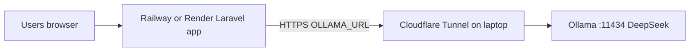

# Ollama on laptop + Cloudflare Tunnel (PaaS app)

## Architecture (your setup)



- **Laravel app** stays on **PaaS** (online 24/7).
- **Ollama** stays on **your laptop** only.
- App calls Ollama via [`OllamaClient`](app/Services/OllamaClient.php) using `OLLAMA_URL` — **no app code change** for basic HTTP tunnel.

**Affected features when Ollama is down:** Procurement Analytics AI narrative, RAG embeddings/chat ([`RagService`](app/Services/RagService.php)). App still works; shows deterministic fallback (`__OLLAMA_UNAVAILABLE__`).

---

## What you need (checklist)

### On your laptop (always when demoing AI)

| Item                                    | Purpose                               |
| --------------------------------------- | ------------------------------------- |
| [Ollama](https://ollama.com/download)   | Runs DeepSeek locally                 |
| Models: `nomic-embed-text` + chat model | Embeddings + recommendations          |
| `cloudflared`                           | Tunnel to expose `:11434` to internet |
| Laptop **on**, not sleeping             | Tunnel + Ollama must run during demo  |
| Stable internet                         | PaaS → Cloudflare → your home network |

### On PaaS (Railway / Render)

| Env var              | Example                                   |
| -------------------- | ----------------------------------------- |
| `OLLAMA_URL`         | Tunnel HTTPS URL (see below)              |
| `OLLAMA_EMBED_MODEL` | `nomic-embed-text`                        |
| `OLLAMA_CHAT_MODEL`  | Match your `.env` (e.g. `deepseek-r1:7b`) |

### Optional but recommended later

- **Own domain on Cloudflare** — stable `ollama.yourdomain.com` (URL hindi nagbabago every restart)
- **Cloudflare Access + Service Token** — Ollama has **no auth**; public tunnel = anyone can use your GPU

---

## Step 1 — Install and prepare Ollama (laptop)

```powershell
ollama pull nomic-embed-text
ollama pull deepseek-r1:7b
```

Match `OLLAMA_CHAT_MODEL` sa production sa exact name from `ollama list`.

Verify locally:

```powershell
curl http://127.0.0.1:11434/api/tags
php artisan ollama:test
```

**Keep Ollama bound to localhost** (`127.0.0.1:11434`) — tunnel connects locally; huwag i-expose ang port 11434 sa router/firewall.

Docs: [`docs/OLLAMA_DEEPSEEK.md`](docs/OLLAMA_DEEPSEEK.md), [`docs/DESIGNS_AND_OLLAMA_SETUP.md`](docs/DESIGNS_AND_OLLAMA_SETUP.md)

---

## Step 2 — Install cloudflared (laptop)

```powershell
winget install Cloudflare.cloudflared
```

---

## Step 3 — Tunnel options (wala kang domain pa)

### Option A — Quick tunnel (OK for testing / short demo)

**Pros:** Walang domain, mabilis.  
**Cons:** URL **nagbabago** kada restart; **walang auth** — treat as temporary public endpoint.

**Verified working (June 2026):** set User env vars `OLLAMA_ORIGINS=*` and `OLLAMA_HOST=0.0.0.0:11434`, restart Ollama, then:

```powershell
& "C:\Program Files (x86)\cloudflared\cloudflared.exe" tunnel --url http://localhost:11434 --http-host-header="localhost:11434"
```

`curl.exe -v https://xxxx.trycloudflare.com/` → `HTTP/1.1 200 OK` + `Ollama is running`.

Copy ang **bagong** `https://xxxx.trycloudflare.com` mula sa terminal na iyon (hindi lumang URL).

Sa **Railway/Render** → Environment variables:

```env
OLLAMA_URL=https://xxxx.trycloudflare.com
OLLAMA_EMBED_MODEL=nomic-embed-text
OLLAMA_CHAT_MODEL=deepseek-r1:7b
```

Redeploy / `php artisan config:clear` on host.

**Before each demo session:** i-restart ang quick tunnel kung nag-close, i-update ang `OLLAMA_URL` sa PaaS kung bagong URL.

Test from PaaS shell (if available):

```bash
php artisan ollama:test
```

### Option B — Named tunnel + domain (recommended for defense week)

Kailangan ng domain na naka-add sa Cloudflare (mura ~$10/yr o school-provided).

1. `cloudflared tunnel login`
2. `cloudflared tunnel create owwa-ollama`
3. Config `~/.cloudflared/ollama-config.yml`:

```yaml
tunnel: <OLLAMA_TUNNEL_ID>
credentials-file: C:\Users\<you>\.cloudflared\<OLLAMA_TUNNEL_ID>.json

ingress:
  - hostname: ollama.yourdomain.com
    service: http://127.0.0.1:11434
  - service: http_status:404
```

4. `cloudflared tunnel route dns owwa-ollama ollama.yourdomain.com`
5. Run as Windows service (NSSM) or Task Scheduler at startup

Production:

```env
OLLAMA_URL=https://ollama.yourdomain.com
```

Full reference: [`.cursor/plans/free_demo_deployment_524e58bb.plan.md`](.cursor/plans/free_demo_deployment_524e58bb.plan.md) section 4, [`docs/DEPLOYMENT.md`](docs/DEPLOYMENT.md)

---

## Step 4 — Security (important)

Ollama API has **no login**. Kung naka-public ang tunnel URL, puwedeng gamitin ng iba ang model mo.

| Scenario                             | Risk                               | Mitigation                                       |
| ------------------------------------ | ---------------------------------- | ------------------------------------------------ |
| trycloudflare quick tunnel           | High — random URL but still public | Gamitin lang during demo; **patayin** pagkatapos |
| Named tunnel without Access          | High                               | Huwag i-share ang URL                            |
| Named tunnel + **Cloudflare Access** | Low                                | Email OTP / Google login sa hostname             |

**Note for PaaS → Ollama:** Browser-based Cloudflare Access (email OTP) **hindi gumagana** sa server-to-server HTTP calls ng Laravel. Kung gagamit ng Access, kailangan **Service Token** headers (`CF-Access-Client-Id`, `CF-Access-Client-Secret`) — **small code change** sa [`OllamaClient`](app/Services/OllamaClient.php) (hindi pa implemented ngayon). Para sa capstone quick demo, common approach: private tunnel URL + turn off when not demoing.

---

## Step 5 — PaaS app configuration

Set on Railway/Render (not only laptop `.env`):

```env
OLLAMA_URL=<tunnel HTTPS URL>
OLLAMA_EMBED_MODEL=nomic-embed-text
OLLAMA_CHAT_MODEL=deepseek-r1:7b
```

Laptop `.env` for local dev stays:

```env
OLLAMA_URL=http://127.0.0.1:11434
```

After deploy, test **Procurement Analytics** in admin — dapat may AI narrative, hindi `Ollama not running`.

If RAG was indexed locally only, run on PaaS once (if DB is shared):

```bash
php artisan rag:reindex
```

---

## Step 6 — Demo-day runbook

1. Open laptop, disable sleep (Power settings).
2. Confirm Ollama running (`ollama list`, tray icon).
3. Start tunnel (`cloudflared tunnel ...` or quick tunnel).
4. If quick tunnel: update `OLLAMA_URL` on PaaS if URL changed.
5. `php artisan ollama:test` (local or PaaS shell).
6. Open Procurement Analytics → generate recommendation.
7. After demo: stop tunnel; optional stop Ollama.

---

## Common failures

| Symptom                    | Fix                                                                         |
| -------------------------- | --------------------------------------------------------------------------- |
| `__OLLAMA_UNAVAILABLE__`   | Laptop off, Ollama stopped, tunnel down, or wrong `OLLAMA_URL`              |
| Timeout (120s)             | Model too heavy for laptop RAM; try smaller model or keep laptop plugged in |
| Model not found            | `ollama pull <model>`; match `OLLAMA_CHAT_MODEL`                            |
| Works locally, not on PaaS | `OLLAMA_URL` still `127.0.0.1` on PaaS (must be tunnel HTTPS URL)           |
| trycloudflare URL changed  | Update Railway env and redeploy                                             |

---

## Suggested path for you (no domain yet)

1. **Now:** Quick tunnel + Railway `OLLAMA_URL` — prove end-to-end AI works.
2. **Before defense:** Buy/add domain sa Cloudflare → named tunnel → stable URL.
3. **Optional code task:** Add Cloudflare Access Service Token support sa `OllamaClient` kung kailangan secured long-term.

Walang Laravel feature code required para sa basic tunnel — **infrastructure + env vars** lang.
