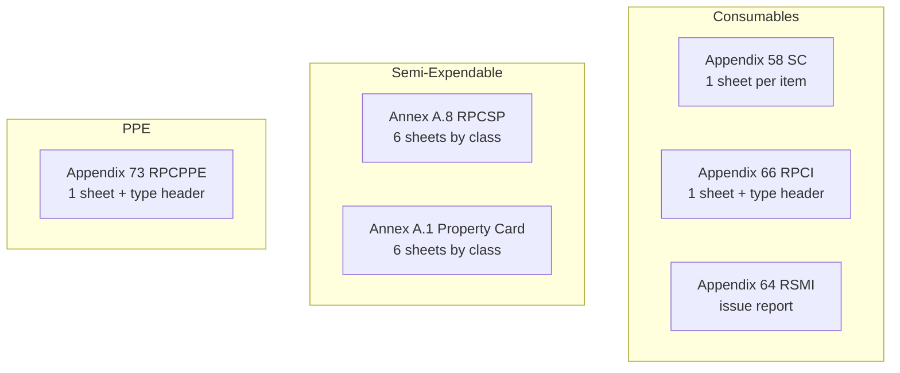

# OWWA Stock Card and supply-type export plan

## Findings (answers to your questions)

### Why Option A felt wrong

There are **two different "export" paths** today, and the labels overlap:

| What you see                | Where                                                                                         | What it actually downloads                                                                                    |
| --------------------------- | --------------------------------------------------------------------------------------------- | ------------------------------------------------------------------------------------------------------------- |
| **Export Report**           | [StockLevels.php](app/Filament/Pages/StockLevels.php)                                         | **COA PDF** via `reports.coa.stock-level` — a simple internal stock summary, **not** Appendix 58              |
| **Export OWWA item report** | [ItemsTable.php](app/Filament/Resources/Items/Tables/ItemsTable.php) (hidden under Actions ⋯) | **Appendix 58 XLS** via [OwwaItemReportService::downloadItemReport()](app/Services/OwwaItemReportService.php) |
| **Export Report**           | Issuances / Acquisitions lists                                                                | **Proper OWWA XLS** (RSMI, SC receipt entry, etc.)                                                            |

So your observation is correct: the **visible** export on Stock Levels is PDF-only. The XLS Stock Card path exists but is buried on Items.

### RSMI vs Stock Card (recap)

- **RSMI (Appendix 64)** — daily **issue report** by Stock No. Export from **Inventory → Consumables → Issuances → Export Report**.
- **Stock Card (Appendix 58)** — **ledger for one item** (all receipts/issues). Backend already fills `Appendix 58 - SC.xls`; UI is the gap.

### What is "type of supplies"?

In OWWA instructions this is the **inventory classification**, not Consumables vs PPE vs Semi:

- Consumables examples: _Office Supplies Inventory_, _Medical/Dental/Laboratory Supplies Inventory_, _Accountable Forms Inventory_
- PPE/Semi examples: _Type of Property, Plant and Equipment_ (e.g. ICT, Office Equipment, Medical Equipment)

**In your template files** ([template-structure.txt](storage/app/templates/template-structure.txt) from `php artisan owwa:analyze-templates`):

| Template                          | Sheets                                                                                                         | "Type" on form                                                      |
| --------------------------------- | -------------------------------------------------------------------------------------------------------------- | ------------------------------------------------------------------- |
| **Appendix 58 SC** (consumable)   | 1 sheet: `SC`                                                                                                  | No type line — card is **per item** (Item + Stock No.)              |
| **Appendix 66 RPCI** (consumable) | 1 sheet: `RPCI`                                                                                                | **B5: "(Type of Inventory Item)"** — e.g. Office Supplies Inventory |
| **Appendix 73 RPCPPE** (PPE)      | 1 sheet: `RPCPPE`                                                                                              | **C5: "(Type of Property, Plant and Equipment)"**                   |
| **Annex A.8 RPCSP** (semi)        | 6 sheets: `RPCSP`, `OFFICE EQUIPMENT`, `FURNITURES & FIXTURES`, `SPORTS EQUIPMENT`, `MEDICAL EQUIPMENT`, `ICT` | **B6: "(Type of Property, Plant and Equipment)"** + tab per class   |
| **Annex A.1 / A.4** (semi)        | Same pattern (ICT, Medical, etc.)                                                                              | Property class tabs                                                 |

**Applicability by category:**

- **Consumables:** "Type of inventory" applies to **RPCI** (physical count), not to the Stock Card layout in your bundle. SC is one card per stock item.
- **PPE:** Type label on **RPCPPE** header (single sheet in your templates).
- **Semi-expendable:** Type applies to **RPCSP / Annex A.1 / A.4** — and your templates use **Excel tabs** for each property class (ICT, Medical, etc.).

The app already has a partial mapping: [PhysicalCountSessionForm.php](app/Filament/Resources/PhysicalCountSessions/Schemas/PhysicalCountSessionForm.php) field `inventory_type_label` ("Type of inventory / property") → exported to RPCI/RPCPPE/RPCSP header cells in [OwwaItemReportService::cellValuesForPhysicalCount()](app/Services/OwwaItemReportService.php). It does **not** yet select the correct **sheet tab** for semi multi-tab workbooks.



---

## What we will build

### 1. Fix Stock Levels export UX (your choice: per-row Stock Card)

In [StockLevels.php](app/Filament/Pages/StockLevels.php) / [stock-levels.blade.php](resources/views/filament/pages/stock-levels.blade.php):

- Rename header **Export Report** → **Download COA summary (PDF)** so it is not confused with OWWA forms.
- Add a **per-row action**: **Export Stock Card (XLS)** that calls existing route `owwa.export.item?form=sc&office_id={office}` using the row's `item_id` and `office_id`.
- Reuse [OwwaItemReportService::cellValuesForSc()](app/Services/OwwaItemReportService.php) — no new mapping logic needed for consumables.

Optional: keep Items row export but relabel to **Export Stock Card (XLS)** for consistency.

### 2. Wire proper XLS template + sheet selection for semi

Add **`property_class`** (or `equipment_class`) on items — enum/string aligned with template tabs:

- `ict`, `office_equipment`, `furnitures_fixtures`, `sports_equipment`, `medical_equipment`, `vehicle_equipment` (match sheet names in Annex A.1 / A.4 / A.8)

Changes:

- Migration + [Item.php](app/Models/Item.php) + [ItemForm.php](app/Filament/Resources/Items/Schemas/ItemForm.php): show field only when category is Semi-Expendable (required on create/edit for semi items).
- [config/owwa_templates.php](config/owwa_templates.php): add `sheet_name` per semi form keyed by property class, e.g.:

```php
'semi_expendable' => [
    'annex_a1' => [
        'file' => 'Semi-Expendable/Property-Form-Annex-A.1-...xlsx',
        'sheets' => [
            'ict' => 'ICT',
            'office_equipment' => 'OFFICE EQUIPMENT',
            // ...
        ],
    ],
],
```

- [OwwaItemReportService::downloadItemReport()](app/Services/OwwaItemReportService.php): pass `sheetIndex` / `sheetName` to `downloadFromTemplate()` (today it always uses sheet 0 — wrong for semi).
- [OwwaItemReportService::downloadPhysicalCount()](app/Services/OwwaItemReportService.php): for `TYPE_RPCSP`, pick sheet from session's `inventory_type_label` or a new `property_class` on the count session if all lines share one class.

### 3. Consumable RPCI — document + small UX tweak

- Physical count already supports **Type of inventory** free text → maps to RPCI **B4**.
- Add helper text / placeholder examples from OWWA (Office Supplies Inventory, etc.) in [PhysicalCountSessionForm.php](app/Filament/Resources/PhysicalCountSessions/Schemas/PhysicalCountSessionForm.php).
- No Excel tabs for consumable RPCI in your template set — single sheet is correct.

### 4. Keep RSMI path as-is

Issuances list **Export Report** already uses [Appendix 64 - RSMI.xls](config/owwa_templates.php) with batch workbook support in [OwwaTemplateExportService](app/Services/OwwaTemplateExportService.php). No change needed unless you want RSMI on the issuance view modal too (out of scope unless requested).

### 5. Tests

- Feature test: Stock Levels row action redirects to `owwa.export.item` with `form=sc` and correct `item_id` / `office_id`.
- Unit test: semi item with `property_class=ict` exports using sheet name `ICT`.
- Unit test: consumable SC export still uses single `SC` sheet.

### 6. Docs (brief)

Update [docs/OWWA_EXPORT_MAPPING.md](docs/OWWA_EXPORT_MAPPING.md) with a "Where to export" table distinguishing COA PDF vs OWWA XLS, and explain type-of-supplies vs property-class tabs.

---

## Out of scope (unless you ask later)

- Adding consumable supply-type tabs to SC/RPCI (your OWWA files don't have those tabs).
- RSMI export from issuance view modal.
- Replacing COA PDF reports — they remain useful internal summaries, just relabeled.
