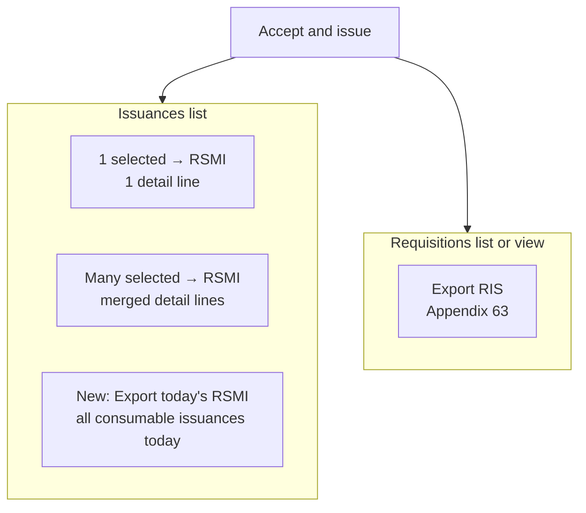

# RIS vs RSMI export behavior and UX plan

## Answer to your question (current vs correct)

### What OWWA expects

| Form                   | When                                                | Scope                                                                     |
| ---------------------- | --------------------------------------------------- | ------------------------------------------------------------------------- |
| **RIS (Appendix 63)**  | Request **and** issue proof for **one requisition** | One RIS No., all request lines, issue qty/remarks                         |
| **RSMI (Appendix 64)** | Supply custodian’s **daily report of issuances**    | One Serial No. on header; many detail lines (each may show a **RIS No.**) |

### What the app does **today**

| Action                                           | Form used                                               | Auto “all today”?           |
| ------------------------------------------------ | ------------------------------------------------------- | --------------------------- |
| **Issuances → Export Report** (selected rows)    | **RSMI** for consumables (PAR/ICS for other categories) | **No** — only selected rows |
| **1 issuance selected**                          | Still **RSMI** (one line)                               | No                          |
| **Requisitions → Export Report** (selected rows) | **RIS**                                                 | No                          |
| **Requisitions → Edit → Export RIS**             | **RIS**                                                 | No                          |

So your intuition is **half right**:

- **RSMI should represent the day’s issuances** (OWWA-correct) — but the app does **not** auto-select today; you must check rows manually.
- **Selecting 1 issuance should NOT switch to RIS.** RIS is the **requisition document**; RSMI is the **issuance report**. A single issuance exports a **one-line RSMI** that references the RIS No. in column A — that is correct.

---

## What we will build (your choice: daily RSMI + clearer RIS UI)

### 1. “Export today’s RSMI” on Consumables → Issuances

Add a header action on [`ListIssuances.php`](app/Filament/Resources/Issuances/Pages/ListIssuances.php):

- Label: **Export today’s RSMI (Excel)**
- Visible when active category is **Consumables** (slug `consumables`).
- Logic (new method on [`OwwaTemplateExportService`](app/Services/OwwaTemplateExportService.php) or small helper):
    - Query `IssuanceResource::getEloquentQuery()` filtered by `whereDate('issuance_date', today())`.
    - If **0 rows**: Filament warning notification — “No consumable issuances recorded today.”
    - If **1+ rows**: call existing [`downloadIssuancesRsmiMerged()`](app/Services/OwwaTemplateExportService.php) (same as multi-select workbook path).
- New route e.g. `GET reports/owwa/issuances/today-rsmi` in [`routes/web.php`](routes/web.php) + [`OwwaBulkExportController`](app/Http/Controllers/OwwaBulkExportController.php) (or dedicated thin controller) — avoids hacking the “must select rows” bulk flow.

**Note:** “Today” uses app timezone (`config('app.timezone')`). Fiscal-year list filters still apply via existing `getEloquentQuery()`.

### 2. Export RIS on requisition view (not only Edit)

Shared action factory (e.g. `RequisitionExportActions::exportRisAction()`) used in:

- [`RequisitionsTable.php`](app/Filament/Resources/Requisitions/Tables/RequisitionsTable.php) — add to `extraModalFooterActions` beside Accept & issue
- [`ViewRequisition.php`](app/Filament/Resources/Requisitions/Pages/ViewRequisition.php) — add to `getHeaderActions()`
- Refactor [`EditRequisition.php`](app/Filament/Resources/Requisitions/Pages/EditRequisition.php) to reuse the same action

Redirects to existing `route('owwa.export.requisition', $record)`.

### 3. Rename export buttons (reduce confusion)

| Location                            | Current                      | New label                                                                                      |
| ----------------------------------- | ---------------------------- | ---------------------------------------------------------------------------------------------- |
| Issuances list — selected export    | Export Report                | **Export RSMI — selected rows** (consumables) / **Export issuance form — selected** (PPE/semi) |
| Issuances list — new action         | —                            | **Export today’s RSMI**                                                                        |
| Requisitions list — selected export | Export Report                | **Export RIS — selected rows**                                                                 |
| Requisition view/edit/modal         | Export RIS (edit only today) | **Export RIS (Appendix 63)**                                                                   |

Update [`OwwaListExportActions.php`](app/Filament/Concerns/OwwaListExportActions.php) modal copy: workbook option text already mentions RSMI; add one line — _“Use Requisitions → Export RIS for the request slip, not Issuances.”_

Optional short helper on Issuances empty state in [`IssuancesTable.php`](app/Filament/Resources/Issuances/Tables/IssuancesTable.php): _“Export RSMI here after issue; export RIS from Requisitions.”_

### 4. Do **not** change these (OWWA-correct)

- Single issuance export stays **RSMI**, not RIS.
- Do not auto-export RIS on Accept & issue (user exports RIS when they need the slip).
- PPE/semi “today” batch export is **out of scope** for now (PAR/ICS are per-issuance forms; only consumables use merged RSMI).

### 5. Tests

- Feature test: today’s issuances → new route returns RSMI xlsx with all today’s lines.
- Feature test: zero today’s issuances → 404 or redirect with message (match controller pattern).
- Feature test: requisition view/modal has Export RIS action calling `owwa.export.requisition`.

### 6. Doc snippet (one paragraph)

Add to [`docs/OWWA_EXPORT_MAPPING.md`](docs/OWWA_EXPORT_MAPPING.md):

- **RIS** = export from **Requisitions** (one slip per request).
- **RSMI** = export from **Issuances** (daily report; use **Export today’s RSMI** or select rows).
- Single issuance → one-line RSMI with RIS No. in detail column, not RIS form.
