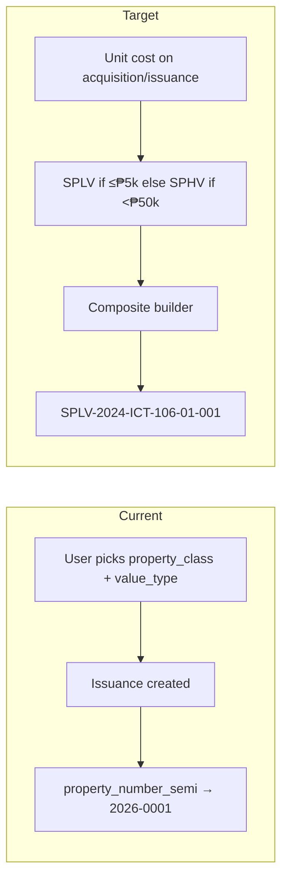

# Semi-expendable COA value tiers and composite property numbers

## How the system works today (two separate ideas)

Semi-expendable items currently use **two user-selected fields** that are easy to confuse:

| Concept                                                | Field                               | Who sets it                                                                                          | Used for today                                                      |
| ------------------------------------------------------ | ----------------------------------- | ---------------------------------------------------------------------------------------------------- | ------------------------------------------------------------------- |
| **Equipment / supply type** (ICT, Office equipment, …) | `items.property_class`              | User on Items form                                                                                   | Annex A.1/A.4 **Excel tab** names; Annex A.1 header “property type” |
| **Low vs high value**                                  | `items.value_type` (`low` / `high`) | User on Items form ([`ItemForm.php`](app/Filament/Resources/Items/Schemas/ItemForm.php) lines 61–77) | Items table badge/filter only — **not** used in numbering           |

**Property / inventory item numbers** (ICS “Item No.”, Annex A.1 “Semi-expendable Property Number”) are assigned at **issuance** into `issuances.property_number` via [`IssuanceObserver`](app/Observers/IssuanceObserver.php) + [`ReferenceCodeService::forPropertyNumber()`](app/Services/ReferenceCodeService.php), using a single series `property_number_semi` with pattern `{Y}-{seq:4}` (e.g. `2026-0001`). There is **no** SPLV/SPHV prefix, no UACS segment, and no office/asset-class segments.



## COA Circular 2022-004 alignment

From the circular (fetched text):

- Semi-expendable: useful life > 1 year, below **₱50,000** capitalization threshold.
- **Low-valued**: ₱5,000.00 or less per unit.
- **High-valued**: more than ₱5,000.00 but less than ₱50,000.00 per unit.
- Separate **ICS control numbers** for low-valued vs high-valued items.

Your confirmed sample format:

```text
SPLV-2024-ICT-106-01-001
 │     │     │   │  │   └── Sequence No. (3 digits)
 │     │     │   │  └────── Custodian / location (department code)
 │     │     │   └───────── UACS prefix (object code segment)
 │     │     └───────────── Equipment / supply type (items.property_class → ICT)
 │     └─────────────────── Acquisition year
 └───────────────────────── Value category (SPLV / SPHV)
```

**Terminology clarification:** When you described the format as “Office/Asset Class”, you meant the **equipment/supply type** — the same thing as **Property class** on the Items form (`ict` → `ICT`, etc.). **Office code is not part of the property number** (no `RWO4A` segment). Office still scopes stock and transactions in the app, but it is omitted from the printed inventory item / property number.

| Format segment          | What it is                                | DB / UI source                        |
| ----------------------- | ----------------------------------------- | ------------------------------------- |
| Value category          | SPLV / SPHV (COA low vs high valued)      | Auto from unit cost                   |
| Acquisition year        | Year acquired                             | `acquisitions.acquisition_date`       |
| Equipment / supply type | Property class (ICT, Office equipment, …) | `items.property_class` (user chooses) |
| UACS prefix             | Object code segment                       | Config map per property class         |
| Sequence no.            | Running serial in bucket                  | Per-bucket counter                    |
| Custodian/location      | End-user location                         | `departments.code` on issuance        |

**User choice:** `property_class` (equipment/supply type) remains a user choice on the item. **Value category** (SPLV/SPHV) will be **auto-derived from unit cost**.

## Target behavior

### 1) Value category from unit cost

Add [`App\Support\SemiExpendableValueCategory`](app/Support/SemiExpendableValueCategory.php) (or extend existing helpers):

| Unit cost (₱)        | Prefix | `items.value_type`                                                |
| -------------------- | ------ | ----------------------------------------------------------------- |
| ≤ 5,000              | `SPLV` | `low`                                                             |
| > 5,000 and < 50,000 | `SPHV` | `high`                                                            |
| ≥ 50,000             | —      | **block** semi acquisition/issuance (belongs under PPE, not semi) |

Thresholds in [`config/inventory.php`](config/inventory.php) (e.g. `semi_low_value_max` = 5000, `semi_cap_threshold` = 50000).

**When to resolve cost:**

- **At issuance** (primary): use `issuances.unit_cost` (already backfilled from latest acquisition in [`Issuance::applyPricingFromAcquisitions`](app/Models/Issuance.php)).
- **On acquisition save** (secondary): sync `items.value_type` from `acquisitions.unit_cost` so Items list/Stock Levels show the tier before first issue.
- Make `value_type` on the item form **read-only / computed** (remove manual select) with helper text explaining COA thresholds.

### 2) Composite property number at issuance

Replace simple `forPropertyNumber('semi_expendable')` with a dedicated builder, e.g. [`SemiExpendablePropertyNumberBuilder`](app/Services/SemiExpendablePropertyNumberBuilder.php):

**Pattern (config-driven):**

```php
// config/inventory.php
'semi_property_number' => [
    'pattern' => '{value_category}-{acq_year}-{supply_type_code}-{uacs_prefix}-{custodian_code}-{seq:3}',
],
```

**Segment sources:**

| Segment            | Source                                                             | Notes                                                                                                                 |
| ------------------ | ------------------------------------------------------------------ | --------------------------------------------------------------------------------------------------------------------- |
| `value_category`   | `SPLV` / `SPHV` from unit cost                                     | Auto                                                                                                                  |
| `acq_year`         | Year of **latest acquisition** for item×office, else issuance year | From `acquisitions.acquisition_date`                                                                                  |
| `supply_type_code` | Map from `items.property_class`                                    | **Equipment/supply type**. Short codes in config: `ict`→`ICT`, `office_equipment`→`OE`, `furnitures_fixtures`→`FF`, … |
| `uacs_prefix`      | Per `property_class` in config                                     | e.g. `ict`→`106` in `config/inventory.php` `semi_uacs_prefixes`                                                       |
| `custodian_code`   | `departments.code` on issuance                                     | Required on semi issuances; fallback `00` only if department missing                                                  |
| `seq`              | Per-bucket counter                                                 | See below                                                                                                             |

**Sequence counter:** Add table `property_number_buckets` (`bucket_key` string unique, `next_sequence` int) and allocate inside a DB transaction in the builder. Bucket key = all segments except sequence, e.g. `SPLV|2024|ICT|106|01`.

**Propagation:** When issuance creates `property_number`, copy to related **transfer** / **disposal** rows (existing fields). Transfers keep the same number.

### 3) Reference series cleanup

- Deprecate single [`property_number_semi`](database/seeders/ReferenceSeriesSeeder.php) for new issuances (keep row for legacy docs).
- Optionally add two admin-visible series labels in Reference series UI documenting SPLV/SPHV buckets, or document in [`docs/INVENTORY_NUMBERING.md`](docs/INVENTORY_NUMBERING.md) that semi property numbers are bucket-based, not one global counter.

### 4) UI / UX updates

| Area                                                                                     | Change                                                                                    |
| ---------------------------------------------------------------------------------------- | ----------------------------------------------------------------------------------------- |
| [`ItemForm.php`](app/Filament/Resources/Items/Schemas/ItemForm.php)                      | `value_type` → read-only badge from cost; COA helper text; keep **Property class** select |
| [`AcquisitionForm.php`](app/Filament/Resources/Acquisitions/Schemas/AcquisitionForm.php) | Validate semi `unit_cost` < ₱50,000; show computed SPLV/SPHV preview                      |
| [`IssuanceForm.php`](app/Filament/Resources/Issuances/Schemas/IssuanceForm.php)          | Show preview of next property number; require department for semi                         |
| Stock Levels semi table                                                                  | Add **Value** column (SPLV/SPHV) alongside existing property class column                 |
| [`OwwaReferenceLabels`](app/Support/OwwaReferenceLabels.php)                             | Helper text: explains composite format                                                    |

### 5) Exports unchanged in structure

Annex A.1 / ICS already print `issuances.property_number` ([`OwwaItemReportService`](app/Services/OwwaItemReportService.php), [`OwwaTemplateExportService`](app/Services/OwwaTemplateExportService.php)). Once issuance stores the full composite number, exports pick it up automatically.

### 6) Tests and docs

- Unit test: cost ₱4,500 → `SPLV`; ₱12,000 → `SPHV`; ₱50,000 → validation error.
- Unit test: builder produces `SPLV-2024-ICT-106-01-001` with mocked bucket seq=1.
- Feature test: semi issuance auto-assigns composite `property_number`.
- Update [`docs/INVENTORY_NUMBERING.md`](docs/INVENTORY_NUMBERING.md) with COA tiers, segment table, and distinction between **property class / equipment type** (user, e.g. ICT) vs **value category** (auto, SPLV/SPHV). Note that **office code is not embedded** in the property number.

## Risks / office confirmation needed during implementation

- **UACS prefix map** (`106` for ICT in your sample): ship as config defaults; System Admin can adjust without code changes if we expose optional per-class override later.
- **Custodian segment `01`**: plan assumes `departments.code`; if your PDF uses employee/location codes instead, adjust mapping in one place in the builder.
- **Re-issuance / multiple units**: one property number per **issuance line** (each physical unit issued). If you issue qty>1 on one ICS line, confirm whether each unit needs its own number (likely yes for accountability) — may require splitting qty into per-unit issuances or generating N sequential numbers in a loop.

## Out of scope (unless you ask)

- New CRUD for custom property classes beyond OWWA list.
- Changing catalog **stock number** (`items.item_code` / `SE-2026-0001`) — that stays separate from ICS inventory item number.
- Retroactive renumbering of existing `issuances.property_number` rows (can add optional artisan backfill command if needed).
