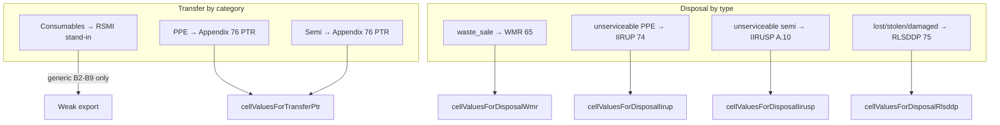

# Transfer & disposal templates: analysis and signatory integration

## Executive summary

The system **already has** category-aware template routing ([`config/owwa_templates.php`](config/owwa_templates.php)) and substantial export logic in [`OwwaTemplateExportService`](app/Services/OwwaTemplateExportService.php). **PPE/semi PTR** and **all disposal types** have dedicated cell mappers; **consumable transfers** are a known weak spot (RSMI stand-in with **no real cell mapping**). Signatory fields exist on [`Transfer`](app/Models/Transfer.php) and [`Disposal`](app/Models/Disposal.php) models and in Filament forms, but they are **optional, collapsed, and mostly free-text** — with **no office/user defaults** and a few **field visibility bugs** for RLSDDP.



---

## 1. Form routing matrix (current)

| Category            | Transfer template                    | Disposal templates                                                        |
| ------------------- | ------------------------------------ | ------------------------------------------------------------------------- |
| **Consumables**     | RSMI (`Appendix 64`) — stand-in only | WMR (`Appendix 65`)                                                       |
| **PPE**             | PTR (`Appendix 76`)                  | IIRUP (`Appendix 74`), RLSDDP (`Appendix 75`)                             |
| **Semi-expendable** | PTR (`Appendix 76`)                  | IIRUSP (Annex A.10 layout; **reuses IIRUP .xls**), RLSDDP (`Appendix 75`) |

Export entry points: [`ViewTransfer`](app/Filament/Resources/Transfers/Pages/ViewTransfer.php), [`ViewDisposal`](app/Filament/Resources/Disposals/Pages/ViewDisposal.php) (auto-selects form from category + `disposal_type`).

---

## 2. XLS column mapping status

### Transfer — Appendix 76 PTR (PPE + semi)

**Config:** [`config/owwa_cell_maps.php`](config/owwa_cell_maps.php) `PTR` section (header + detail row 17).

**Exporter:** `cellValuesForTransferPtr()` — uses `OwwaCellMapping::applyHeader` for headers; hardcodes signature rows and transfer-type checkboxes.

| Template area                                                       | Cells (current)    | DB / form source                                                                   | Status                                      |
| ------------------------------------------------------------------- | ------------------ | ---------------------------------------------------------------------------------- | ------------------------------------------- |
| Entity / fund cluster                                               | A6, G6             | `fromOffice` / `toOffice`                                                          | OK                                          |
| From accountable officer                                            | A8                 | `transfers.from_accountable_officer` → fallback `fromOffice.name`                  | Field exists; **collapsed, optional**       |
| PTR No.                                                             | H8                 | `reference_code`                                                                   | OK                                          |
| To accountable officer                                              | A9                 | `transfers.to_accountable_officer` → fallback `toOffice.name`                      | Same gap                                    |
| Date                                                                | H9                 | `transfer_date`                                                                    | OK                                          |
| Transfer type (donation/relocate/reassignment/others)               | C13, F13, C14, F14 | `transfer_type`, `transfer_type_other`                                             | OK                                          |
| Detail: date acquired, property no., description, amount, condition | Row 17 A/B/D/H/I   | lookup + `property_number` + item                                                  | OK; **property_number** manual for PPE/semi |
| Reason                                                              | A43                | `reason_for_transfer` / `remarks`                                                  | OK                                          |
| Approved / Released / Received (name)                               | B53, F53, H53      | `approved_by_printed_name`, `released_by_printed_name`, `received_by_printed_name` | Fields exist; **collapsed**                 |
| Designations                                                        | A54, F54, H54      | `*_designation` fields                                                             | Fields exist; **collapsed**                 |
| Signature dates                                                     | B55, F55, H55      | `transfer_date` (same date for all)                                                | OK but **no separate sign dates**           |

**Gap:** Consumable transfer exports [`cellValuesForTransfer`](app/Services/OwwaTemplateExportService.php) generic `B2–B9` because path has no `PTR` — RSMI template is loaded but **not filled** with RSMI layout.

---

### Disposal — Appendix 65 WMR (consumables)

**Config:** `WMR` in cell maps (header A7/G7/A8/G8, detail row 13).

**Exporter:** `cellValuesForDisposalWmr()` — **hardcodes cells**; does **not** call `OwwaCellMapping::applyHeader` (inconsistent with PTR/RIS).

| Template area                                                   | Cells          | DB source                                                 | Status                                |
| --------------------------------------------------------------- | -------------- | --------------------------------------------------------- | ------------------------------------- |
| Entity, fund cluster, place of storage, date                    | A7, G7, A8, G8 | `office`, `place_of_storage`, `disposal_date`             | OK                                    |
| Line: item#, qty, unit, description, OR no., sale date, amount  | Row 13         | item + disposal fields                                    | OK                                    |
| Disposal mode marks (destroyed/sold private/public/transferred) | B32–B35        | `disposal_mode` + `wmr_inspection_item_no`                | OK                                    |
| Prepared by / Approved by                                       | B25, G25       | `custodian_printed_name`, `approved_by_printed_name`      | Names only — **no designation cells** |
| Inspected by / Witness                                          | B37, G37       | `inspection_officer_printed_name`, `witness_printed_name` | Names only                            |

---

### Disposal — Appendix 74 IIRUP (PPE unserviceable)

**Config:** `IIRUP` — **minimal** (only `detail.start_row => 15`).

**Exporter:** `cellValuesForDisposalIirup()` — mostly hardcoded.

| Template area             | Cells              | DB source                                                                                  | Status                                   |
| ------------------------- | ------------------ | ------------------------------------------------------------------------------------------ | ---------------------------------------- |
| Entity, fund cluster      | B6, P6             | `office`                                                                                   | OK                                       |
| Accountable officer block | B7, F7, K7         | `custodian_printed_name`, `accountable_officer_designation`, `accountable_officer_station` | Fields in **Unserviceable** section only |
| Detail row 15             | B–E, K, L–O        | acquisition date, item, property no., qty, reason, disposal mode X marks                   | OK                                       |
| Endorsement signatures    | C40, H40, L40, Q40 | custodian, approved, inspection, witness                                                   | Names only                               |

---

### Disposal — Annex A.10 IIRUSP (semi unserviceable)

Same physical template as IIRUP; `cellValuesForDisposalIirusp()` uses **different row offsets** (detail row 18, signatures row 37–38). No separate `IIRUSP` cell-map entry.

---

### Disposal — Appendix 75 RLSDDP (all categories)

**Config:** `RLSDDP` header + detail row 20.

**Exporter:** `cellValuesForDisposalRlsddp()` — hardcoded with label prefixes in values.

| Template area                                   | Cells              | DB source                                                         | Status                                                                                      |
| ----------------------------------------------- | ------------------ | ----------------------------------------------------------------- | ------------------------------------------------------------------------------------------- |
| Entity, fund cluster, dept/office               | B6, G6, B8         | `office`                                                          | OK                                                                                          |
| RLSDDP No. / Date                               | G8, G9             | `reference_code`, `disposal_date`                                 | OK                                                                                          |
| Accountable officer / Designation               | B9, B10            | `custodian_printed_name`, `accountable_officer_designation`       | **Bug:** designation field only visible under **Unserviceable** section, not RLSDDP section |
| PAR No. / PAR Date                              | G10, G11           | `par_issuance_id` → linked issuance                               | OK when linked                                                                              |
| Police notified                                 | C11/C13, D11/D12   | `police_notified`, station, date                                  | OK                                                                                          |
| Property status (lost/stolen/damaged/destroyed) | D17–F18            | `property_status`                                                 | OK                                                                                          |
| Property line                                   | B20, C20, G20      | property no., description, `acquisition_cost`                     | OK                                                                                          |
| Circumstances                                   | B30                | `circumstances` / `reason`                                        | OK                                                                                          |
| Signatures                                      | B39, F39, B41, F41 | custodian, `immediate_supervisor_printed_name` or approved, dates | Partial — **no designation rows** for supervisor                                            |
| Government ID                                   | B44–B46            | `gov_id_*`                                                        | OK                                                                                          |

---

## 3. Can users manually type signatories? (all tasks)

**Short answer: Yes, where the form has free-text `TextInput` fields — but labels and visibility depend on the task, category, and (for disposal) disposal type.** There is no user-picker for signatories (except indirect links like `issued_to` on issuances or `requested_by`/`approved_by` on requisitions). Everything else is **typed printed names** the custodian enters.

### Master matrix: task × manual entry × export label

| Task               | OWWA form(s)                                 | Can user type signatories in UI?                                             | UI labels (what user sees)                                                | How export gets the name                                                            |
| ------------------ | -------------------------------------------- | ---------------------------------------------------------------------------- | ------------------------------------------------------------------------- | ----------------------------------------------------------------------------------- |
| **Requisition**    | RIS (63)                                     | **No manual fields**                                                         | N/A                                                                       | Auto: `requestedBy.name` → B37; `approvedBy.name` → D37                             |
| **Issuance**       | RSMI / PAR / ICS                             | **Yes** — via **Edit** on Issuance view (not at Accept & issue)              | Custodian, Custodian designation, Issued-to designation, Accounting staff | See per-category below; recipient name from `issuedTo` user                         |
| **Acquisition**    | SC / PC / Annex A.1                          | **No**                                                                       | N/A                                                                       | No signature block on receipt-line exports                                          |
| **Transfer**       | PTR (PPE/semi) or RSMI stand-in (consumable) | **Yes** — Create/Edit transfer                                               | From/To accountable officer; Approved/Released/Received + designations    | PTR rows 53–55; accountable A8/A9                                                   |
| **Disposal**       | WMR / IIRUP / IIRUSP / RLSDDP                | **Yes** — Create/Edit; fields vary by `disposal_type`                        | See disposal table below                                                  | Per disposal mapper                                                                 |
| **Physical count** | RPCI / RPCPPE / RPCSP                        | **Yes** — Accountable officer visible; Certified/Approved/Verified collapsed | Accountable officer, Designation; Certified by, Approved by, Verified by  | Accountable block exported; **certified/approved/verified NOT wired to export yet** |
| **Distribution**   | RSMI/PAR/ICS pseudo                          | **No**                                                                       | N/A                                                                       | Auto: `distributedBy.name`, recipient department as designation                     |

### Issuance — labels depend on category (same DB fields, different XLS roles)

All three categories share one **Signatories** section on [`IssuanceForm`](app/Filament/Resources/Issuances/Schemas/IssuanceForm.php) (collapsed). User edits via **View Issuance → Edit** ([`ViewIssuance`](app/Filament/Resources/Issuances/Pages/ViewIssuance.php)); **Accept & issue** modal has no signatory fields ([`RequisitionIssuanceFormSchema`](app/Filament/Resources/Requisitions/Schemas/RequisitionIssuanceFormSchema.php)).

| UI field              | Consumables (RSMI 64)                                                                 | PPE (PAR 71)                  | Semi (ICS 59)                                                   |
| --------------------- | ------------------------------------------------------------------------------------- | ----------------------------- | --------------------------------------------------------------- |
| Custodian             | A52 — Supply officer / custodian                                                      | D45 — Issued by (custodian)   | F46 — Issued by (custodian)                                     |
| Custodian designation | _(not mapped on RSMI export)_                                                         | D48 — Issued-by designation   | F49 — Custodian designation                                     |
| Issued-to designation | _(not mapped)_                                                                        | A48 — Received-by designation | A49 — Received-by designation                                   |
| Accounting staff      | Print view only ([`rsmi-print.blade.php`](resources/views/owwa/rsmi-print.blade.php)) | _(not on PAR export)_         | _(not on ICS export)_                                           |
| Recipient name        | From `issued_to` user                                                                 | A45 — Received by             | A46 — Received by                                               |
| Received from (semi)  | —                                                                                     | —                             | A44 — `received_from_name` (separate field, Additional details) |

**Gap:** Custodian/signatory data is often blank because users issue from requisition and export without opening Edit first.

### Transfer — labels (PPE + semi use PTR; consumable weak)

[`TransferForm`](app/Filament/Resources/Transfers/Schemas/TransferForm.php) — all **manual text**, sections collapsed by default:

| UI section / field        | PTR template label                           | Export cell |
| ------------------------- | -------------------------------------------- | ----------- |
| From accountable officer  | From Accountable Officer/Agency/Fund Cluster | A8          |
| To accountable officer    | To Accountable Officer/Agency/Fund Cluster   | A9          |
| Approved by + designation | Approved by                                  | B53, A54    |
| Released by + designation | Released by                                  | F53, F54    |
| Received by + designation | Received by                                  | H53, H54    |

Consumable transfer: same form fields exist but export does **not** map to RSMI — falls back to generic cells.

### Disposal — labels depend on `disposal_type`

| `disposal_type`       | Form           | Signatory / officer UI labels                                                                     | Notes                                                                                                |
| --------------------- | -------------- | ------------------------------------------------------------------------------------------------- | ---------------------------------------------------------------------------------------------------- |
| `waste_sale`          | WMR            | Signatories: **Custodian / accountable officer**, Approved by, Inspection officer, Witness        | WMR has no designation columns in export                                                             |
| `unserviceable`       | IIRUP / IIRUSP | Unserviceable section: **Accountable officer designation**, Station; Signatories: same four names | `custodian_printed_name` → header accountable name                                                   |
| `lost_stolen_damaged` | RLSDDP         | RLSDDP: **Immediate supervisor (Noted by)**; Signatories: custodian, approved, etc.               | **Bug:** `accountable_officer_designation` hidden (only on Unserviceable section) but needed for B10 |

### Physical count — labels depend on `count_type`

[`PhysicalCountSessionForm`](app/Filament/Resources/PhysicalCountSessions/Schemas/PhysicalCountSessionForm.php):

| `count_type`      | Form        | Accountable officer block                                            | Signatories (collapsed)         |
| ----------------- | ----------- | -------------------------------------------------------------------- | ------------------------------- |
| RPCI (consumable) | Appendix 66 | Accountable officer, Designation, Date of assumption → B10 narrative | Certified / Approved / Verified |
| RPCPPE            | Appendix 73 | Same → C10 narrative                                                 | Same three                      |
| RPCSP (semi)      | Annex A.8   | _(accountable block not in RPCSP header export today)_               | Same three                      |

### Tasks with **no** signatory typing

- **Requisition** — signatures come from linked **User** records only.
- **Acquisition** — custody receipt; no signatory block in app or receipt-line export.
- **Distribution** — JOE distribution; export synthesizes from `distributedBy` / recipient.

---

## 4. What the system already captures (signatories & officers)

### Transfer form ([`TransferForm.php`](app/Filament/Resources/Transfers/Schemas/TransferForm.php))

| Section                          | Fields                                                                      | Exported to PTR? |
| -------------------------------- | --------------------------------------------------------------------------- | ---------------- |
| Accountable officers (collapsed) | `from_accountable_officer`, `to_accountable_officer`, `reason_for_transfer` | A8, A9, A43      |
| Signatories (collapsed)          | approved/released/received names + designations                             | Rows 53–55       |

### Disposal form ([`DisposalForm.php`](app/Filament/Resources/Disposals/Schemas/DisposalForm.php))

| Section                 | When visible          | Key fields                                                                                        |
| ----------------------- | --------------------- | ------------------------------------------------------------------------------------------------- |
| WMR inspection          | `waste_sale`          | `disposal_mode`, `wmr_inspection_item_no`                                                         |
| Unserviceable           | `unserviceable`       | `iirup_disposal_mode`, `accountable_officer_designation`, `accountable_officer_station`           |
| RLSDDP details          | `lost_stolen_damaged` | PAR link, `property_status`, `circumstances`, police, gov ID, `immediate_supervisor_printed_name` |
| Sale details            | optional              | OR no., sale date, amount                                                                         |
| Signatories (collapsed) | all types             | custodian, approved, inspection officer, witness                                                  |

### Related patterns elsewhere

- **Issuances:** `custodian_printed_name`, `custodian_designation`, `issued_to_designation`, `accounting_staff_printed_name` — used in PAR/ICS/RSMI exports ([`IssuanceForm`](app/Filament/Resources/Issuances/Schemas/IssuanceForm.php)).
- **Physical count:** `accountable_officer_name`, `accountable_officer_designation` on session ([`PhysicalCountSessionForm`](app/Filament/Resources/PhysicalCountSessions/Schemas/PhysicalCountSessionForm.php)).
- **Offices:** only `fund_cluster` — **no default signatory block**.
- **Users:** name/role/office — **no designation field** on user profile.

---

## 5. Data still missing or weak for complete exports

### Critical (appears on template, weak in UI)

1. **Accountable officers on PTR** — fields exist but collapsed; users often leave blank → export falls back to **office name**, not person name.
2. **RLSDDP designation (B10)** — exported from `accountable_officer_designation` but field hidden when `disposal_type = lost_stolen_damaged`.
3. **PTR / WMR / IIRUP signature designations** — several template rows expect title under printed name; only PTR stores designations; WMR/IIRUP/RLSDDP mostly name-only.
4. **Consumable transfer** — no proper RSMI-or-other mapping; export is effectively broken for OWWA compliance.

### Moderate

5. **Issuance signatories only on Edit** — not captured during Accept & issue; easy to export with blank PAR/ICS/RSMI signature rows.
6. **Physical count Certified/Approved/Verified** — stored on session but **not exported** to RPCI/RPCPPE/RPCSP.
7. **Issuance RSMI** — `accounting_staff_printed_name` only in print view, not in XLS `cellValuesForIssuanceRsmi`.

### Out of scope (per capstone boundary)

- Accounting approval chains, inspection committee membership beyond printed names, notarized attachments.

---

## 6. Recommended integration approach

**Design principle confirmed:** Keep **manual typed signatories** (printed names + designations) — do **not** replace with user dropdowns, because OWWA forms expect exact printed names that may differ from system login names. Improve UX by **category/task-specific labels**, **defaults**, and **visibility** — not by removing manual entry.

### Phase A — Fix data capture (no template changes)

1. **Contextual labels per task/category** (not one generic "Signatories" block):
    - Issuance: relabel fields when category is consumables vs PPE vs semi (e.g. show "Issued by (PAR)" vs "Custodian (ICS)").
    - Disposal: split signatory fields into WMR / IIRUP / RLSDDP sections with template row hints.
    - Transfer: expand accountable + signatory sections for PPE/semi PTR.

2. **Fix RLSDDP field visibility:**
    - Show `accountable_officer_designation` (and station if needed) on RLSDDP section when `lost_stolen_damaged`.

3. **Issuance signatory capture at issue time** (choose one):
    - Add optional signatory fields to Accept & issue modal (category-aware), **or**
    - After issue, redirect/prompt to edit issuance before first export.

4. **Auto-prefill typed defaults** (user can override):
    - `custodian_printed_name` / `released_by_printed_name` ← `auth()->user()->name` on create.
    - Office-level defaults for designation (Phase B).

5. **Property number assist** on transfer/disposal for PPE/semi.

### Phase B — Office signatory defaults (recommended central model)

Add optional defaults on **Office** (or a small `office_signatories` config table):

| Office field                               | Used as default for                                     |
| ------------------------------------------ | ------------------------------------------------------- |
| `supply_custodian_name` / `designation`    | PTR released-by, WMR/IIRUP custodian, ICS/PAR custodian |
| `authorized_officer_name` / `designation`  | PTR approved-by, WMR approved-by                        |
| `inspection_officer_name`                  | WMR/IIRUP inspection                                    |
| `accountable_officer_name` / `designation` | PTR from/to hints, RLSDDP header                        |

On Transfer/Disposal **create**, prefill empty signatory fields from office defaults; user can override per transaction.

Alternative lighter approach: extend **User** with optional `printed_designation` for supply custodians only.

### Phase C — Align exports with cell maps

1. Refactor `cellValuesForDisposalWmr`, `cellValuesForDisposalIirup`, `cellValuesForDisposalRlsddp` to use `OwwaCellMapping::applyHeader` + detail columns (same pattern as PTR).
2. Complete `IIRUP` / add `IIRUSP` entries in [`config/owwa_cell_maps.php`](config/owwa_cell_maps.php) including signature blocks.
3. Extract shared **signatory row layout** helper (e.g. `PtrSignatureLayout`) similar to [`PropertyCardLayout`](app/Support/PropertyCardLayout.php).

### Phase D — Consumable transfer decision

Pick one (needs product decision):

- **Option A (minimal):** Document that consumable inter-office moves are recorded in-app + COA PDF only; RSMI export is **not** provided for transfers.
- **Option B:** Build `cellValuesForTransferRsmi()` mapping from/to offices as RSMI header + one detail line (reuse RSMI map).
- **Option C:** If OWWA provides a consumable transfer form, add template path + mapper (none configured today).

### Phase E — Verification

When templates exist under `storage/app/templates/`:

```bash
php artisan owwa:analyze-templates --output=storage/app/templates/template-structure.txt
php artisan app:audit-owwa-templates
```

Cross-check PTR row 17 vs comment "row 18", WMR signature rows, RLSDDP police block — adjust cell maps if analyzer differs.

Add tests mirroring [`tests/Unit/OwwaTemplateExportMappingTest.php`](tests/Unit/OwwaTemplateExportMappingTest.php) (PTR exists; WMR/IIRUP/RLSDDP missing).

### Phase F — Documentation

Extend [`docs/OWWA_EXPORT_MAPPING.md`](docs/OWWA_EXPORT_MAPPING.md) with:

- Transfer/disposal section tables (like existing RIS/ICS/EUL sections)
- Signatory field → cell reference matrix per form
- Note consumable transfer limitation

---

## 7. Suggested implementation priority

| Priority | Item                                                             | Effort                  |
| -------- | ---------------------------------------------------------------- | ----------------------- |
| P0       | Fix RLSDDP designation visibility                                | Small                   |
| P0       | Auto-prefill custodian/released-by from auth user                | Small                   |
| P0       | Issuance signatory capture at issue or edit-before-export prompt | Medium                  |
| P1       | Category/task-specific signatory labels + helper text            | Medium                  |
| P1       | Office-level signatory defaults                                  | Medium                  |
| P2       | Refactor WMR/IIRUP/RLSDDP to cell maps                           | Medium                  |
| P2       | Physical count certified/approved/verified → export              | Small                   |
| P2       | Complete IIRUP/IIRUSP cell maps + tests                          | Medium                  |
| P3       | Consumable transfer export strategy                              | Decision + small/medium |
| P3       | Property number auto-suggest on transfer/disposal                | Small                   |

---

## 8. Instruction PDFs

[`AuditOwwaTemplates`](app/Console/Commands/AuditOwwaTemplates.php) expects paired `Instructions - Appendix XX - …` files beside templates. The git workspace typically has **no templates/instructions** checked in. Final signatory requirements (e.g. whether WMR needs designations under signatures) should be confirmed after placing templates locally and running the audit command.
