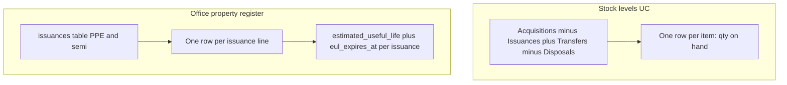
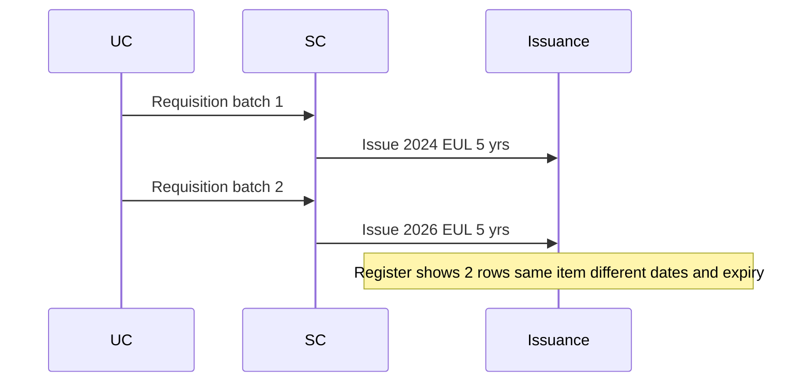

# Office property register vs Stock levels (UC)

## Maikling sagot

|                         | **Stock levels**                                                                                                            | **Office property register**                                                                                                                                      |
| ----------------------- | --------------------------------------------------------------------------------------------------------------------------- | ----------------------------------------------------------------------------------------------------------------------------------------------------------------- |
| **Ano ang ipinapakita** | **On-hand quantity** — ilang piraso pa ang _nasa office_ (movement-based)                                                   | **Accountable property** — anong PPE/semi ang **na-issue** at naka-record pa sa PAR/ICS                                                                           |
| **Granularity**         | **1 row = 1 item** (hal. "Printer" qty 2)                                                                                   | **1 row = 1 issuance** (bawat beses na na-issue)                                                                                                                  |
| **Useful life**         | Wala                                                                                                                        | Per **issuance** (semi lang)                                                                                                                                      |
| **Property no.**        | Wala (stock no. lang sa ledger)                                                                                             | `issuances.property_number`                                                                                                                                       |
| **Source code**         | [`StockLevels.php`](app/Filament/Pages/StockLevels.php) + [`InventoryStockService`](app/Services/InventoryStockService.php) | [`OfficePropertyRegister.php`](app/Filament/Pages/OfficePropertyRegister.php) + [`OfficePropertyRegisterService`](app/Services/OfficePropertyRegisterService.php) |



---

## 1. Ano ang pinagkaiba para sa UC?

### Stock levels

- Nakikita ng UC ang **quantity on hand sa kanyang office** — pinagsama-samang bilang mula sa acquisitions, issuances, transfers, at disposals.
- Para sa semi/PPE, may helper text: _"On-hand quantity only. Issued property remains on PAR/ICS and property registers."_
- **Hindi** ito property accountability list; hindi nito ipinapakita kung sino ang accountable o kailan mag-e-expire ang useful life.

### Office property register

- Lista ng **issued PPE at semi-expendable** na nauugnay sa UC:
  - `issued_to` = UC user, **o**
  - `office_id` (+ `department_id` kung may dept ang UC) ay tumutugma
- Bawat row ay **isang issuance record**, hindi item catalog.
- Dito lang makikita ang **useful life** at **EUL status** (semi lang; PPE = N/A by design).

**Halimbawa sa screenshot mo:** dalawang row ang "Printer (Laser)" — iyon ay **dalawang hiwalay na issuance** (Apr 05, 2026 at Feb 01, 2026), hindi isang row na qty=2. Tama ang design para sa accountability.

---

## 2. Parehong item, dalawang stock, magkaibang useful life?

**Oo, kaya ng system — basta hiwalay na issuance ang bawat batch.**

- Useful life ay naka-store sa **`issuances`**, hindi sa `items` lang:
  - `estimated_useful_life` — text sa ICS
  - `eul_expires_at` — computed mula sa `issuance_date` + parsed EUL
- **Bagong batch** (bagong requisition → Accept & issue) = **bagong issuance row** = sariling issuance date at EUL.
- **Lumang unit** na na-issue noon = lumang row na may sariling EUL/expiry.

**Flow sa production:**



**Limitasyon ngayon:** kung **isang issuance** ang may `quantity > 1`, isang row lang sa register (isang property number/EUL per issuance line). Para sa PPE/semi, karaniwang **qty=1 per unit** o may `inventory_units` bawat pisong physical asset.

**Stock levels vs register sa scenario na ito:**

- Stock levels: maaaring "Stapler qty 0" sa UC office kung lahat ay na-issue na (hindi na on-hand).
- Register: makikita pa rin ang dalawang stapler bilang **dalawang issued property lines** — accountability record, hindi stock count.

---

## 3. Saan kinukuha ang Property no.? Bakit "—" sa screenshot?

### Dapat na source (production path)

Property number ay nasa **`issuances.property_number`**, na sine-set kapag nag-issue ang SC:

1. **Preferred:** `inventory_units` mula sa acquisition — [`IssuanceUnitAssignmentService`](app/Services/IssuanceUnitAssignmentService.php) kumukuha ng `in_stock` unit at kinokopya ang `property_number` sa issuance.
2. **Fallback:** auto-generate sa [`IssuanceObserver`](app/Observers/IssuanceObserver.php):
   - Semi: [`SemiExpendablePropertyNumberBuilder`](app/Services/SemiExpendablePropertyNumberBuilder.php)
   - PPE: [`ReferenceCodeService::forPropertyNumber`](app/Services/ReferenceCodeService.php)

May fallback din ang model: `Issuance::inventoryUnit()` — may `inventory_units.issuance_id` link.

Register blade ay direktang nagdi-display:

```57:57:resources/views/filament/pages/office-property-register.blade.php
<td class="owwa-cell-primary">{{ $row->property_number ?? '—' }}</td>
```

### Bakit blank sa demo/screenshot mo

Malamang **demo/legacy data**, hindi fresh requisition fulfillment:

- [`DemoDataSeeder`](database/seeders/DemoDataSeeder.php) gumagamit ng `Issuance::updateOrCreate` **nang walang** `property_number`, `issued_to`, `estimated_useful_life`, o `requisition_id` sa bulk issuance loop (~line 321).
- Hindi tumatakbo ang buong [`IssuanceObserver`](app/Observers/IssuanceObserver.php) flow (kailangan ng `requisition_id` sa bagong issuance; seeder bypasses normal path).
- Hindi tinatawag ang `AcquisitionUnitService::generateUnitsForAcquisition` — walang `inventory_units` na may property tags.

Kaya:

- **Property no.** = `—` (walang value sa DB)
- **Useful life / Expires** = `—` (walang `estimated_useful_life` / `eul_expires_at`)
- **EUL status = Active** sa semi — UI default kapag hindi expired/nearing; **misleading** kapag walang EUL data (cosmetic bug, hindi missing business logic)

**Sa totoong workflow** (Requisitions → Accept & issue), dapat may `issued_to`, property number, at semi EUL — gaya ng [`RequisitionFulfillmentService`](app/Services/RequisitionFulfillmentService.php).

---

## Praktikal na gabay para sa defense/demo

1. **Stock levels** = "Ilan pa ang nasa opisina?" (quantity)
2. **Office property register** = "Ano ang accountable sa akin / opisina ko?" (per issuance, may EUL para sa semi)
3. **Parehong item, luma at bago** = dalawang issuance row, magkaibang issued date at expiry
4. **Property no.** = galing sa issuance (mula sa QR/inventory unit o auto-generated); blank sa screenshot = demo data hindi dumadaan sa normal issuance pipeline

Walang code changes sa ngayon (explain-only ang pinili mo). Kung gusto mo later: demo seeder backfill, register fallback sa `inventoryUnit.property_number`, at "Unknown" badge kapag walang EUL data.
