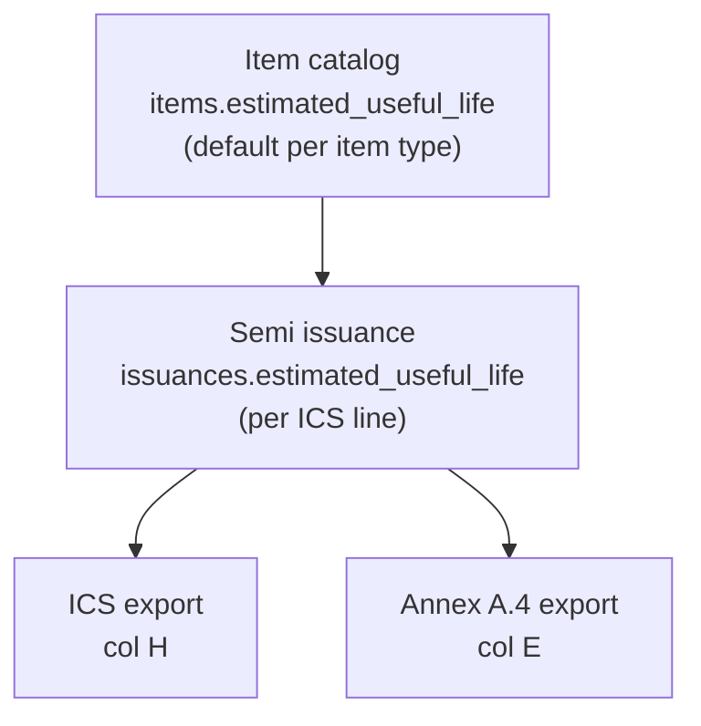

# Useful life: PPE vs semi-expendable

## Instruction sources reviewed

**Note:** Paired instruction PDFs are expected under [`storage/app/templates/`](storage/app/templates/) (e.g. `Instructions - Appendix 59 - ICS.pdf`) per [`AuditOwwaTemplates`](app/Console/Commands/AuditOwwaTemplates.php), but that folder is empty in the git workspace. Findings below use **COA Circular 2022-004** annex form layouts and standard OWWA instruction text (PC, PAR, SPC, ICS) cross-checked with your Excel cell maps.

### Semi-expendable — useful life **is required**

| Form                                  | Where EUL appears                    | Purpose                                      |
| ------------------------------------- | ------------------------------------ | -------------------------------------------- |
| **ICS** (Appendix 59 / COA Annex A.3) | Column **H — Estimated Useful Life** | Captured when property is issued to end-user |
| **Registry** (Annex A.4)              | Column **E — Estimated Useful Life** | Tracks EUL per issued property line          |
| **SPC** (Annex A.1 property card)     | **No EUL column**                    | Ledger of receipts/issues only               |
| **RSPI** (Annex A.7)                  | **No EUL column**                    | Weekly issue summary from ICS                |

**COA Circular 2022-004 rules (semi):**

- Semi-expendable = tangible PPE-type items **below ₱50,000** with **useful life > 1 year**.
- **EUL is agency-determined** (experience, mission, nature of operations); COA gives **guide ranges**:
    - Machinery & equipment: **5–15 years**
    - Furniture, fixtures & books: **2–15 years**
- **Low-valued** (≤ ₱5,000): accountability ends at EUL expiry or early return; ICS auto-cancelled at EUL end.
- **High-valued** (> ₱5,000, < ₱50,000): accountability ends only on approved return/disposal, not merely at EUL expiry.



### PPE — useful life **not on custody forms** (confirmed out of scope)

| Form                            | EUL field? | Instructions summary                                                                                                            |
| ------------------------------- | ---------- | ------------------------------------------------------------------------------------------------------------------------------- |
| **Property Card** (Appendix 69) | **No**     | Entity, fund cluster, property type, description, property no., date, reference/PAR, receipt/issue/balance qty, amount, remarks |
| **PAR** (Appendix 71)           | **No**     | Quantity, unit, description, property number, date acquired, amount                                                             |
| **RPCPPE** (Appendix 73)        | **No**     | Physical count by article — no EUL column                                                                                       |

PPE estimated useful life lives on **accounting PPE ledger cards** (depreciation), not on supply/property custody slips. Per your choice: **do not add PPE useful life fields** in this inventory system.

---

## Current app state (semi)

| Layer            | Status                                                                 | Files                                                                                                                                                         |
| ---------------- | ---------------------------------------------------------------------- | ------------------------------------------------------------------------------------------------------------------------------------------------------------- |
| DB               | `items.estimated_useful_life`, `issuances.estimated_useful_life` exist | [`2026_05_31_152718_add_owwa_gap_analysis_fields.php`](database/migrations/2026_05_31_152718_add_owwa_gap_analysis_fields.php)                                |
| Item form        | Field visible for **semi only**                                        | [`ItemForm.php`](app/Filament/Resources/Items/Schemas/ItemForm.php)                                                                                           |
| Issuance form    | Field visible for **semi only**                                        | [`IssuanceForm.php`](app/Filament/Resources/Issuances/Schemas/IssuanceForm.php)                                                                               |
| ICS export       | Column H filled: `issuance → item` fallback                            | [`OwwaTemplateExportService::cellValuesForIssuanceIcs`](app/Services/OwwaTemplateExportService.php), [`config/owwa_cell_maps.php`](config/owwa_cell_maps.php) |
| Annex A.4 export | Column E filled from registry rows                                     | [`OwwaItemReportService::cellValuesForAnnexA4`](app/Services/OwwaItemReportService.php)                                                                       |
| Annex A.1 export | No EUL (correct per form)                                              | [`OwwaItemReportService::cellValuesForAnnexA1`](app/Services/OwwaItemReportService.php)                                                                       |

**Gaps to close:**

1. **No auto-fill** — selecting an item on issuance does not copy `items.estimated_useful_life` into the issuance field (unlike `unit_cost`).
2. **No defaults** — custodian must type free text (`e.g. 3yrs`) with no property-class guidance.
3. **No eligibility check** — COA requires semi items to have EUL **> 1 year**; not validated.
4. **Not required on semi issuance** — ICS instructions expect EUL; field is optional today.
5. **Requisition fulfillment** — verify [`RequisitionFulfillmentService`](app/Services/RequisitionFulfillmentService.php) does not drop `estimated_useful_life` when creating issuances from requisitions.

---

## Recommended implementation (semi only)

### 1) Centralize EUL rules

Add [`app/Support/SemiExpendableUsefulLife.php`](app/Support/SemiExpendableUsefulLife.php) (or extend existing support class):

- `defaultForPropertyClass(string $propertyClass): ?string` — config-driven defaults from COA guide ranges, e.g. `ict` → `5 yrs`, `furnitures_fixtures` → `5 yrs`.
- `parseToYears(?string $value): ?float` — parse `3yrs`, `3 years`, `36 months`.
- `assertEligibleForSemi(?string $value): void` — block if parsed years ≤ 1 (COA eligibility).
- `labelSummary(): string` — helper text for forms.

Config in [`config/inventory.php`](config/inventory.php):

```php
'semi_useful_life_defaults' => [
    'ict' => '5 yrs',
    'office_equipment' => '5 yrs',
    'furnitures_fixtures' => '5 yrs',
    // ...
],
'semi_min_useful_life_years' => 1,
```

### 2) Item catalog (default EUL)

In [`ItemForm.php`](app/Filament/Resources/Items/Schemas/ItemForm.php):

- Keep field **semi-only**.
- When `property_class` changes, suggest default from config (user can override).
- Helper text: agency-determined per COA; guide ranges 2–15 / 5–15 years by class; must exceed 1 year for semi eligibility.

### 3) Issuance (ICS source of truth per line)

In [`IssuanceForm.php`](app/Filament/Resources/Issuances/Schemas/IssuanceForm.php):

- On `item_id` change: `set('estimated_useful_life', Item::…->estimated_useful_life ?? defaultForPropertyClass(…))`.
- **Require** for semi issuances (`->required(fn …)`).
- Validate with `assertEligibleForSemi`.

In [`IssuanceObserver`](app/Observers/IssuanceObserver.php) (or form rules): reject semi issuance without EUL or with EUL ≤ 1 year.

### 4) Requisition → issuance path

In [`RequisitionFulfillmentService`](app/Services/RequisitionFulfillmentService.php): when creating semi issuances, pass through `estimated_useful_life` from item default if not set on the line.

### 5) Exports (already wired — verify only)

- ICS column H and Annex A.4 column E already use `issuance.estimated_useful_life ?? item.estimated_useful_life`.
- No change to Annex A.1, PAR, or PC exports.

### 6) Tests and docs

- Unit tests: parse `5 yrs` / `18 months`; reject `1 yr` for semi eligibility.
- Feature test: semi issuance saves EUL and ICS export cell H is populated.
- Update [`docs/INVENTORY_NUMBERING.md`](docs/INVENTORY_NUMBERING.md) or [`docs/OWWA_EXPORT_MAPPING.md`](docs/OWWA_EXPORT_MAPPING.md) with EUL segment table and note that **PPE PAR/PC do not carry useful life**.

---

## What we are **not** doing

- PPE `estimated_useful_life` field, validation, or export (per your choice and form instructions).
- Annex A.2 SPLC / accounting ledger exports (accounting division scope).
- Auto-cancellation of ICS at EUL expiry (workflow/notification — future enhancement if needed).

---

## Optional later (out of scope unless requested)

- EUL expiry alerts for low-valued semi (ICS auto-cancel per COA).
- RSPI (Annex A.7) export — does not need EUL column.
- Load local instruction PDFs into `storage/app/templates/` and run `php artisan app:audit-owwa-templates` to verify pairing.
