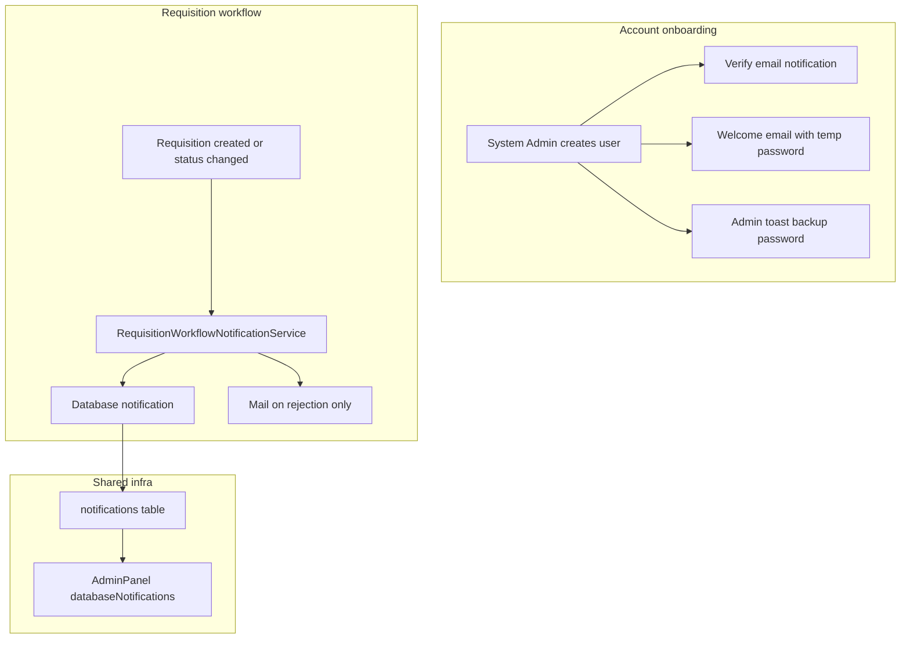

# Workflow notifications (email verification + requisitions)

## Scope

| In                                                                 | Out                                                                                                                                      |
| ------------------------------------------------------------------ | ---------------------------------------------------------------------------------------------------------------------------------------- |
| Shared `notifications` table + Filament bell on **admin** panel    | Notifications on acquisition / issuance / transfer / disposal                                                                            |
| Email verification + welcome email on user create                  | Inventory plan reminders (separate [inventory plans plan](.cursor/plans/inventory_plans_reminders_798afaf8.plan.md) — shares same infra) |
| **Forgot password** (Filament reset link via email) on both panels | Low-stock digest, email on every status change                                                                                           |
| Requisition workflow: bell + email on rejections                   | Stock transaction notifications (acquisition, issuance, transfer, disposal)                                                              |
| Tests for verification, password reset, recipients, requisitions   |                                                                                                                                          |

**Coordination:** Implement the **notifications table** and `->databaseNotifications()` once; the inventory-plans plan reuses it for scheduled count reminders.

---

## Architecture



---

## 1. Shared notification infrastructure

### Database

- Migration: `php artisan notifications:table` (if not already applied by inventory-plans work).

### Filament panel

In [`AdminPanelProvider`](app/Providers/Filament/AdminPanelProvider.php):

```php
->databaseNotifications()
->databaseNotificationsPolling('30s')
```

(System Admin panel optional; operational users live on `admin`.)

### Base notification pattern

**New:** [`app/Notifications/Concerns/InteractsWithFilamentDatabase.php`](app/Notifications/Concerns/InteractsWithFilamentDatabase.php) (or small helper) to format `toArray()` with `title`, `body`, `icon`, `format: 'filament'`, and `actions` URL to the relevant Filament resource.

---

## 2. Email verification + welcome on user create

### User model

[`app/Models/User.php`](app/Models/User.php):

- Implement `Illuminate\Contracts\Auth\MustVerifyEmail`.
- In `canAccessPanel()`: require `hasVerifiedEmail()` for `admin` panel (system admins on `system-admin` panel may remain verified-only as well for consistency).

### Filament auth

Both [`AdminPanelProvider`](app/Providers/Filament/AdminPanelProvider.php) and [`SystemAdminPanelProvider`](app/Providers/Filament/SystemAdminPanelProvider.php):

```php
->emailVerification()
```

Unverified users hitting login get Filament’s verify-email flow.

### Routes

- Ensure Laravel `Auth::routes(['verify' => true])` or equivalent verified routes exist in [`routes/web.php`](routes/web.php) (add `Illuminate\Foundation\Auth\EmailVerificationRequest` routes if missing).

### User create flow

Primary create path is [`ListUsers`](app/Filament/Resources/Users/Pages/ListUsers.php) modal (not standalone `CreateUser`).

On successful create:

1. Set `email_verified_at` to `null` explicitly.
2. Keep existing random temp password generation.
3. `$user->sendEmailVerificationNotification()` (Laravel default or custom).
4. Queue **new** [`UserWelcomeNotification`](app/Notifications/UserWelcomeNotification.php) (mail channel) with temp password and login URL for the correct panel by role.
5. Update admin **toast**: “Verification and welcome emails sent to {email}” **and** retain current persistent toast showing temp password as backup (per your choice).

**New mail:** `resources/views/mail/user-welcome.blade.php` — professional, OWWA-branded plain layout; includes verify link reference (“check your inbox to verify”) + temporary password + panel URL.

### Edit user

On [`EditUser`](app/Filament/Resources/Users/Pages/EditUser.php) or table action: **Resend verification email** (visible when `!$user->hasVerifiedEmail()`).

### Mail transport (no separate PHPMail package)

Laravel sends mail through a **configured transport** in [`config/mail.php`](config/mail.php). You do **not** install PHPMail or `phpmail()` as a separate step—Laravel handles SMTP/sendmail internally.

| Environment       | Recommended `MAIL_MAILER`                                          | Notes                                                                                            |
| ----------------- | ------------------------------------------------------------------ | ------------------------------------------------------------------------------------------------ |
| **Local dev**     | `smtp` → [Mailpit](https://github.com/axllent/mailpit) or Mailtrap | Catches all outbound mail in a web UI (host `127.0.0.1`, port `1025` or `2525`)                  |
| **Default today** | `log`                                                              | Writes email body to `storage/logs/laravel.log` only—**no real inbox**; fine for automated tests |
| **Production**    | `smtp`                                                             | OWWA/office SMTP relay, or a provider (Gmail workspace, SendGrid, etc.)                          |

Minimum `.env` for real emails (example — Mailpit local):

```env
MAIL_MAILER=smtp
MAIL_HOST=127.0.0.1
MAIL_PORT=1025
MAIL_USERNAME=null
MAIL_PASSWORD=null
MAIL_FROM_ADDRESS=noreply@owwa-iva.example.gov.ph
MAIL_FROM_NAME="${APP_NAME}"
```

All mail in this plan uses the same transport: verification, welcome, forgot-password, requisition rejection.

Tests use `Notification::fake()` / `Mail::fake()` — no live SMTP required in CI.

---

## 3. Forgot password

**Previously out of scope — now included.**

[`Login.php`](app/Filament/Pages/Auth/Login.php) already shows a “Forgot password?” link **only when** `filament()->hasPasswordReset()` is true. Panels do not enable it yet.

### Filament panels

On both [`AdminPanelProvider`](app/Providers/Filament/AdminPanelProvider.php) and [`SystemAdminPanelProvider`](app/Providers/Filament/SystemAdminPanelProvider.php):

```php
->passwordReset()
```

Filament registers request-reset and reset-password pages; Laravel sends the standard `ResetPassword` notification email.

### Routes / prerequisites

- `users` table already has `password` + `remember_token` (required).
- Ensure password reset routes are available (Filament registers panel-scoped routes; verify no conflict with [`routes/web.php`](routes/web.php)).
- User must have **verified email** before reset is meaningful (optional: allow reset even if unverified—default Laravel allows).

### UX flow

1. User clicks **Forgot password?** on login.
2. Enters email → system sends reset link (same `MAIL_*` as verification).
3. User sets new password → can log in.

No custom UI beyond Filament defaults unless styling is needed later.

### Test

[`tests/Feature/PasswordResetTest.php`](tests/Feature/PasswordResetTest.php):

- Request reset for existing user → `ResetPassword` notification sent (`Notification::fake()`).
- Invalid email does not leak whether account exists (Laravel default behavior).

---

## 4. Requisition workflow notifications

Centralize logic in **new** [`app/Services/RequisitionWorkflowNotificationService.php`](app/Services/RequisitionWorkflowNotificationService.php).

**New notification classes:**

- [`RequisitionWorkflowDatabaseNotification`](app/Notifications/RequisitionWorkflowDatabaseNotification.php) — `database` channel only.
- [`RequisitionRejectedMailNotification`](app/Notifications/RequisitionRejectedMailNotification.php) — `mail` channel only (used together with database on rejections).

### Event matrix

| Trigger                                                                                                                           | Recipient(s)                               | Bell | Email                       |
| --------------------------------------------------------------------------------------------------------------------------------- | ------------------------------------------ | ---- | --------------------------- |
| JOE creates requisition (`pending`)                                                                                               | Unit Consolidator(s) with same `office_id` | Yes  | No                          |
| UC approves JOE request (`pending` → `accepted`, requester role = employee)                                                       | JOE (`requested_by`)                       | Yes  | No                          |
| UC rejects JOE request                                                                                                            | JOE                                        | Yes  | **Yes** (include `remarks`) |
| UC creates consolidated requisition (`pending`, requester role = unit_consolidator)                                               | All `ROLE_SUPPLY_CUSTODIAN` users          | Yes  | No                          |
| Custodian issues stock (via [`RequisitionFulfillmentService::issueLines`](app/Services/RequisitionFulfillmentService.php))        | UC (`requested_by`)                        | Yes  | No                          |
| Custodian rejects (via `reject()`)                                                                                                | UC                                         | Yes  | **Yes** (include `remarks`) |
| UC distributes to JOE ([`RequisitionsTable` distribute action](app/Filament/Resources/Requisitions/Tables/RequisitionsTable.php)) | `distributed_to` employee                  | Yes  | No                          |

**Out of scope:** notifying every compiled JOE when custodian issues (optional future); UC already distributes downstream.

### Wiring (single dispatch point)

Extend [`RequisitionObserver`](app/Observers/RequisitionObserver.php):

```php
public function created(Requisition $requisition): void
{
    RequisitionChanged::dispatch($requisition, 'created');
    app(RequisitionWorkflowNotificationService::class)->handleCreated($requisition);
}

public function updating(Requisition $requisition): void
{
    $requisition->statusBeforeUpdate = $requisition->getOriginal('status');
}

public function updated(Requisition $requisition): void
{
    RequisitionChanged::dispatch($requisition, 'updated');
    app(RequisitionWorkflowNotificationService::class)->handleUpdated(
        $requisition,
        $requisition->statusBeforeUpdate ?? $requisition->status,
    );
}
```

Use a transient property or pass `getOriginal('status')` before update — avoid storing on DB.

Call `handleDistributed(User $employee, Distribution $distribution)` from distribute action after create (or add `DistributionObserver`).

Call `handleCustodianIssued()` from `RequisitionFulfillmentService` after successful `issueLines` when `$created > 0`.

Call `handleCustodianRejected()` from `reject()` after update.

**Dedupe:** Service checks meaningful transitions only (e.g. ignore `updated` when status unchanged).

**Recipient resolver:** new small [`RequisitionNotificationRecipients`](app/Support/RequisitionNotificationRecipients.php):

- `unitConsolidatorsForOffice(int $officeId): Collection<User>`
- `supplyCustodians(): Collection<User>`

### Notification content

- Title examples: “New employee requisition”, “Requisition approved”, “Requisition rejected”, “Consolidated requisition submitted”, “Stock issued for your requisition”, “Items distributed to you”.
- Body: `reference_code`, office name, short status/remark snippet.
- Action URL: `RequisitionResource::getUrl('index')` with modal/view query for record id (match existing [`HasOwwaViewModalUrl`](app/Filament/Concerns/HasOwwaViewModalUrl.php) pattern).

Keep existing **Filament toasts** and **RequisitionChanged broadcast** (table refresh) — notifications are additive.

---

## 5. What we are NOT notifying

| Transaction             | Reason                                                             |
| ----------------------- | ------------------------------------------------------------------ |
| Acquisition / PR-PO-IAR | Custodian is the actor                                             |
| Standalone issuance     | Custodian is the actor                                             |
| Transfer / Disposal     | Custodian is the actor                                             |
| Physical count complete | Actor already knows; inventory **schedule** reminders are separate |

---

## 6. Tests

### [`tests/Feature/UserEmailVerificationTest.php`](tests/Feature/UserEmailVerificationTest.php)

- System Admin creates user → `VerifyEmail` + `UserWelcomeNotification` sent (`Notification::fake()`).
- Unverified user cannot access `admin` panel (`canAccessPanel` / login attempt).
- Verified user can access panel.
- Admin toast still contains temp password text (assert notification body in Livewire test).

### [`tests/Unit/RequisitionNotificationRecipientsTest.php`](tests/Unit/RequisitionNotificationRecipientsTest.php)

- Returns UC users for office only.
- Returns all supply custodians.

### [`tests/Unit/RequisitionWorkflowNotificationServiceTest.php`](tests/Unit/RequisitionWorkflowNotificationServiceTest.php)

- JOE create → notifies UC, not custodian.
- UC consolidated create → notifies custodian.
- UC reject JOE → database + mail to JOE.
- Custodian reject → database + mail to UC.
- Status update without change → no notifications.

### [`tests/Feature/RequisitionWorkflowNotificationTest.php`](tests/Feature/RequisitionWorkflowNotificationTest.php)

- End-to-end: create employee requisition via model/factory → custodian does not receive notification; UC does.
- Custodian `issueLines` → UC receives database notification.

Run:

```bash
php artisan test --compact tests/Feature/UserEmailVerificationTest.php tests/Feature/PasswordResetTest.php tests/Unit/RequisitionNotificationRecipientsTest.php tests/Unit/RequisitionWorkflowNotificationServiceTest.php tests/Feature/RequisitionWorkflowNotificationTest.php
vendor/bin/pint --dirty
```

---

### [`tests/Feature/PasswordResetTest.php`](tests/Feature/PasswordResetTest.php)

- Password reset request sends notification to known user.
- Uses `Mail::fake()` or `Notification::fake()`.

---

## 7. Files to create / touch

| Area                 | Files                                                                                                                                       |
| -------------------- | ------------------------------------------------------------------------------------------------------------------------------------------- |
| Migration            | `create_notifications_table`                                                                                                                |
| Models               | [`User.php`](app/Models/User.php) — `MustVerifyEmail`, panel gate                                                                           |
| Notifications        | `UserWelcomeNotification`, `RequisitionWorkflowDatabaseNotification`, `RequisitionRejectedMailNotification`                                 |
| Mail view            | `resources/views/mail/user-welcome.blade.php`, `requisition-rejected.blade.php`                                                             |
| Services             | `RequisitionWorkflowNotificationService`                                                                                                    |
| Support              | `RequisitionNotificationRecipients`                                                                                                         |
| Observers / services | `RequisitionObserver`, `RequisitionFulfillmentService`, `RequisitionsTable` distribute action                                               |
| Filament             | `ListUsers`, `EditUser` (resend), `AdminPanelProvider`, `SystemAdminPanelProvider` (`emailVerification`, `passwordReset`), `routes/web.php` |
| Tests                | 5 test files (includes `PasswordResetTest`)                                                                                                 |

---

## 8. Suggested implementation order

1. Shared infra (migration + `databaseNotifications` on panel).
2. Mail transport note in `.env.example` (SMTP/Mailpit example block).
3. Email verification + welcome mail + user create toasts.
4. Forgot password (`->passwordReset()` on both panels).
5. `RequisitionWorkflowNotificationService` + observer/fulfillment hooks.
6. Distribution notification.
7. Tests + pint.

## Defense talking point

> Notifications target **handoffs between roles**, not every stock transaction. New users receive **email verification**, a **welcome email**, and can use **forgot password**; requisition participants get **in-app bell alerts**, with **email on rejections** so remarks are not missed. All emails use Laravel’s configured mail transport (SMTP in production). Inventory schedule reminders use the same bell infrastructure in a separate module.
