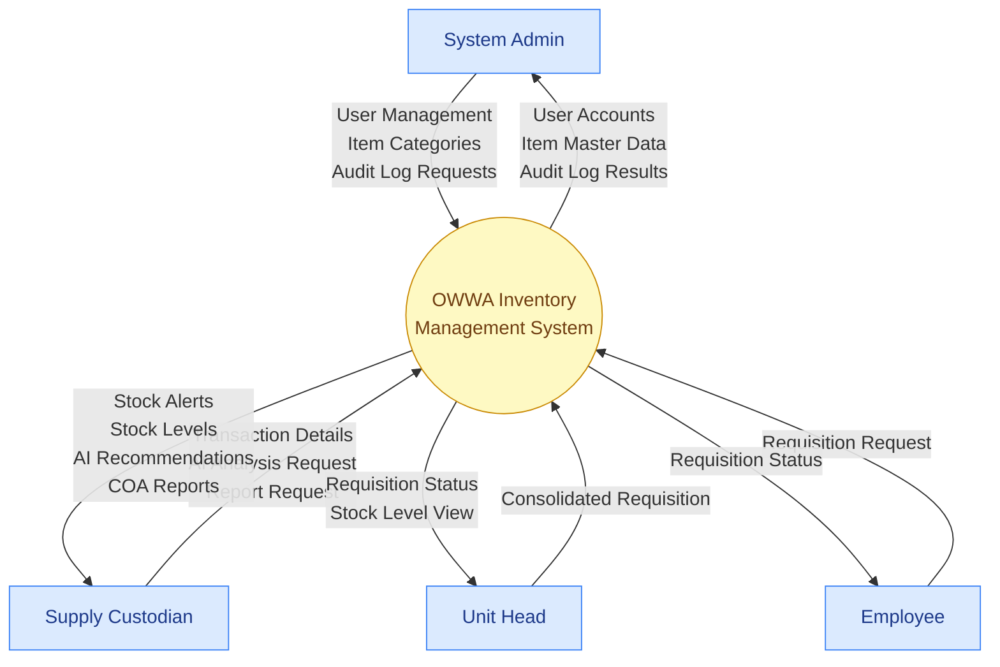
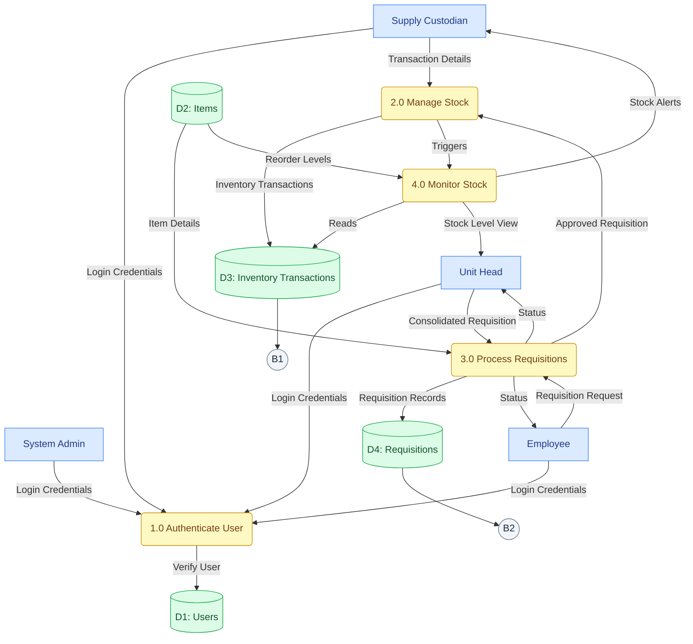
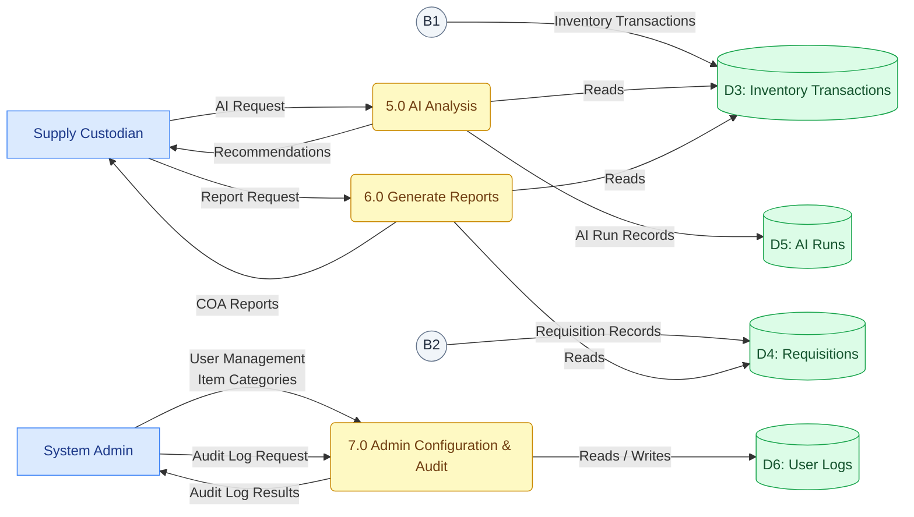

# OWWA Region IV-A Inventory Management System - Data Flow Diagrams

---

## DFD Level 0 - Context Diagram

The entire system is a single black box. This shows the system boundary, who interacts with it, and what data crosses in and out.

---

## DFD Level 1 - System Decomposition

The black box is cracked open into its major functional processes. To keep the diagram readable on a standard page, Level 1 is partitioned into two coordinated parts that together still represent a single, balanced Level 1 view.

### DFD Level 1 - Part A: Core Operations (Authentication, Stock, and Requisitions)

### DFD Level 1 - Part B: Analytics and Reporting

---

## Balancing Check

Every data flow in Level 0 maps to a process in Level 1:

| Level 0 Data Flow        | Direction        | Level 1 Process                  |
| ------------------------ | ---------------- | -------------------------------- |
| Transaction Details      | SC → System      | P2: Manage Stock                 |
| AI Analysis Request      | SC → System      | P5: AI Analysis                  |
| Report Request           | SC → System      | P6: Generate Reports             |
| Consolidated Requisition | UH → System      | P3: Process Requisitions         |
| Requisition Request      | EMP → System     | P3: Process Requisitions         |
| Stock Alerts             | System → SC      | P4: Monitor Stock                |
| Stock Levels             | System → SC, UH  | P4: Monitor Stock                |
| AI Recommendations       | System → SC      | P5: AI Analysis                  |
| COA Reports              | System → SC      | P6: Generate Reports             |
| Requisition Status       | System → UH, EMP | P3: Process Requisitions         |
| User Management          | SA → System      | P7: Admin Configuration & Audit  |
| Item Categories          | SA → System      | P7: Admin Configuration & Audit  |
| Audit Log Requests       | SA → System      | P7: Admin Configuration & Audit  |
| User Accounts            | System → SA      | P7: Admin Configuration & Audit  |
| Item Master Data         | System → SA      | P7: Admin Configuration & Audit  |
| Audit Log Results        | System → SA      | P7: Admin Configuration & Audit  |

> **Note:** P1 (Authenticate User) is an internal security process not shown at Level 0. It is implicit — all actors must log in before any flow in Level 0 is possible.
