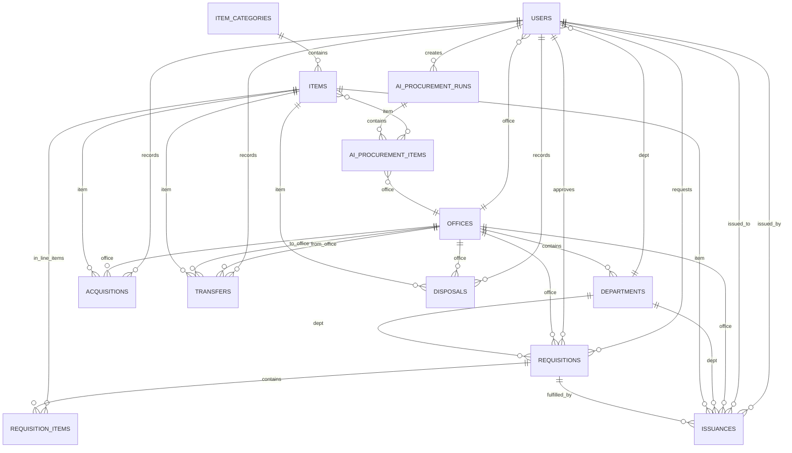

# OWWA Region IV-A Inventory Management System — Entity-Relationship Diagram

This document describes the database entities and their relationships.

---

## ERD (compact)

Relationships only; attribute details are in the tables below.

---

## Entity Summary

| Entity | Description | Key columns |
|--------|-------------|-------------|
| **users** | System users (Supply Custodian, Unit Head, Employee). | id, name, email, role, office_id, department_id |
| **offices** | OWWA offices (region/branch). | id, name, code, is_satellite, address |
| **departments** | Departments within an office. | id, office_id, name, code |
| **item_categories** | Item classification. | id, name, description |
| **items** | Inventory item master. | id, item_category_id, name, unit, reorder_level |
| **requisitions** | Request for supplies. | id, reference_code, office_id, department_id, requested_by, status, approved_by |
| **requisition_items** | Line items of a requisition. | id, requisition_id, item_id, quantity |
| **issuances** | Issue of items to office/department/user. | id, reference_code, item_id, office_id, requisition_id, quantity, issued_by, issued_to |
| **acquisitions** | Stock-in. | id, reference_code, item_id, office_id, quantity, unit_cost, recorded_by |
| **transfers** | Stock movement between offices. | id, reference_code, item_id, from_office_id, to_office_id, quantity, recorded_by |
| **disposals** | Stock write-off. | id, reference_code, item_id, office_id, quantity, reason, recorded_by |
| **ai_procurement_runs** | AI procurement analysis run. | id, period_from, period_to, status, created_by |
| **ai_procurement_items** | Per-item AI suggestion. | id, run_id, item_id, office_id, suggested_qty_min, suggested_qty_max |
| **fiscal_years** | Fiscal year definitions. Standalone. | id, name, start_date, end_date, is_default |
| **rag_embeddings** | RAG vector store. Standalone. | id, source, content, metadata, embedding |

---

## Key Relationships

- **User** is assigned to one **Office** and optionally one **Department**.
- **Requisition** is for one **Office** and optionally one **Department**, requested and optionally approved by **Users**; it has many **Requisition items** (each references an **Item**).
- **Issuance** records giving an **Item** to an **Office**/Department; it can link to one **Requisition** and records **issued_by** and **issued_to** users.
- **Acquisition**, **Transfer**, and **Disposal** record stock in/out and movements; each references one **Item** and **Office**(s), and a **User** (recorded_by).
- **Ai_procurement_runs** and **ai_procurement_items** support AI procurement suggestions; items reference **Item** and **Office**, runs reference **User** (created_by).
