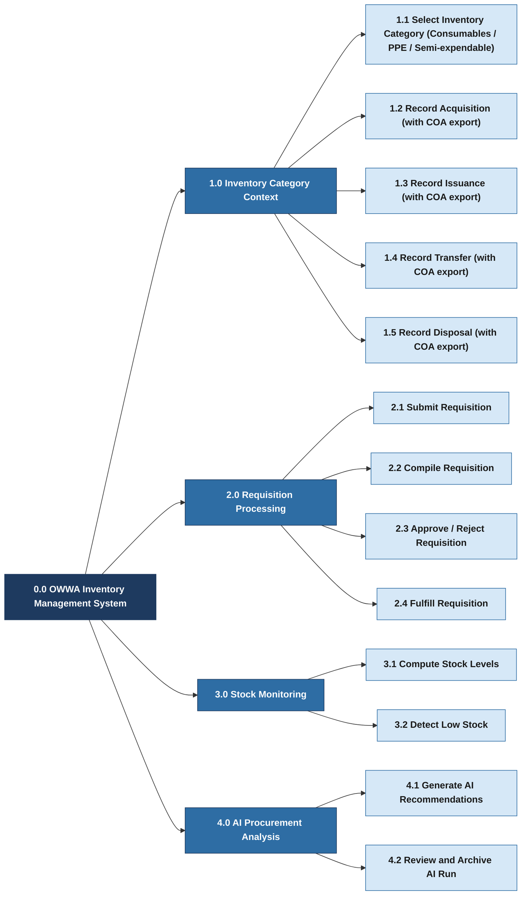

# HIPO Diagram — OWWA Region IV-A Inventory Management System

---

## Part 1: Hierarchy Chart (Visual Table of Contents)

---

## Part 2: IPO Tables (Input-Process-Output)

---

### 1.0 Inventory Category Context (includes Stock Transactions)

#### 1.1 Select Inventory Category (Consumables / PPE / Semi-expendable)

| INPUT | PROCESS | OUTPUT |
|-------|---------|--------|
| Category choice (Consumables, PPE, Semi-expendable) | 1. Persist active category (e.g., session). 2. Scope item lists and transaction forms to the selected category. 3. Load the inventory category dashboard. | Active category displayed; category-scoped items and transaction tasks shown. |

#### 1.2 Record Acquisition (with COA export)

| INPUT | PROCESS | OUTPUT |
|-------|---------|--------|
| Category context; item, office, quantity, unit cost, source, acquisition date | 1. Validate required fields. 2. Generate unique reference code. 3. Save acquisition record to the database. 4. Update computed stock level. 5. Generate COA-aligned PDF export from the acquisition list when requested. | Acquisition record saved; stock level increased; COA-aligned acquisition export available. |

#### 1.3 Record Issuance (with COA export)

| INPUT | PROCESS | OUTPUT |
|-------|---------|--------|
| Category context; item, office, department, quantity, issuance date, issued to, linked requisition (optional) | 1. Validate required fields. 2. Generate unique reference code. 3. Link to requisition record if provided. 4. Save issuance record to the database. 5. Generate COA-aligned PDF export from the issuance list when requested. | Issuance record saved; stock level decreased; COA-aligned issuance export available. |

#### 1.4 Record Transfer (with COA export)

| INPUT | PROCESS | OUTPUT |
|-------|---------|--------|
| Category context; item, source office, destination office, quantity, transfer date | 1. Validate required fields. 2. Generate unique reference code. 3. Save transfer record to the database. 4. Generate COA-aligned PDF export from the transfer list when requested. | Transfer record saved; stock adjusted at both offices; COA-aligned transfer export available. |

#### 1.5 Record Disposal (with COA export)

| INPUT | PROCESS | OUTPUT |
|-------|---------|--------|
| Category context; item, office, quantity, reason, disposal date | 1. Validate required fields. 2. Generate unique reference code. 3. Save disposal record to the database. 4. Generate COA-aligned PDF export from the disposal list when requested. | Disposal record saved; stock decreased; COA-aligned disposal export available. |

---

### 2.0 Requisition Processing

#### 2.1 Submit Requisition

| INPUT | PROCESS | OUTPUT |
|-------|---------|--------|
| Items and quantities needed, office, department (Employee) | 1. Validate that items and quantities are provided. 2. Generate unique reference code. 3. Save requisition with status set to Pending. | Requisition record created with Pending status; visible to the Unit Head for review. |

#### 2.2 Compile Requisition

| INPUT | PROCESS | OUTPUT |
|-------|---------|--------|
| Selected employee requisitions, Unit Head's office and department | 1. Retrieve line items from all selected requisitions. 2. Merge and sum quantities for duplicate items. 3. Create a new consolidated requisition record under the Unit Head's name. | Consolidated requisition created with Pending status; visible to the Supply Custodian. |

#### 2.3 Approve / Reject Requisition

| INPUT | PROCESS | OUTPUT |
|-------|---------|--------|
| Consolidated requisition record, decision (Approve or Reject), remarks | 1. Review requisition details and line items. 2. Update requisition status to Approved or Rejected. 3. Record the approving user and approval timestamp. 4. Save remarks if provided. | Requisition status updated; visible to Unit Head and Employee through status view. |

#### 2.4 Fulfill Requisition

| INPUT | PROCESS | OUTPUT |
|-------|---------|--------|
| Approved requisition record, item, quantity, issuance date, issued to | 1. Validate issuance details. 2. Generate unique reference code. 3. Save issuance record linked to the approved requisition. 4. Update requisition status to Fulfilled. | Issuance record saved; requisition marked as Fulfilled; stock level decreased. |

---

### 3.0 Stock Monitoring

#### 3.1 Compute Stock Levels

| INPUT | PROCESS | OUTPUT |
|-------|---------|--------|
| All acquisition, issuance, transfer, and disposal records per item and office | 1. Sum all acquisition quantities and incoming transfer quantities per item and office. 2. Subtract all issuance quantities, outgoing transfer quantities, and disposal quantities. 3. Return the result as the current stock level. | Current stock level computed for each item and office combination; displayed on the stock levels page and dashboard. |

#### 3.2 Detect Low Stock

| INPUT | PROCESS | OUTPUT |
|-------|---------|--------|
| Computed stock levels, item reorder levels | 1. Compare current stock level against the item's reorder level for each item-office pair. 2. Flag the pair as low stock when stock is at or below the reorder level. | Low-stock count displayed on the dashboard; individual items flagged for review. |

---

### 4.0 AI Procurement Analysis

#### 4.1 Generate AI Recommendations

| INPUT | PROCESS | OUTPUT |
|-------|---------|--------|
| Review period (from and to dates), item category filter (optional), inventory transaction history | 1. Retrieve historical issuance and stock data for the selected period. 2. Compute consumption rate and moving average per item and office. 3. Estimate months of cover based on current stock and average monthly usage. 4. Build context summary and send to AI model. 5. Parse AI response and save run and item records. | AI procurement run record saved; per-item recommendations generated with priority level, suggested reorder quantity, months of cover, and reason. |

#### 4.2 Review and Archive AI Run

| INPUT | PROCESS | OUTPUT |
|-------|---------|--------|
| AI procurement run record, Supply Custodian action (use for planning or archive) | 1. Display recommendations list to Supply Custodian. 2. Allow item-level review and selection. 3. Update run status based on Custodian's decision. | Run status updated to approved or archived; selected recommendations used as basis for next acquisition. |

---

