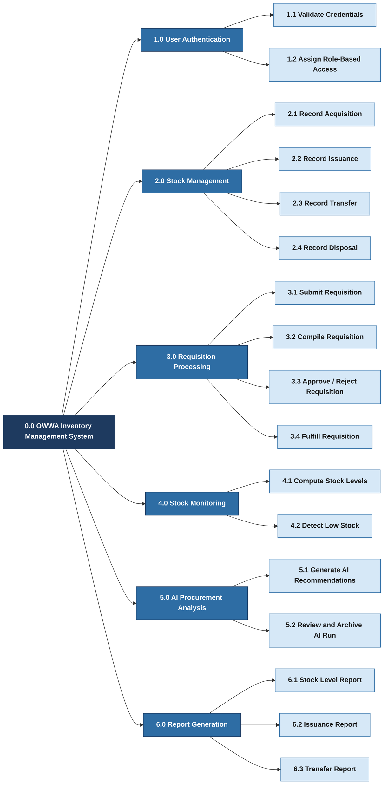

# HIPO Diagram — OWWA Region IV-A Inventory Management System

---

## Part 1: Hierarchy Chart (Visual Table of Contents)

---

## Part 2: IPO Tables (Input-Process-Output)

---

### 1.0 User Authentication

#### 1.1 Validate Credentials

| INPUT | PROCESS | OUTPUT |
|-------|---------|--------|
| Email address, password | 1. Receive login form submission. 2. Search for matching email in the Users database. 3. Verify hashed password. 4. Allow or deny access. | Valid credentials proceed to role assignment; invalid credentials return an error message. |

#### 1.2 Assign Role-Based Access

| INPUT | PROCESS | OUTPUT |
|-------|---------|--------|
| Authenticated user record, assigned role, office, department | 1. Read user role from the database. 2. Load permitted navigation items and resources for that role. 3. Apply office and department scope to data visibility. | Role-specific dashboard and navigation displayed; data filtered according to user's office and department. |

---

### 2.0 Stock Management

#### 2.1 Record Acquisition

| INPUT | PROCESS | OUTPUT |
|-------|---------|--------|
| Item, office, quantity, unit cost, source, acquisition date | 1. Validate required fields. 2. Generate unique reference code. 3. Save acquisition record to the database. 4. Update computed stock level. | Acquisition record saved; stock level for the item and office increased. |

#### 2.2 Record Issuance

| INPUT | PROCESS | OUTPUT |
|-------|---------|--------|
| Item, office, department, quantity, issuance date, issued to, linked requisition (optional) | 1. Validate required fields. 2. Generate unique reference code. 3. Link to requisition record if provided. 4. Save issuance record to the database. | Issuance record saved; stock level for the item and office decreased. |

#### 2.3 Record Transfer

| INPUT | PROCESS | OUTPUT |
|-------|---------|--------|
| Item, source office, destination office, quantity, transfer date | 1. Validate required fields. 2. Generate unique reference code. 3. Save transfer record to the database. | Transfer record saved; stock decreased at source office and increased at destination office. |

#### 2.4 Record Disposal

| INPUT | PROCESS | OUTPUT |
|-------|---------|--------|
| Item, office, quantity, reason, disposal date | 1. Validate required fields. 2. Generate unique reference code. 3. Save disposal record to the database. | Disposal record saved; stock level for the item and office decreased. |

---

### 3.0 Requisition Processing

#### 3.1 Submit Requisition

| INPUT | PROCESS | OUTPUT |
|-------|---------|--------|
| Items and quantities needed, office, department (Employee) | 1. Validate that items and quantities are provided. 2. Generate unique reference code. 3. Save requisition with status set to Pending. | Requisition record created with Pending status; visible to the Unit Head for review. |

#### 3.2 Compile Requisition

| INPUT | PROCESS | OUTPUT |
|-------|---------|--------|
| Selected employee requisitions, Unit Head's office and department | 1. Retrieve line items from all selected requisitions. 2. Merge and sum quantities for duplicate items. 3. Create a new consolidated requisition record under the Unit Head's name. | Consolidated requisition created with Pending status; visible to the Supply Custodian. |

#### 3.3 Approve / Reject Requisition

| INPUT | PROCESS | OUTPUT |
|-------|---------|--------|
| Consolidated requisition record, decision (Approve or Reject), remarks | 1. Review requisition details and line items. 2. Update requisition status to Approved or Rejected. 3. Record the approving user and approval timestamp. 4. Save remarks if provided. | Requisition status updated; visible to Unit Head and Employee through status view. |

#### 3.4 Fulfill Requisition

| INPUT | PROCESS | OUTPUT |
|-------|---------|--------|
| Approved requisition record, item, quantity, issuance date, issued to | 1. Validate issuance details. 2. Generate unique reference code. 3. Save issuance record linked to the approved requisition. 4. Update requisition status to Fulfilled. | Issuance record saved; requisition marked as Fulfilled; stock level decreased. |

---

### 4.0 Stock Monitoring

#### 4.1 Compute Stock Levels

| INPUT | PROCESS | OUTPUT |
|-------|---------|--------|
| All acquisition, issuance, transfer, and disposal records per item and office | 1. Sum all acquisition quantities and incoming transfer quantities per item and office. 2. Subtract all issuance quantities, outgoing transfer quantities, and disposal quantities. 3. Return the result as the current stock level. | Current stock level computed for each item and office combination; displayed on the stock levels page and dashboard. |

#### 4.2 Detect Low Stock

| INPUT | PROCESS | OUTPUT |
|-------|---------|--------|
| Computed stock levels, item reorder levels | 1. Compare current stock level against the item's reorder level for each item-office pair. 2. Flag the pair as low stock when stock is at or below the reorder level. | Low-stock count displayed on the dashboard; individual items flagged for review. |

---

### 5.0 AI Procurement Analysis

#### 5.1 Generate AI Recommendations

| INPUT | PROCESS | OUTPUT |
|-------|---------|--------|
| Review period (from and to dates), item category filter (optional), inventory transaction history | 1. Retrieve historical issuance and stock data for the selected period. 2. Compute consumption rate and moving average per item and office. 3. Estimate months of cover based on current stock and average monthly usage. 4. Build context summary and send to AI model. 5. Parse AI response and save run and item records. | AI procurement run record saved; per-item recommendations generated with priority level, suggested reorder quantity, months of cover, and reason. |

#### 5.2 Review and Archive AI Run

| INPUT | PROCESS | OUTPUT |
|-------|---------|--------|
| AI procurement run record, Supply Custodian action (use for planning or archive) | 1. Display recommendations list to Supply Custodian. 2. Allow item-level review and selection. 3. Update run status based on Custodian's decision. | Run status updated to approved or archived; selected recommendations used as basis for next acquisition. |

---

### 6.0 Report Generation

#### 6.1 Stock Level Report

| INPUT | PROCESS | OUTPUT |
|-------|---------|--------|
| Date range, office filter (optional) | 1. Compute current stock levels per item and office for the selected filters. 2. Format data into the COA-aligned report layout. 3. Generate and serve PDF file. | Downloadable stock level report in PDF format ready for COA submission. |

#### 6.2 Issuance Report

| INPUT | PROCESS | OUTPUT |
|-------|---------|--------|
| Date range, office or department filter (optional) | 1. Query all issuance records within the selected date range and filters. 2. Format data into the report layout. 3. Generate and serve PDF file. | Downloadable issuance report in PDF format ready for COA submission. |

#### 6.3 Transfer Report

| INPUT | PROCESS | OUTPUT |
|-------|---------|--------|
| Date range, office filter (optional) | 1. Query all transfer records within the selected date range and filters. 2. Format data into the report layout. 3. Generate and serve PDF file. | Downloadable transfer report in PDF format showing inter-office item movements. |
