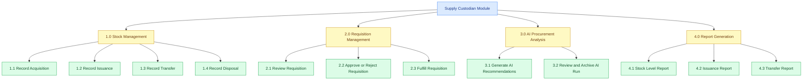
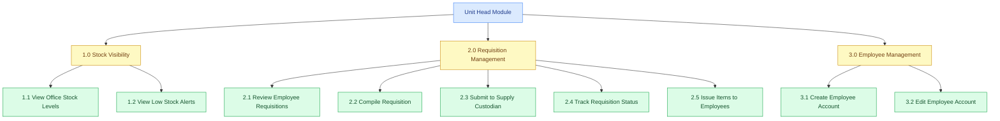
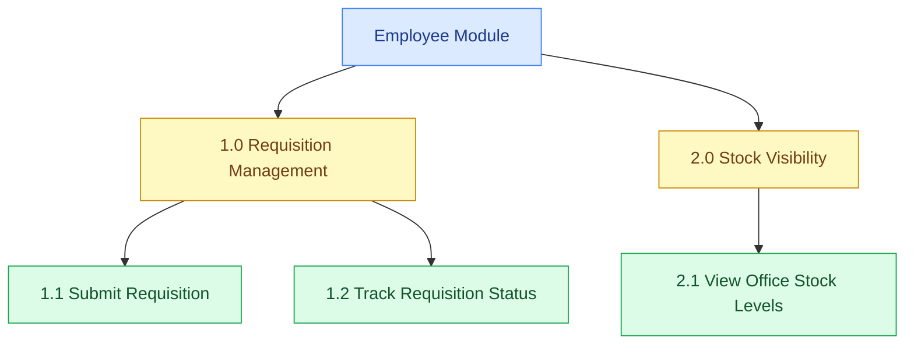

# HIPO Diagram (User-Based) — OWWA Region IV-A Inventory Management System

The HIPO package has two linked parts. The **Hierarchy Chart (VTOC)** is a top-down tree of functions for each user role; it does not show data flow or timing, only structure. The **blue** (root) and **yellow** (mid-level) boxes are headers only—no IPO is written for them. **IPO tables are written only for the green boxes**, where the actual logic happens. To save space, all sub-functions per role are grouped into one or two IPO tables (e.g. Supply Custodian: two tables; Unit Head and Employee: one table each). Numbering in the chart (e.g. 1.1, 1.2) matches the rows in the IPO tables. Login is omitted from the hierarchy.

---

## Supply Custodian Module

**Figure 3-x. Supply Custodian Hierarchy Chart (HIPO)**

This figure shows the Supply Custodian HIPO diagram, which illustrates the key functions available to the Supply Custodian: managing inventory stock through acquisitions, issuances, transfers, and disposals; handling requisitions from Unit Heads by reviewing, approving, rejecting, or fulfilling them; running AI-assisted procurement analysis to generate and review recommendations; and generating COA-compliant stock, issuance, and transfer reports.

---

### IPO Tables — Supply Custodian

**Table 1 — Stock & Requisition (1.1–2.3)**

Table 3-x presents the Input-Process-Output of the Supply Custodian module for stock and requisition functions. It shows the specific data inputs required for recording acquisitions, issuances, transfers, and disposals, and for reviewing, approving or rejecting, and fulfilling requisitions from Unit Heads, together with the steps the system performs and the resulting outputs produced.

| Function | INPUT | PROCESS | OUTPUT |
|----------|-------|---------|--------|
| 1.1 Record Acquisition | Item, office, quantity, unit cost, source, date | Validate fields; generate reference code; save acquisition record; update stock. | Acquisition record saved; stock level increased. |
| 1.2 Record Issuance | Item, office, quantity, issued to, date, linked requisition (optional) | Validate fields; generate reference code; save issuance record; update stock. | Issuance record saved; stock level decreased. |
| 1.3 Record Transfer | Item, source office, destination office, quantity, date | Validate fields; generate reference code; save transfer record; update stock at both offices. | Transfer record saved; stock adjusted at both offices. |
| 1.4 Record Disposal | Item, office, quantity, reason, date | Validate fields; generate reference code; save disposal record; update stock. | Disposal record saved; stock level decreased. |
| 2.1 Review Requisition | Consolidated requisition from Unit Head | Display requisition details and line items for review. | Requisition details and items visible to Supply Custodian. |
| 2.2 Approve or Reject Requisition | Decision (approve/reject), remarks | Update requisition status; record approving user and timestamp; save remarks. | Requisition status (Approved/Rejected); visible to Unit Head. |
| 2.3 Fulfill Requisition | Approved requisition; item, quantity, issued to, date | Create issuance record linked to requisition; update requisition status to Fulfilled. | Issuance saved; requisition marked Fulfilled; stock decreased. |

**Table 2 — AI & Reports (3.1–4.3)**

Table 3-y presents the Input-Process-Output of the Supply Custodian module for AI procurement analysis and report generation. It shows the data inputs, internal process steps, and outputs for generating and reviewing AI recommendations and for producing COA-aligned stock level, issuance, and transfer reports.

| Function | INPUT | PROCESS | OUTPUT |
|----------|-------|---------|--------|
| 3.1 Generate AI Recommendations | Review period, item category (optional), transaction history | Compute consumption and months of cover; build context; call AI model; save run and item recommendations. | AI run saved with per-item recommendations, priority, suggested quantities. |
| 3.2 Review and Archive AI Run | AI run record; Supply Custodian action (use or dismiss) | Display recommendations; update run status (e.g. accepted/archived). | Run status updated; selected items available for acquisition. |
| 4.1 Stock Level Report | Date range, office filter (optional) | Compute stock levels; format COA layout; generate PDF. | Downloadable stock level report (PDF). |
| 4.2 Issuance Report | Date range, office or department filter (optional) | Query issuance records; format layout; generate PDF. | Downloadable issuance report (PDF). |
| 4.3 Transfer Report | Date range, office filter (optional) | Query transfer records; format layout; generate PDF. | Downloadable transfer report (PDF). |

---

---

## Unit Head Module

**Figure 3-x. Unit Head Hierarchy Chart (HIPO)**

This figure shows the Unit Head HIPO diagram, which illustrates the key functions available to the Unit Head: viewing stock levels and low-stock alerts scoped to their assigned office; managing the requisition process by reviewing employee requests, compiling them into a single consolidated requisition, submitting it to the Supply Custodian, tracking its status, and issuing items to employees upon fulfillment; and managing Employee user accounts within their office.

---

### IPO Table — Unit Head

Table 3-x presents the Input-Process-Output of the Unit Head module. It illustrates the data inputs, internal processes, and outputs associated with each function available to the Unit Head, covering office stock monitoring, employee requisition review and compilation, consolidated requisition submission and tracking, item issuance, and employee account management.

| Function | INPUT | PROCESS | OUTPUT |
|----------|-------|---------|--------|
| 1.1 View Office Stock Levels | Assigned office | Retrieve and compute stock levels for the Unit Head's office. | Current stock levels displayed for the office. |
| 1.2 View Low Stock Alerts | Assigned office, reorder levels | Compare computed stock against reorder levels; flag low items. | Low-stock alerts displayed for the office. |
| 2.1 Review Employee Requisitions | Pending requisitions from employees in office | Retrieve and display employee requisitions and line items. | List of pending requisitions for review. |
| 2.2 Compile Requisition | Selected employee requisitions | Merge line items; sum quantities per item; create consolidated requisition under Unit Head. | Consolidated requisition created (Pending). |
| 2.3 Submit to Supply Custodian | Consolidated requisition | Submit requisition to Supply Custodian workflow. | Requisition visible to Supply Custodian. |
| 2.4 Track Requisition Status | Submitted requisition records | Retrieve and display status and remarks for each requisition. | Status (Pending, Approved, Rejected, Fulfilled) and remarks displayed. |
| 2.5 Issue Items to Employees | Item, employee recipient, quantity, date | Validate fields; generate reference code; save issuance record for office. | Issuance record saved; stock decreased; items released to employee. |
| 3.1 Create Employee Account | Employee name, email, password, department | Validate fields; assign Employee role and office; save user. | Employee account created within the office. |
| 3.2 Edit Employee Account | Employee record; updated name, email, department, etc. | Validate fields; update user record. | Employee account updated within the office. |

---

---

## Employee Module

**Figure 3-x. Employee Hierarchy Chart (HIPO)**

This figure shows the Employee HIPO diagram, which illustrates the key functions available to the Employee: submitting supply requisitions by specifying the needed items and quantities, tracking the status of submitted requests to monitor whether they are pending, approved, fulfilled, or rejected, and viewing the current stock levels of their assigned office.

---

### IPO Table — Employee

Table 3-x presents the Input-Process-Output of the Employee module. It documents the inputs provided by the employee, the processes the system performs in response, and the outputs returned to the user, covering requisition submission, status tracking, and stock level viewing.

| Function | INPUT | PROCESS | OUTPUT |
|----------|-------|---------|--------|
| 1.1 Submit Requisition | Items and quantities needed, office, department | Validate items and quantities; generate reference code; save requisition with Pending status. | Requisition record created; visible to Unit Head for review. |
| 1.2 Track Requisition Status | Submitted requisition records | Retrieve and display current status and remarks for the Employee's requisitions. | Status (Pending, Approved, Fulfilled, Rejected) and remarks displayed. |
| 2.1 View Office Stock Levels | Assigned office | Retrieve and compute stock levels for the Employee's office. | Current stock levels for the office displayed. |
