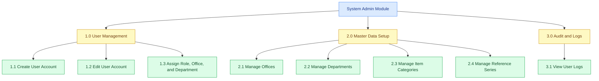
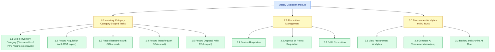
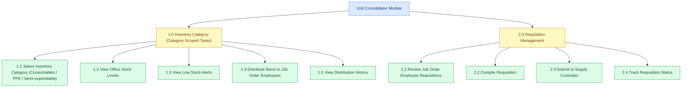
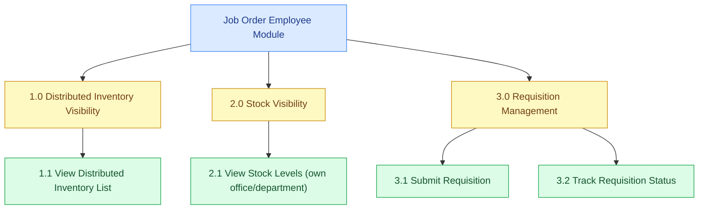

# HIPO Diagram (User-Based) — OWWA Region IV-A Inventory Management System

The HIPO package has two linked parts. The **Hierarchy Chart (VTOC)** is a top-down tree of functions for each user role; it does not show data flow or timing, only structure. The **blue** (root) and **yellow** (mid-level) boxes are headers only—no IPO is written for them. **IPO tables are written only for the green boxes**, where the actual logic happens. To save space, all sub-functions per role are grouped into one or two IPO tables (e.g. Supply Custodian: two tables; Unit Head and Employee: one table each). Numbering in the chart (e.g. 1.1, 1.2) matches the rows in the IPO tables. Login is omitted from the hierarchy.

---

## System Admin Module

**Figure 3-x. System Admin Hierarchy Chart (HIPO)**

This figure shows the System Admin HIPO diagram, which illustrates the key functions available to the System Admin: creating and managing user accounts and assignments, maintaining setup master data (offices, departments, item categories, reference series), and viewing audit logs. Item maintenance is handled by the Supply Custodian.

---

### IPO Table — System Admin

This table describes the System Admin’s setup responsibilities. The System Admin maintains the **structure** of the system (organizational setup, roles/scopes, and reference numbering) and reviews audit trails. It intentionally excludes operational inventory tasks (transactions, requisition fulfillment, and item maintenance), which belong to other roles.

| Function | INPUT | PROCESS | OUTPUT |
|----------|-------|---------|--------|
| 1.1 Create User Account | Name; email; password; role; office; department (optional) | Validate fields; create user; assign role and scope fields. | User account created. |
| 1.2 Edit User Account | User record; updated fields | Validate changes; update user record. | User account updated. |
| 1.3 Assign Role, Office, and Department | User record; role; office; department | Update role/scope assignments and ensure consistency with configured setup. | User scope updated. |
| 2.1 Manage Offices | Office fields | Create/update/archive office records (organizational scope). | Office setup updated. |
| 2.2 Manage Departments | Department fields | Create/update/archive department records (organizational scope). | Department setup updated. |
| 2.3 Manage Item Categories | Category name; archive flag | Create/update/archive item categories. | Item categories updated. |
| 2.4 Manage Reference Series | Prefix and counters | Update reference series for transaction codes. | Reference codes follow updated series. |
| 3.1 View User Logs | Date range; filters | Query user logs and display results. | User log entries displayed for audit. |

---

## Supply Custodian Module

**Figure 3-x. Supply Custodian Hierarchy Chart (HIPO)**

This figure shows the Supply Custodian HIPO diagram, which illustrates the key functions available to the Supply Custodian: selecting an inventory category context (Consumables, PPE, or Semi-expendable) before performing category-scoped tasks; managing inventory stock through acquisitions, issuances, transfers, and disposals (each with COA-aligned export from within the transaction screens); handling requisitions from Unit Heads by reviewing, approving, rejecting, or fulfilling them; and using procurement analytics and AI procurement runs to generate and review procurement recommendations.

---

### IPO Tables — Supply Custodian

**Table 1 — Inventory Category Tasks and Requisitions (1.1–2.3)**

Table 3-x presents the Input-Process-Output of the Supply Custodian module for selecting an inventory category and performing category-scoped stock transactions (with COA export available inside each transaction task), and for reviewing, approving or rejecting, and fulfilling requisitions from Unit Heads.

| Function | INPUT | PROCESS | OUTPUT |
|----------|-------|---------|--------|
| 1.1 Select Inventory Category | Category choice (Consumables, PPE, Semi-expendable) | Persist active category; load inventory category dashboard; scope item lists and forms to the selected category. | Active category set; category-scoped tasks and items displayed. |
| 1.2 Record Acquisition | Category context; item, office, quantity, unit cost, source, date | Validate fields; generate reference code; save acquisition record; update stock; allow COA export from acquisition list/view. | Acquisition saved; stock level increased; COA-aligned acquisition export available. |
| 1.3 Record Issuance | Category context; item, office, quantity, issued to, date, linked requisition (optional) | Validate fields; generate reference code; save issuance record; update stock; allow COA export from issuance list/view. | Issuance saved; stock level decreased; COA-aligned issuance export available. |
| 1.4 Record Transfer | Category context; item, source office, destination office, quantity, date | Validate fields; generate reference code; save transfer record; update stock at both offices; allow COA export from transfer list/view. | Transfer saved; stock adjusted; COA-aligned transfer export available. |
| 1.5 Record Disposal | Category context; item, office, quantity, reason, date | Validate fields; generate reference code; save disposal record; update stock; allow COA export from disposal list/view. | Disposal saved; stock decreased; COA-aligned disposal export available. |
| 2.1 Review Requisition | Consolidated requisition from Unit Head | Display requisition details and line items for review. | Requisition details and items visible to Supply Custodian. |
| 2.2 Approve or Reject Requisition | Decision (approve/reject), remarks | Update requisition status; record approving user and timestamp; save remarks. | Requisition status (Approved/Rejected); visible to Unit Head. |
| 2.3 Fulfill Requisition | Approved requisition; issuance details (item, quantity, issued to, date) | Create issuance record linked to requisition; update requisition status to Fulfilled. | Issuance saved; requisition marked Fulfilled; stock decreased. |

**Table 2 — Procurement Analytics and AI Runs (3.1–3.3)**

Table 3-y presents the Input-Process-Output of the Supply Custodian module for procurement analytics and AI procurement runs. It shows the data inputs, internal process steps, and outputs for viewing deterministic analytics and generating/reviewing AI-assisted recommendations.

| Function | INPUT | PROCESS | OUTPUT |
|----------|-------|---------|--------|
| 3.1 View Procurement Analytics | Fiscal year date range; optional category; stock and issuance history | Compute coverage KPIs and at-risk lines; display trends and projections. | Analytics dashboard displayed with deterministic KPIs and at-risk list. |
| 3.2 Generate AI Recommendation (Run) | Fiscal year date range; optional category; at-risk list and context | Build context from deterministic analytics; call AI model; store run and line items. | AI run saved with per-item recommendations, priority, and suggested quantities. |
| 3.3 Review and Archive AI Run | AI run record; Supply Custodian action (keep, edit, or archive) | Display run details; update run/items status based on decision. | Run status updated; selected items can be used as basis for acquisitions. |

---

---

## Unit Consolidator Module

**Figure 3-x. Unit Consolidator Hierarchy Chart (HIPO)**

This figure shows the Unit Consolidator HIPO diagram, which illustrates the key functions available to the Unit Consolidator: selecting an inventory category first, then performing category-scoped inventory tasks (stock visibility, low-stock awareness, and distributing items); and managing the requisition process by reviewing Job Order Employee requests, compiling them into a single consolidated requisition, submitting it to the Supply Custodian, and tracking its status. User account creation/editing is handled by the System Admin, not the Unit Consolidator.

---

### IPO Table — Unit Consolidator

Table 3-x presents the Input-Process-Output of the Unit Consolidator module. It illustrates the data inputs, internal processes, and outputs associated with each function available to the Unit Consolidator, covering inventory category selection, office stock monitoring, category-scoped distribution to Job Order Employees, and Job Order Employee requisition review and consolidation.

| Function | INPUT | PROCESS | OUTPUT |
|----------|-------|---------|--------|
| 1.1 Select Inventory Category | Category choice (Consumables, PPE, Semi-expendable) | Persist active category; load inventory category dashboard; scope item lists and pages to the selected category. | Active category set; category-scoped pages and tasks shown. |
| 1.2 View Office Stock Levels | Assigned office; selected category | Retrieve and compute stock levels for the Unit Consolidator's office (category-scoped). | Current stock levels displayed for the office and category. |
| 1.3 View Low Stock Alerts | Assigned office; selected category; reorder levels | Compare computed stock against reorder levels; flag low items (category-scoped). | Low-stock alerts displayed for the office and category. |
| 1.4 Distribute Items to Job Order Employees | Selected category; item; employee recipient; quantity; date; linked requisition (optional) | Validate fields; save distribution record; link to requisition when applicable. | Distribution saved; employee sees items in their distributed inventory list. |
| 1.5 View Distribution History | Selected category; office/department scope; optional employee filter | Retrieve and display distributions for the scope and period (category-scoped). | Distribution history displayed. |
| 2.1 Review Job Order Employee Requisitions | Pending requisitions from employees in office/department | Retrieve and display employee requisitions and line items. | List of pending requisitions for review. |
| 2.2 Compile Requisition | Selected employee requisitions | Merge line items; sum quantities per item; create consolidated requisition under Unit Consolidator. | Consolidated requisition created (Pending). |
| 2.3 Submit to Supply Custodian | Consolidated requisition | Submit requisition to Supply Custodian workflow. | Requisition visible to Supply Custodian. |
| 2.4 Track Requisition Status | Submitted requisition records | Retrieve and display status and remarks for each requisition. | Status (Pending, Approved, Rejected, Fulfilled) and remarks displayed. |

---

---

## Job Order Employee Module

**Figure 3-x. Job Order Employee Hierarchy Chart (HIPO)**

This figure shows the Job Order Employee HIPO diagram, which illustrates the key functions available to the Job Order Employee: viewing the inventory items that were distributed to them (as a personal distributed inventory list), viewing stock levels scoped to their own office/department, submitting supply requisitions by specifying the needed items and quantities, and tracking requisition status. Job Order Employees do not need to select inventory categories; they work from their assigned/distributed inventory list.

---

### IPO Table — Job Order Employee

Table 3-x presents the Input-Process-Output of the Job Order Employee module. It documents the inputs provided by the employee, the processes the system performs in response, and the outputs returned to the user, covering distributed inventory visibility, office/department stock visibility, requisition submission, and requisition status tracking.

| Function | INPUT | PROCESS | OUTPUT |
|----------|-------|---------|--------|
| 1.1 View Distributed Inventory List | Authenticated user | Retrieve items distributed to the user; display quantities and last distribution dates. | Distributed inventory list displayed for the user. |
| 2.1 View Stock Levels (own office/department) | Authenticated user; stock records in system | Retrieve computed stock levels and show only the user's office (and department context where applicable). | Stock levels displayed for the user’s scope. |
| 3.1 Submit Requisition | Items and quantities needed; office/department derived from user profile | Validate items and quantities; generate reference code; save requisition with Pending status. | Requisition record created; visible to Unit Consolidator for review. |
| 3.2 Track Requisition Status | Submitted requisition records | Retrieve and display current status and remarks for the user's requisitions. | Status (Pending, Approved, Fulfilled, Rejected) and remarks displayed. |
