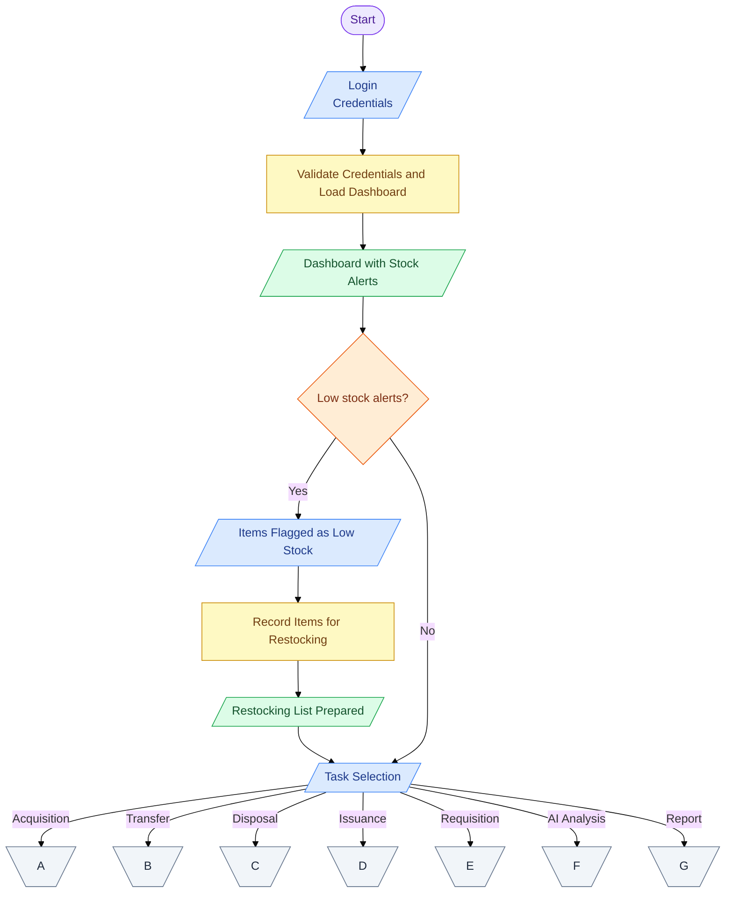
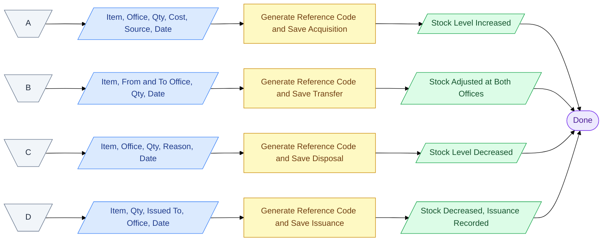
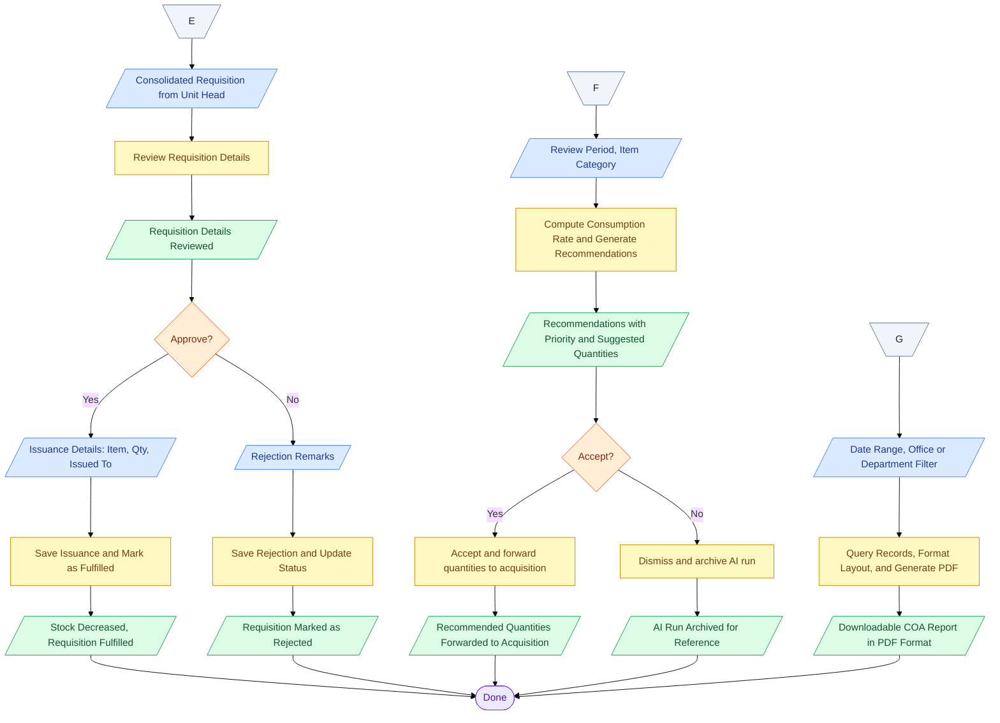
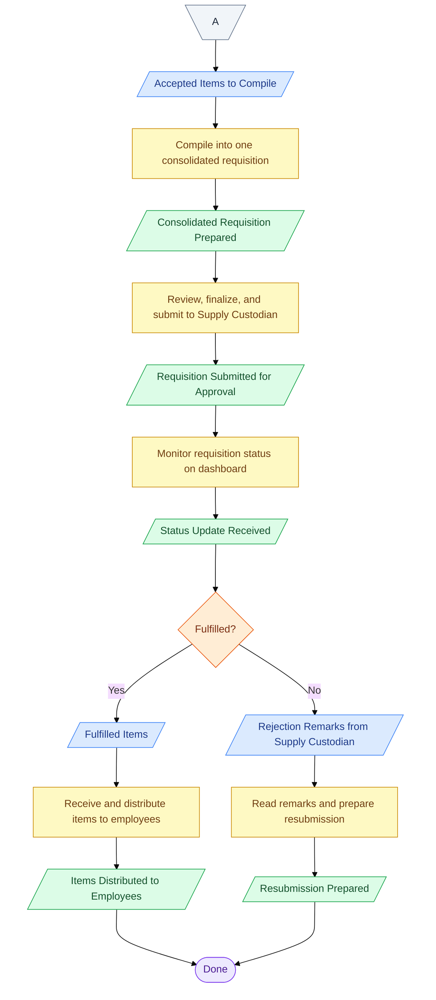

# OWWA Region IV-A Inventory Management System - Process Workflow

---

## Supply Custodian Workflow

### Part 1 of 3 — Login and Task Selection

### Part 2 of 3 — Stock Transactions

### Part 3 of 3 — Requisition, AI Analysis, and Reports

---

## Unit Head Workflow

### Part 1 of 2 — Login and Task Entry

### Part 2 of 2 — Compile, Submit, and Monitor

---

## Employee Workflow

