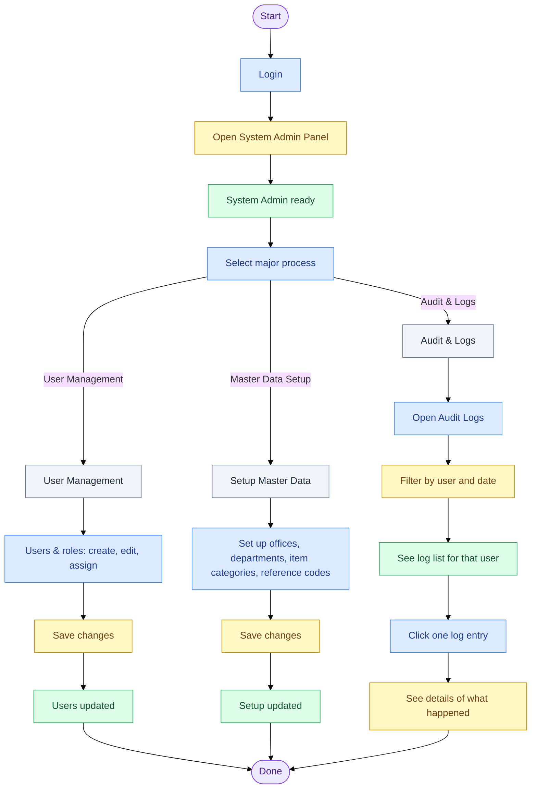
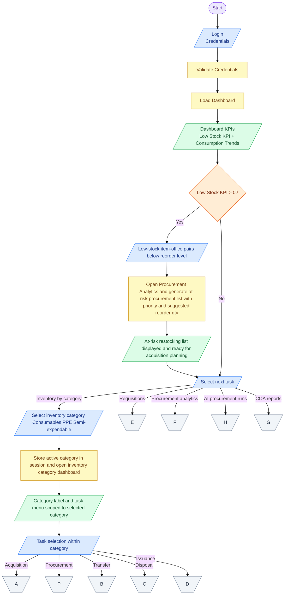
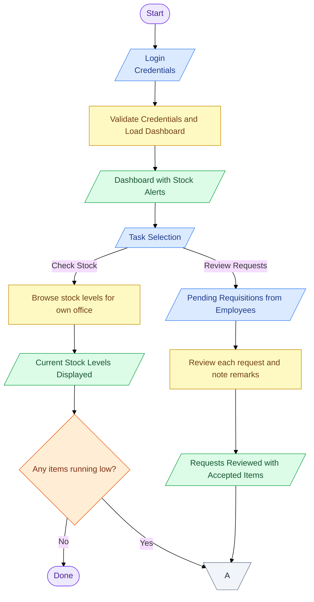
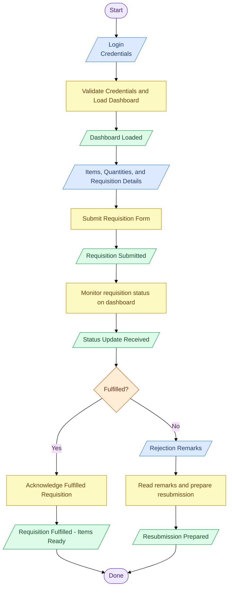

# OWWA Region IV-A Inventory Management System - Process Workflow

---

## System Admin Workflow



## Supply Custodian Workflow

### Part 1 of 3 — Login and Task Selection

**Inventory category vs cross-category tasks.** **Requisitions**, **Procurement Analytics**, **AI Procurement Runs**, and **COA reports** are **not** tied to an inventory category in navigation—they are chosen from the same level as other work. Only **Acquisition, Issuance, Transfer, Disposal** (and similar category-scoped lists) sit inside the **Inventory Category Dashboard** after you pick Consumables / PPE / Semi-expendable. A single requisition may include items from more than one category; when the Supply Custodian accepts and issues stock, each line creates its own issuance under the correct category (Consumables, Semi-Expendable, or PPE).

**Which flowchart shapes to use**

- **Parallelogram** = **Input / Output** (classical symbol). Use it for **“Select next task”** and **“Select inventory category”** because the user is entering a choice from the system menu.
- **Rectangle** = **Process** (system action such as save session, load dashboard).
- **Diamond** = **Decision** — use **only for yes/no** (already used for low-stock KPI).

Do **not** use a diamond for “pick among many tasks”; keep one **parallelogram** for the choice, then draw **separate arrows** with **labels** to each task group.

**Inventory category selection (IPO).** Treat “Select inventory category” as the **input**: the user picks **one** of **Consumables**, **PPE**, or **Semi-expendable** (a multi-value choice on a form or dashboard list, not a yes/no decision). The **process** is: persist the choice (for example `active_item_category_id` in session) and load the **Inventory Category Dashboard** so navigation and forms only use items under that category. The **output** is: the UI shows the active category name and category-scoped tasks.



### Part 2 of 3 — Stock Transactions

```mermaid
%%{init: {'theme': 'base'}}%%
flowchart LR
    CA[\A/]:::connector
    CP[\P/]:::connector
    CB[\B/]:::connector
    CC[\C/]:::connector
    CD[\D/]:::connector

    CP --> I3P[/Category, office, PR lines, purpose/]:::input
    I3P --> P3P[Submit PR and export Appendix 60]:::process
    P3P --> P3Pa[Mark PR approved offline assigns PR No.]:::process
    P3Pa --> P3Q[Submit PO with supplier and costs export Appendix 61]:::process
    P3Q --> P3Qa[Mark PO approved offline assigns PO No.]:::process
    P3Qa --> P3R[Submit IAR with inspection signatories export Appendix 62]:::process
    P3R --> P3Ra[Mark IAR approved offline assigns IAR No.]:::process
    P3Ra --> P3S[Record custody receipt per line]:::process
    P3S --> O3R[/Stock levels increased Reference on Stock Card/]:::output
    O3R --> END([Done]):::terminal

    CA --> I3[/Legacy manual custody receipt optional/]:::input
    I3 --> P3[Generate Reference Code and Save Acquisition]:::process
    P3 --> O3[/Stock Level Increased/]:::output

    CB --> I4[/Item, From and To Office, Qty, Date/]:::input
    I4 --> P4[Generate Reference Code and Save Transfer]:::process
    P4 --> O4[/Stock Adjusted at Both Offices/]:::output

    CC --> I5[/Item, Office, Qty, Reason, Date/]:::input
    I5 --> P5[Generate Reference Code and Save Disposal]:::process
    P5 --> O5[/Stock Level Decreased/]:::output

    CD --> I6[/Item, Qty, Issued To, Office, Date/]:::input
    I6 --> P6[Generate Reference Code and Save Issuance]:::process
    P6 --> O6[/Stock Decreased, Issuance Recorded/]:::output

    O3 --> END([Done]):::terminal
    O3R --> CA
    O4 --> END
    O5 --> END
    O6 --> END

    classDef terminal fill:#ede9fe,stroke:#7c3aed,color:#4c1d95
    classDef input fill:#dbeafe,stroke:#3b82f6,color:#1e3a8a
    classDef process fill:#fef9c3,stroke:#ca8a04,color:#713f12
    classDef output fill:#dcfce7,stroke:#16a34a,color:#14532d
    classDef decide fill:#ffedd5,stroke:#ea580c,color:#7c2d12
    classDef connector fill:#f1f5f9,stroke:#64748b,color:#1e293b
```



### Part 3 of 3 — Requisition, analytics, AI procurement runs, and reports

```mermaid
%%{init: {'theme': 'base'}}%%
flowchart TD
    CE[\E/]:::connector
    CF[\F/]:::connector
    CG[\G/]:::connector
    AH[\H/]:::connector

    CE --> I6[/Consolidated Requisition from Unit Head/]:::input
    I6 --> P6[Review Requisition Details]:::process
    P6 --> O6b[/Requisition Details Reviewed/]:::output
    O6b --> D4{Approve?}:::decide
    D4 -- Yes --> I7[/Per-line: Qty to issue, stock, issue remarks/]:::input
    I7 --> P7[Accept and issue: linked issuances; status Accepted]:::process
    P7 --> O6[/Stock decreased; remainder via Issue remainder if partial/]:::output
    D4 -- No --> I8[/Rejection Remarks/]:::input
    I8 --> P8[Save Rejection and Update Status]:::process
    P8 --> O7[/Requisition Marked as Rejected/]:::output

    CF --> I9[/Review Period, Item Category/]:::input
    I9 --> P9[Compute consumption (scoped to selected review period) and generate recommendations]:::process
    P9 --> O8[/Recommendations with Priority and Suggested Quantities/]:::output
    O8 --> D5{Accept?}:::decide
    D5 -- Yes --> P9b[Accept and forward quantities to acquisition]:::process
    P9b --> O9[/Recommended Quantities Forwarded to Acquisition/]:::output
    D5 -- No --> P9c[Dismiss and archive AI run]:::process
    P9c --> O10[/AI Run Archived for Reference/]:::output

    AH --> I_AH[/Saved AI procurement runs and line items/]:::input
    I_AH --> P_AH[Review edit approve or archive runs and items]:::process
    P_AH --> O_AH[/Run records updated/]:::output

    CG --> I10[/Date Range, Office/Department Filter/]:::input
    I10 --> P10[Query Records, Format Layout, and Generate PDF]:::process
    P10 --> O11[/Downloadable COA Report in PDF Format/]:::output

    O6 --> END([Done]):::terminal
    O7 --> END
    O9 --> END
    O10 --> END
    O11 --> END
    O_AH --> END

    classDef terminal fill:#ede9fe,stroke:#7c3aed,color:#4c1d95
    classDef input fill:#dbeafe,stroke:#3b82f6,color:#1e3a8a
    classDef process fill:#fef9c3,stroke:#ca8a04,color:#713f12
    classDef output fill:#dcfce7,stroke:#16a34a,color:#14532d
    classDef decide fill:#ffedd5,stroke:#ea580c,color:#7c2d12
    classDef connector fill:#f1f5f9,stroke:#64748b,color:#1e293b
```

---

## Unit Head Workflow

### Part 1 of 2 — Login and Task Entry



### Part 2 of 2 — Compile, Submit, and Monitor


---

## Employee Workflow



---

## Stock vs accountable property

**Consumables:** When the Supply Custodian issues stock, quantity leaves regional on-hand inventory and is treated as **consumed** for that office. There is no per-unit property number or ongoing custody register in the app.

**Semi-expendable and PPE:** Issuance **reduces on-hand stock** on Stock levels (same formula as consumables) but **does not erase** the property record. Each issued unit keeps its **property number**, appears on **PAR/ICS** exports, and remains in `inventory_units` with status **issued**. Physical count and QR scan still resolve issued property.

| After issue | On-hand stock (Stock levels) | Property register (PAR / ICS / Annex A.4) |
| ----------- | ---------------------------- | ------------------------------------------- |
| Consumables | Down                         | N/A                                         |
| Semi / PPE  | Down                         | **Still listed** — accountability follows the end-user |

**Estimated useful life (semi only):** Captured on ICS at issuance for property accountability (not the same as PPE accounting depreciation). See [OWWA export mapping — Estimated useful life](OWWA_EXPORT_MAPPING.md#estimated-useful-life-semi-expendable-only).

**Unit Consolidator:** Items issued to the UC remain on the property register; the UC should use **Office property register** (not Stock levels alone) to see accountable semi/PPE and useful-life status.

