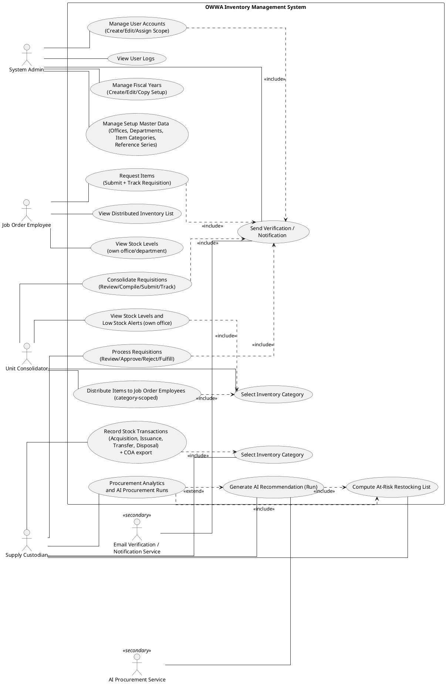

# OWWA Region IV-A Inventory Management System — Use Case Diagram

The use case diagram summarizes which external actors interact with the proposed inventory system and what functions they can perform. It focuses on user goals (use cases) rather than internal process flow or data movement.

Figure 3-20 presents a comprehensive Use Case Diagram that identifies the system’s actors and enumerates the specific functions available to each, providing a user-centered view that complements the data-centered DFDs and the process-oriented flowcharts. At the top of the hierarchy is the System Admin, who is responsible for configuring and safeguarding the system. This actor can manage user accounts and assignments, maintain setup master data such as offices, departments, item categories, and reference series, and review user logs to see who accessed the system and when. The user management process includes sending notification emails, such as account verification and activation messages, ensuring that new and updated accounts are properly confirmed through the Email Verification/Notification Service.

The Supply Custodian remains the primary operational actor for the regional inventory lifecycle. This actor can select an inventory category context and record stock transactions such as acquisitions, issuances, transfers, and disposals, with COA-aligned PDF exports available from within the transaction tasks. The Supply Custodian also handles requisition-related functions by reviewing consolidated requisitions, approving or rejecting them, and fulfilling approved requests through item issuance. In addition, the Supply Custodian can use procurement analytics and AI-assisted procurement runs to generate at-risk restocking lists and AI recommendations through the AI Procurement Service.

The Unit Consolidator serves as an intermediate actor focused on oversight and consolidation within their assigned office. This actor selects an inventory category context to view office-scoped stock levels and low-stock alerts, distributes items to Job Order Employees within the selected category, and consolidates employee requisitions by reviewing requests, compiling them into a consolidated requisition, submitting to the Supply Custodian, and tracking status updates. The Job Order Employee, as the end-user actor, initiates the supply chain process by viewing their distributed inventory list, viewing stock levels scoped to their own office/department, submitting requisitions that specify needed items and quantities, and tracking the status of those requests. Together, these actors and their associated use cases illustrate how individual requests from Job Order Employees and Unit Consolidators feed into centralized inventory decisions and administrative controls managed by the Supply Custodian and System Admin.

**Office vs department:** An **office** is the inventory location (stock ledger per `office_id`; regional vs satellite via `is_satellite`). A **department** is an organizational section within an office (users and requisitions carry both; departments do not hold separate stock). **Regional supply catalog** (Unit Consolidator and Job Order Employee) shows stock at the non-satellite regional supply office so requesters can plan what to ask from the Supply Custodian; requisitions still file under the requester’s own office and department.

