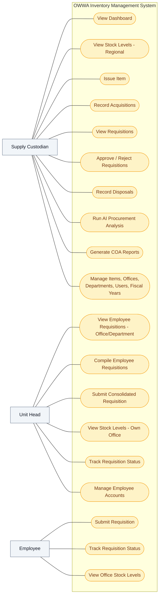

# OWWA Region IV-A Inventory Management System — Use Case Diagram

The use case diagram summarizes which external actors interact with the proposed inventory system and what functions they can perform. It focuses on user goals (use cases) rather than internal process flow or data movement.

